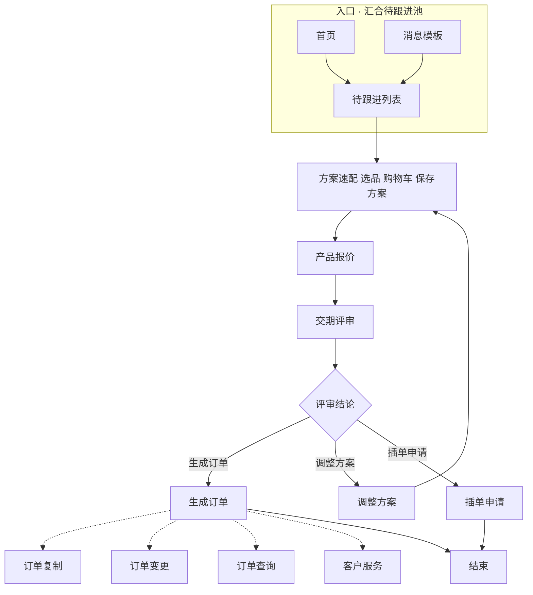
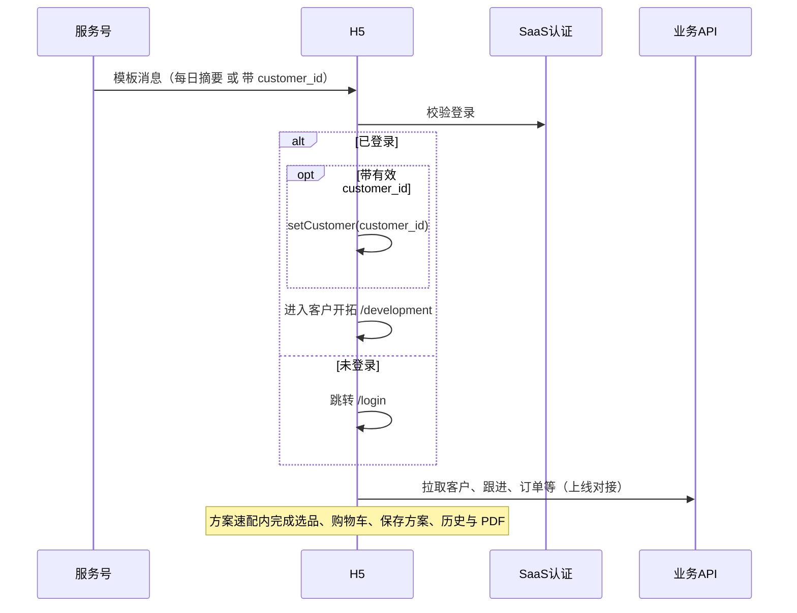

# PRD 定稿：制造业 SaaS · H5 客服智能体系统

> **修订（设计定稿 / 与实现对齐）**：本版在阶段 C 定稿基础上，按当前 **Vue 3 H5 前端实现** 与 **UI 微调定稿** 重写：首页宫格清单、服务号深链行为、方案相关页底部输入条策略、页面与验收条目均已与代码一致。  
> 历史依据仍保留：`PRD-draft.md`（阶段 A 草案）、`Prototype.md`、`.output` 下设计说明。Stitch 原型中超出本 PRD 的生成内容不纳入产品范围。

---

## 1. 产品目标

在现有制造业 SaaS 业务平台上扩展一个 **微信 H5** 端客服智能体能力，主要面向 **销售**，支持语音输入与对话式辅助，帮助销售完成：待跟进与客户详情、**方案速配**（选品、购物车、保存方案）、**方案历史 / PDF**、报价、交期评审、订单处理、订单复制与变更、订单进度查询与客户服务匹配。

交互形态：**功能宫格 + 待跟进条 + 最近客户恢复 +（多数页面的）底部语音/文字输入与意图识别浮层**。业务数据与关键计算来自既有 SaaS / 后端引擎；**H5 不重建主数据**，不自行计算报价、交期、库存权威结果或上线后的推荐排序（当前原型可用 Mock 模拟展示）。

---

## 2. 用户与边界

| 项 | 说明 |
|----|------|
| 主用户 | 一线销售 |
| 账号体系 | 与现有 SaaS 同账号体系 |
| 数据源 | 与现有 SaaS 同源数据 |
| 服务号 | 模板消息；销售与粉丝绑定关系已实现 |
| 语音链路 | 全局支持录音上传服务端转写，已确定使用豆包大模型（上线对接） |
| 大模型边界 | 语音转写；底部输入提交后的 **意图识别 + 一句摘要**（导航 / 填表辅助）；客户服务场景的意图摘要；**交期评审页「交付说明」话术归纳**（基于引擎结构化结果改写，不得单独作为放行依据）。**意图识别不得**自动驱动报价数值、订单状态或推荐排序 |
| 明确不做 | 销售额、转化率、业绩排行、经营看板等经营指标模块 |
| 多岗位 | V1 以销售为主；预留权限配置，不实现其它岗位完整流程 |

---

## 3. V1 功能清单

| ID | 功能 | 范围 |
|----|------|------|
| F01 | 账号与会话 | SaaS 登录态、Token、未登录跳转登录页 |
| F02 | 服务号触达 | **每日固定** 模板：「今日待跟进 **n** 个，点击查看」→ **`/development`**；另支持 URL 带 **`customer_id`** 深链 → `setCustomer` 后 **`/development`** |
| F03 | 首页 | **功能宫格**（见下文固定清单）、**待跟进客户**条、**最近客户**（localStorage Mock 记住上次路由，点击恢复） |
| F04 | 客户开拓与待跟进 | 老客户超时未下单、公海新客户；**客户开拓页**与**待跟进列表**同源客户池；列表进入 **客户详情**（主数据 + **跟进列表**）；**写跟进**多条追加与历史查看 |
| F05 | 方案速配 | **单页多步**：选品 Tab、购物车（`step=cart`）、方案保存（`step=proposal`）；改配弹窗；保存方案后跳转 **方案 PDF** 预览导出；Toolbar **历史方案**进入 **方案历史**；历史上 **变更** 回填购物车并联 `revisedFrom`（Mock） |
| F08 | 产品报价 | 选方案 → **询价**（无折扣/附加费）→ **生成报价单** 持久化 → **报价 PDF**（预览/导出）；PDF 底栏 **导出 / 交期评审 / 直接下单**；**历史报价** 仅从报价页顶栏进入列表（对齐方案历史） |
| F09 | 交期评审 | **选客户 → 选报价单 → 期望交期 → 生成预测**；引擎输出 **是否按期 / 是否齐套 / 卡点**；**话术摘要**可由大模型归纳；**通过后**方可无阻 **生成订单**；未通过可走调整方案 **/adjust**、插单 **/rush-order** |
| F10 | 生成订单 | 关联报价上下文；未完成交期的路径由 store 驱动二次确认口径 |
| F11 | 订单复制 | 选择历史订单写入购物车并可进入方案速配 |
| F12 | 订单变更 | 异常原因与备注 |
| F13 | 订单进度 | 列表 + 详情 |
| F14 | 客户服务 | 问题描述、意图 Mock 结果、工单动作 |
| F15 | 全局语音与意图 | **多数需登录页**底部固定 **语音/文字** 输入；**单次意图识别**后以浮层展示；**无多轮澄清**；**不展示底栏的路由**见 §10 |
| F16 | 权限壳 | 宫格与入口可由权限配置驱动（当前前端为静态清单） |

**兼容跳转**：`/recommend`、`/cart`、`/proposal`、`/proposal-entry` **重定向** 至 `/quick-scheme` 对应 `step`。

**首页宫格（当前实现顺序）**：方案速配、产品报价、交期评审、生成订单、订单复制、订单变更、订单进度、客户服务。  
**不包含**「客户开拓」宫格——客户开拓通过 **首页「待跟进客户」** → 列表 → 详情，或由 **服务号深链** 进入开拓列表。

---

## 4. 核心业务规则

1. **首页**：展示待跟进人数条，不展示交期/插单/经营汇总。
2. **客户开拓与待跟进列表** 的客户池一致：仅 **老客户超时**、**公海新客户**。
3. **服务号**
   - **每日待跟进摘要**：**固定每日 1 次**（发送时点可配置）；模板文案须含 **今日待跟进客户 n 个** 与 **点击查看**；点击打开 **`/development`（客户开拓页）**，与首页待跟进条 **同源池**；链接 **可不携带** `customer_id`（进入后不强制切客）。
   - **单客深链**：URL 中带 **`customer_id`**（与客户主数据 id 对齐）且用户已登录时：`setCustomer`，并 **replace** 跳转至 **`/development`**，**不清空客户上下文**。若直达页已是开拓页则仅净化 Query。
4. **标准串联主链路（仅大模块口径）**：**首页** 或 **服务号模板消息** → **待跟进列表** → **方案速配（选品 → 购物车 → 保存方案）** → **产品报价** → **交期评审** → 按 **评审结论** 分别走向 **生成订单、调整方案、插单申请**；经 **生成订单** 后，还可使用 **订单复制、订单变更、订单查询、客户服务**（与宫格并联，不要求同一会话线性完成）。各模块内部的列表、详情、历史 PDF 等见 F03～F14，不在此主链展开。**方案速配 → 报价 → 订单** 为关键语义顺序；不得跳过「保存方案 / 生效报价上下文」语义上的报价环节（原型用本地 store 串联）。
5. **交期评审为可选**。报价页 **直接生成订单** 须经确认（等同原「跳过交期」语义）；与 PRD 风险留痕对齐由后端审计（前端为确认对话框 + store 标记）。
6. **大模型**：不参与报价数值写库；**交期结构化结论须来自引擎**，话术层可对要点做归纳展示；意图层仅导航与辅助填表。
7. 所有持久化写入以既有后端为准；当前仓库为 **Mock 数据** 演示。

---

## 5. 页面与路由（与 `router/index.ts` 对齐）

| 路由 | 名称 | 说明 |
|------|------|------|
| `/login` | 登录 | 未登录拦截入口 |
| `/home` | 首页 | 宫格 + 待跟进 + 最近客户 |
| `/follow-ups` | 待跟进客户 | Tab 筛选，进 **客户详情** |
| `/development` | 客户开拓 | 待跟进同源池；**服务号每日摘要** 默认落地此路由 |
| `/follow-customer/:id` | 客户详情 | 跟进列表、串联写跟进 / 方案速配 |
| `/follow-write` | 写跟进 | 多条追加 |
| `/quick-scheme` | 方案速配 | `?step=recommend\|cart\|proposal` |
| `/proposal-history` | 方案历史 | 当前客户方案列表；预览 / 变更 |
| `/proposal-pdf/:id` | 方案 PDF | 预览、导出（前端 html2canvas + jsPDF Mock） |
| `/quote-history` | 历史报价 | 当前客户报价列表 |
| `/quote-pdf/:id` | 报价 PDF | 预览、导出；底栏导出/交期/下单（无历史报价入口） |
| `/quote` | 产品报价 | 多方案 → 询价 → 生成报价单 → PDF |
| `/delivery` | 交期评审 | 选报价单、期望交期、生成预测、话术摘要 |
| `/order-create` | 生成订单 | |
| `/adjust` | 调整方案 | 串联回速配 / 历史 |
| `/rush-order` | 插单申请 | |
| `/copy-order` | 订单复制 | |
| `/order-change` | 订单变更 | |
| `/orders`、`/orders/:id` | 订单进度 | |
| `/service` | 客户服务 | |
| `/customers` | 客户选择器 | 换客户入口等 |

**浮动首页按钮**、**全局意图浮层**（Teleport）在各业务页存在；**底部输入条**例外见 **§10**。

---

## 6. 核心流程图

### 6.1 业务主链路（Mermaid · 大模块）

仅表示 **模块之间** 的串联顺序；**不**展开待跟进内详情、写跟进、方案/报价内历史与 PDF 等子步骤（见各功能 REQ / 站点分节图）。

### 6.2 系统时序（服务号 → H5 → 业务）

---

## 7. 数据契约摘要

| 领域 | 口径 |
|------|------|
| 客户 | 类型、待跟进、主数据字段以 SaaS 为准 |
| 跟进 | 多客户、时间线；当前 Mock 为 `followUpRecords` |
| 购物车 / 方案 / 报价 / 订单 | 以 PRD 追溯关系为准；当前为前端 store + `data/mock.ts` |
| 方案历史 | 按 `customerId` 过滤；变更新版本 `revisedFrom` |
| 检查点 | **最近客户** 使用 `localStorage` 记 `fullPath`（可替换为服务端） |

---

## 8. 原型与生成偏差（排除项）

以下若出现在旧原型或 AI 生成稿中，**不纳入范围**：

- 底部 **业务 Tab**：销售概览、客户中心、智能助手等
- **「AI 决策」式**副文案：智能推荐决策、自动改价等
- 未在本 PRD 定义的统计/生产指挥类模块

---

## 9. 验收标准（与当前实现对齐）

1. 服务号 **每日待跟进摘要**：文案含 **n + 点击查看**，落地 **`/development`**；`n` 与首页待跟进条一致。带 **`customer_id`** 打开 H5：已登录时 **选中客户** 并进入 **`/development`**。
2. 待跟进列表与开拓列表为 **同一客户池**；客户详情含跟进列表；写跟进支持 **多条**。
3. **方案速配** 内完成选品、购物车、保存方案；**方案历史** 可预览 / 导出 / 发起变更。
4. 业务语义遵循 **方案（速配内保存）→ 报价 → 订单**，报价为必经（可 Mock 金额）。
5. **跳过交期 / 直接下单** 有确认弹窗；订单侧对未完成交期有 **store 级** 拦截与提示（上线对齐后端审计）。
6. **意图识别** 仅导航 / 填表辅助，不自动改写业务结果；每次提交 **单次识别 + 浮层呈现**，**不发起多轮澄清对话**。
7. **底部全局输入条**：在 **`quick-scheme`、`proposal-pdf`、`proposal-history`、`quote-pdf`、`quote-history`、`quote`、`follow-write`、`follow-ups`、`follow-customer-detail`、`development`** 路由 **不展示**；其余需登录页默认展示（登录页是否展示以产品为准，当前实现为展示）。意图结果 **浮层** 仍可在上述页通过其他入口触发后的状态保留讨论，**主路径不依赖底栏**。
8. **最近客户**：点击后 `setCustomer` 并 `push` 至该客户 **上次 fullPath**；无记录时默认 **`/quick-scheme?step=recommend`**。
9. **顶栏标题** 全站统一字级与字重（**18px / 800**）；副标题、说明性角标类文案已按设计定稿收敛（非功能需求可继续随品牌调整）。

---

## 10. H5 UI 定稿要点（非功能、与实现一致）

- **AppHeader**：单页主标题统一；方案速配使用 **toolbar** 右侧链至方案历史。
- **客户条 CustomerBar**：展示客户名与联系方式；**无标签 pill**；换客户走 `/customers`。
- **报价历史**：列表形态对齐方案历史；**报价 PDF / 历史报价页**同样 **隐藏底栏输入条**。
- **方案速配 / 方案 PDF**：同样 **隐藏底栏输入条**（速配操作密集；PDF 为预览态）。

---

## 11. PRD 自检

- [x] 与 `frontend/src/router/index.ts` 路由表一致。
- [x] 首页宫格与 `HomePage.vue` 一致。
- [x] 服务号深链与 `router.beforeEach` 一致。
- [x] 全局底栏例外与 `GlobalVoiceDock.vue` 一致。
- [x] 交期评审流程与 `.output/REQ-交期评审-F07.md`、`DeliveryReviewPage` 一致。

---

## 12. 技术栈（实现）

**Vue 3 + TypeScript + Vite + Pinia + Vue Router**。语音与意图当前为 **Mock**；PDF 为 **html2canvas + jsPDF** 客户端导出 Mock。
