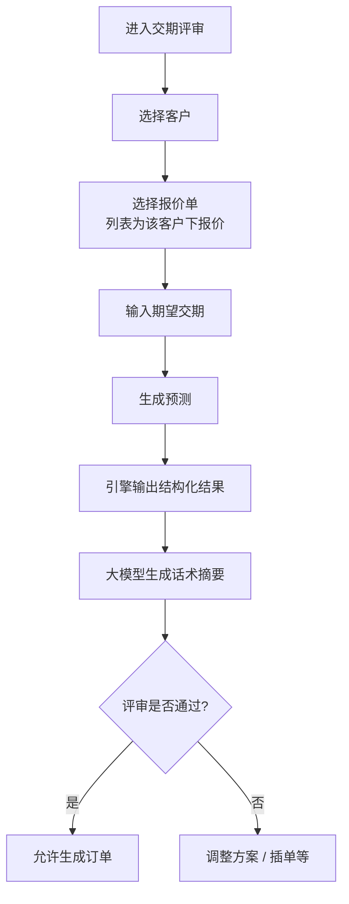

# 交期评审 · 业务需求说明（F07）

**文档受众**：产品经理、业务、UED、项目管理  
**说明**：描述 **交期评审（PRD F09）** H5 流程：**选客户 → 选报价单 → 录入期望交期 → 生成预测 → 输出结构化结论与话术归纳**；**评审通过**后方可进入 **生成订单**（与跳过评审路径并存）。总背景见 `.output/PRD.md`，报价出口见 `.output/REQ-产品报价-F06.md`。

---

## 一、功能定位

### 1.1 解决什么问题

销售在下单前需要基于 **已生效报价单** 与客户约定 **期望交期**，由系统给出 **能否按期交付**、**是否齐套** 及 **延期/卡点说明**，并形成可供对内复述的 **话术摘要**；**仅当评审结论为「通过」** 时，主链路允许 **无额外阻拦地生成订单**。

### 1.2 在整体产品里的位置

- **入口**：首页宫格「交期评审」；**产品报价**页「保存并进入交期评审」串联（继承客户与报价上下文）。  
- **出口**：  
  - **通过** → **生成订单**（`delivery_review` 状态已完成）；  
  - **未通过** → **调整方案** / **申请插单** 等绕行路径（不改变 PRD 既有分支）；  
  - **未做评审直接下单** → 仍遵循报价页「直接生成订单」及订单页风险提示（见 PRD）。

### 1.3 与大模型的边界

| 类型 | 来源 | 说明 |
|------|------|------|
| **结构化结论** | **交期/APS/库存等既有引擎**（或后端编排） | 「是否预计按期」「是否齐套」等 **布尔/枚举** 结论 **不得仅由大模型臆断**。 |
| **话术归纳** | **大模型（如 DeepSeek）** | 将引擎输出的要点 **改写为可读叙述**（卡点、对客户说法提示）；**不得单独作为合规放行依据**。 |

---

## 二、流程图（业务视角）

---

## 三、功能描述

### 3.1 步骤说明

| 步骤 | 名称 | 规则 |
|------|------|------|
| 1 | **选择客户** | 与全局 **当前工作客户** 一致；可通过客户条进入 **客户选择器** 切换；切换后报价列表随之刷新。 |
| 2 | **选择报价单** | 仅展示 **当前客户** 下的报价单列表（与方案通过 `proposal_id` 关联）；必选一条作为评审上下文；列表 **按保存时间倒序**。 |
| 3 | **输入期望交期** | 日期精度 **日**；校验不得早于企业定义的规则（若有）。 |
| 4 | **生成预测** | 调用后端 **预测接口**：聚合产能、物料、工艺等 **引擎结果**；返回结构化字段供界面与大模型拼装。 |
| 5 | **输出展示** | **是否预计按期交付**、**是否齐套**、**延期卡点**（条目化）；附 **话术摘要**（大模型）。 |
| 6 | **分支** | **通过**：展示主按钮 **生成订单**（写入评审完成态）。**未通过**：主按钮弱化或隐藏「生成订单」，强化 **调整方案** / **插单**。 |

### 3.2 与生成订单的衔接

- **评审通过**后，`delivery_review_status = completed`，进入生成订单 **无需**「未完成评审」拦截弹窗。  
- **评审未通过**：不允许在本页一键生成订单（除非用户改交期或绕行插单/调整后重新评审）。  
- **从报价跳过评审下单**：逻辑不变（见 F06 / PRD）。

---

## 四、明确不做（本页）

- 用大模型 **替代** APS/BOM 引擎给出唯一的「能不能交货」法务效力结论。  
- 在交期页 **新建报价单**（须走产品报价）。  
- 首页展示「待交期评审」汇总统计（PRD 已排除）。

---

## 五、验收关注点（业务侧）

- [ ] 客户切换后报价单列表 **仅为该客户**，无串单。  
- [ ] 必选报价单后才能 **生成预测**。  
- [ ] 预测结果包含：**按期 / 齐套 / 卡点 / 话术摘要** 四类信息（卡点可与摘要同源拆分）。  
- [ ] **仅通过**时可无阻进入生成订单（与订单页规则一致）。  
- [ ] 未通过时 **生成订单** 不可用或明确禁用理由。

---

## 六、与其它文档的关系

- 总纲：`.output/PRD.md`  
- 报价：`.output/REQ-产品报价-F06.md`  
- 首页入口：`.output/REQ-首页-F03.md`
