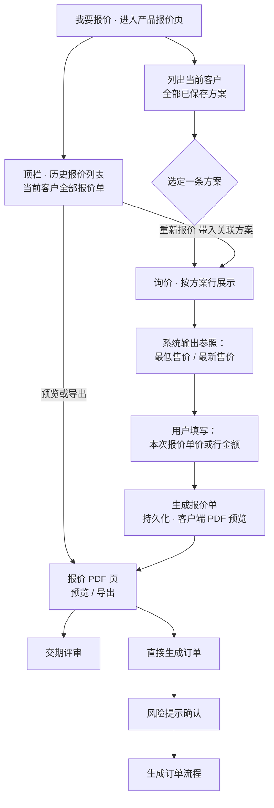

# 产品报价 · 业务需求说明（F06）

**文档受众**：产品经理、业务、UED、项目管理  
**说明**：描述 **产品报价（原 PRD F08）** 能力：**同一当前客户下展示全部已保存方案**，按 **询价 → 报价单 → 下游（交期或订单）** 流转；数值口径与 SaaS **报价引擎** 对齐由后端契约约定，本文约束 **H5 交互与分支**。总背景见 `.output/PRD.md`，方案保存见 `.output/REQ-方案速配-F05.md`。

---

## 一、功能定位

### 1.1 解决什么问题

销售需在移动端基于 **已有方案（货品快照）** 完成：**询价参照 → 填报本次报价 → 生成报价单**，并可选择 **进入交期评审** 或 **不经交期直接进入下单**（风险确认不变）。

### 1.2 在整体产品里的位置

- **入口**：首页宫格「产品报价」；方案 PDF / 方案速配保存后的「生成报价」串联（携带所选方案上下文）。  
- **出口 A**：**报价 PDF 页** 进入 **交期评审**（先已持久化报价单，上下文含 `quote_id`）。  
- **出口 B**：**报价 PDF 页** **直接生成订单**（须经 **风险提示确认**）。  
- **历史报价**：顶栏入口 **历史报价**，列表与 **方案历史** 同款交互（预览/导出、重新报价）。

### 1.3 与方案速配的关系

- **必须先存在已保存方案**（同一客户的方案列表）；报价页 **不为空购物车现场组方案**。  
- **展示范围**：当前 **工作客户** 下的 **全部方案**（多条卡片/列表），**非仅当前上下文一条**。  
- 从 PDF 进入报价时，可 **预选该 PDF 对应方案**，但仍允许用户在同一列表中 **改选其它方案**（返回「选择方案」步）。

---

## 二、流程图（业务视角）

---

## 三、功能描述

### 3.1 页面结构（分步）

| 步骤 | 名称 | 内容要点 |
| ---- | ---- | -------- |
| ① | 方案列表 | **当前客户全部方案**；卡片含名称、保存时间、金额/条目摘要；必选其一；无方案时空状态引导去 **方案速配**。 |
| ② | 询价 | 展示所选方案的 **货品行**；每行 **最低售价、最新售价**（只读参照）；用户填写 **本次报价单价**；实时显示 **询价小计** 与 **含税报价合计**（**不提供**折扣金额、附加费用录入）。 |
| ③ | 生成报价单 | 点击 **生成报价单**：**持久化**报价快照（含行明细、询价小计、合计）→ **跳转报价 PDF 页**，自动 **html2canvas + jsPDF** 生成预览（与方案 PDF 技术栈一致）。 |

### 3.2 报价 PDF 页

| 能力 | 说明 |
| ---- | ---- |
| **预览 / 导出** | 与方案 PDF 一致：iframe 预览、下载 PDF 文件。 |
| **交期评审 / 直接下单** | 固定底栏两颗业务出口；直接下单仍弹风险确认。**不在本页**提供「历史报价」入口（历史列表仅从 **产品报价顶栏** 进入）。 |

### 3.3 历史报价列表

- 与 **方案历史** 对齐：**预览/导出** → 对应报价 PDF；**重新报价** → 回到产品报价页并带入关联方案（重新询价）。  
- 列表排序：**报价保存时间倒序**。

### 3.4 数据与权限（业务语言）

- **方案列表**：过滤条件 = **当前工作客户 ID**；排序默认 **保存时间倒序**（可与列表页对齐）。  
- **询价结果**：最低售价 / 最新售价为 **只读参照**；**本次报价** 必填校验规则由企业定价策略定（原型阶段可只做 >0、格式校验）。  
- **一单报价** 绑定 **一条所选方案** `proposal_id`；切换方案须返回步骤①或②重新询价。

---

## 四、明确不做（本页）

- 用对话模型 **自动生成或改写** 单价、最低价结论。  
- 在报价页 **新建方案行项目**（须在方案速配完成）。  
- 替代 PC 端 **完整减免公式 / 多级价格体系**（H5 只做契约内字段与跳转）。

---

## 五、验收关注点（业务侧）

- [ ] 同一客户多条方案时 **列表齐全**，选中逻辑正确。  
- [ ] 询价区 **最低售价、最新售价** 展示正确（与接口/Mock）；用户填写 **本次报价** 后汇总正确。  
- [ ] 点击 **生成报价单** 后进入 **报价 PDF** 且可 **导出**。  
- [ ] 报价 PDF 底栏 **仅**含 **导出、交期评审、直接下单**；**无**「历史报价」按钮；PDF 正文 **无**折扣/附加费行。
- [ ] **历史报价** 列表齐全（从产品报价 **顶栏** 进入）；预览与 **重新报价** 跳转正确。  
- [ ] 从 PDF / 速配串联进入时 **上下文方案预选** 正确，仍可改选。

---

## 六、与其它文档的关系

- 总纲：`.output/PRD.md`  
- 方案：`.output/REQ-方案速配-F05.md`  
- 首页入口：`.output/REQ-首页-F03.md`  
- 交期评审：`.output/REQ-交期评审-F07.md`
