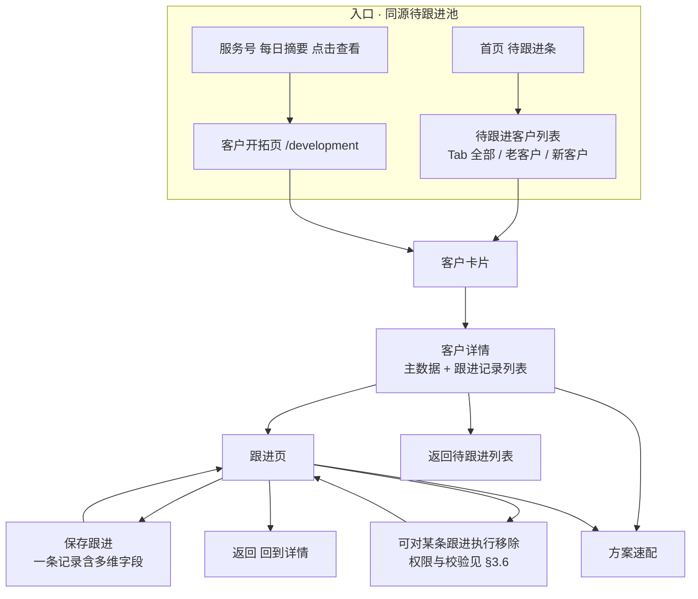

# 客户开拓 · 业务需求说明（F04）

**文档受众**：产品经理、业务、UED、项目管理  
**说明**：描述 **待跟进客户 → 客户详情 → 写跟进 → 方案速配** 闭环中的客户侧能力；技术实现另附。总背景见 `.output/PRD.md`。

---

## 一、入口

- **入口 A（首页）**：首页 **「待跟进客户」** 条 → **待跟进客户列表**（Tab：**全部 / 老客户 / 新客户**，筛选规则见 **§3.1**）。  
- **入口 B（服务号）**：**每日固定 1 次**推送 **待跟进摘要**（文案见 **§3.8**）；销售点击后 **直接进入客户开拓页 `/development`**（与 §3.1 **同源** 待跟进列表）。若链接另带 **单客** `customer_id` 深链，则 **先选中该客户** 再进入同页（与 PRD 一致）。  
- **入口 C（语音）**：意图识别指向「待跟进」时，进入 **同上待跟进列表**（见首页语音 REQ；路由可为 `/follow-ups` 或 `/development`，与实现一致）。  
- 

### 1.3 与首页宫格的关系

首页宫格 **不设**单独「客户开拓」按钮；**待跟进条**（进 `/follow-ups`）与 **服务号每日摘要**（进 `**/development`**）承担进入 **同源待跟进池** 的路径，避免多套名单口径分叉。

---

## 二、流程图（业务视角）

**说明**：首页条与 **客户开拓 `/development`** 为 **同一待跟进池**；服务号 **每日摘要** 点击 **默认进 `/development`**（与 PRD 一致）。单客深链仍可对齐当前客户。**推送规则** 见 **§3.8**。

---

## 三、功能描述

### 3.1 待跟进池：老客户 / 新客户查询逻辑

#### 3.1.1 「老客户」tab页

满足 **全部** 条件时，该往来单位归入待跟进列表中的 **老客户** 分段（若在「老客户」Tab 下展示）：

1. **分管关系**：往来单位的 **分管人员** = **当前登录用户**（本人名下客户）。
2. **超时未下单**：依据该往来单位在主数据侧配置的 **「销售提醒天数」**，结合 **订单日期**（以企业认定的「最后一单日期」或「最近有效订单日期」为准）进行判断是否 **超时未下单**；

**排序说明**：  

- 按照超时时间倒序

#### 3.1.2 「新客户」tab页

满足 **全部** 条件时，归入待跟进列表中的 **新客户** 分段：

1. **无分管人员**：该往来单位 **未指定分管人员**（或企业定义为「公海/无负责人」状态，与主数据一致）。
2. **跟进状态**：在其 **跟进记录** 中，**按时间最新的一条** 记录所填的 **「跟进状态**）为 **「跟进中」**

- **创建时间**倒序。  
- 移除某条跟进后，**须按剩余记录重算**「最新一条」**跟进状态**，客户可能 **移出** 新客户 Tab（若不再满足条件）。

#### 3.1.3 「全部」Tab 与人数

- **全部**：展示 **老客户 ∪ 新客户** 的并集（同一客户 **不重复** 展示）；

#### 3.1.4 与列表展示的关系

- **Tab 切换**即按上述规则 **过滤** 当前待跟进集合；空 Tab 给空状态。

---

### 3.2 待跟进客户列表（交互）

**页面结构**：

- 顶栏：**待跟进客户**。  
- **Tab**：**全部**、**老客户**、**新客户**  
- 下方为 **卡片列表**； 卡片顺序见3.1

| 建议信息块      | 作用                    |
| ---------- | --------------------- |
| 类型标签       | 「老客户」「新客户」与 §3.1 分段一致 |
| 客户名称、编码    | 主识别                   |
| 联系人、电话     | 即刻联系                  |
| 需求摘要或一句话画像 | 进详情前的上下文              |
| 跟进条数等      | 是否已留下跟进痕迹             |
| 主按钮        | 「查看详情」                |

**交互逻辑**：

- 切换 Tab：按 §3.1 规则 **过滤集合**（前端过滤或服务端分页参数变化均可，以性能与一致性方案为准）。  
- Tab 为空：空状态提示。  
- 点击 **查看详情**：切换 **当前工作客户** → 打开 **客户详情**；记住来源为 **待跟进列表**。

#### 跟进记录的查询与新增（与 §3.4、§3.5 对齐）

从待跟进列表进入 **客户详情** 即对该客户 **跟进记录的查询**（时间线列表）；进入 **写跟进** 即 **新增** 一条记录。每条跟进（查询展示与新增保存）须包含并可查看以下 **六个业务字段**（另含系统写入的 **记录人、记录时间**）：

| 字段       | 说明                                                               |
| -------- | ---------------------------------------------------------------- |
| **联系人**  | 本次沟通对接人姓名。                                                       |
| **联系方式** | 电话、微信等。                                                          |
| **发货地址** | 文本或结构化地址。                                                        |
| **跟进信息** | 沟通纪要正文。                                                          |
| **提醒日期** | 再次跟进或履约提醒日期；是否必填见 §3.5。                                          |
| **跟进状态** | 与 §3.5 **客户状态** 为同一字典字段（界面统一称「跟进状态」）；**「跟进中」** 为 §3.1.2 新客户池判定值。 |

---

### 3.4 客户详情页

**结构**：

- 顶栏：**客户详情**。  
- **返回列表** → **待跟进列表**。  
- **主数据区**：只读（编码、名称、性质、类别、结算客户、等级、联系人手机等——以企业字段为准）；**不改主数据**。  
- **跟进记录区**：按时间 **新在上**；**列表** 仅关键字段 + **详情** 查看全量（§3.5）；须含 **记录人、记录时间** 与摘要所需维度。

**交互**：

- **写跟进** → 跟进页（携带返回详情所需上下文）。  
- **去方案速配** → 选品起点，**不换客户**。  
- 进入详情时 **当前工作客户** 必须为该客户。

---

### 3.5 跟进页：表单字段与数据处理

销售 **每保存一条**，即写入 **挂在当前客户名下** 的一条 **跟进记录**（可多笔累积）。

#### 表单字段（产品设计）

| 字段                    | 含义与交互要点                                                                  |
| --------------------- | ------------------------------------------------------------------------ |
| **联系人**               | 本次沟通或对接人姓名；可与主数据默认带出，允许改填。                                               |
| **联系方式**              | 电话/微信等；格式校验由企业约束。                                                        |
| **发货地址**              | 文本或结构化地址，由表单与主数据联动策略定。                                                   |
| **跟进信息**              | 本次沟通纪要正文，多行文本。                                                           |
| **提醒日期**              | 再次跟进或履约提醒日期（日期控件）；**必填与否由配置决定**，未定前建议可先 **选填** 降低摩擦。                     |
| **客户状态**（界面：**跟进状态**） | 选项来自 **企业客户状态字典**；其中 **「跟进中」** 为 **新客户分段规则（§3.1.2）** 的判定值，须在字典中存在且与各端一致。 |

**保存规则**：

- 与业务约定的 **最低必填集** 未满足则阻断保存并提示（通常 **跟进信息** 必选；其余按配置）。  
- 保存成功后：**跳转至该客户的客户详情页**（`/follow-customer/:id`），列表来源 `from` 与进入写跟进时的 **returnTo** 一致，便于「返回列表」；写跟进页 **仅负责新增**。**操作人、创建时间** 由系统写入。

**跟进列表（客户详情）**：

- **列表区** 仅展示 **关键信息**（如：记录时间、跟进状态、跟进信息摘要一行）；点击 **详情** 以弹层/侧栏展示 **该条** 全字段（与 §3.2 六字段一致）。  
- 每条提供 **移除** 能力（见 §3.6）（若实现于详情或详情弹层内）。

---

### 3.6 移除跟进信息

**能力**：对已保存的一条跟进执行 **移除**（对外文案可依合规称「移除 / 作废」）。

**交互**：  

- **二次确认**，防误触。  
- 成功后：列表与条数计数 **同步更新**，该条在默认视图中 **不可见**（物理删除或归档由后台决定，产品上表现为不可用）。

**权限（须企业另附规则）**：谁可移除（本人/管理员）、是否限时、是否与 ERP 同步冲突等。**本文档要求必须有明确规则**，避免纠纷。

---

### 3.7 底部行动区（跟进页）

- **返回** → **客户详情**。  
- **去方案速配** → 同上。

**兜底**：若无返回上下文，→ **待跟进列表**。

**语音填入**（若有）：仅能 **辅助填表**，不能代替保存与校验。

---

### 3.8 服务号通知与公众号推送规则

本节约定 **微信服务号模板消息** 在 **待跟进 / 客户开拓** 场景下的 **固定每日摘要推送**；与 **§3.1 待跟进池**、**PRD 路由 `/development`** 对齐。模板 ID、字段 Key、类目以微信与运营配置为准；本文定义 **业务口径**。

#### 3.8.1 策略：仅每日固定推送

| 规则项       | 约定                                                                                |
| --------- | --------------------------------------------------------------------------------- |
| **频次**    | **每个自然日最多 1 条** 待跟进摘要推送（**不做**客户进池、提醒到期等 **实时多条** 推送）。                            |
| **发送时刻**  | 由企业配置 **固定时点**（如每个工作日 **09:00**）；**节假日是否发送** 可配置（默认可与工作日一致或跳过）。                   |
| **统计口径**  | 推送批次计算时，按 **当前登录销售** 维度，统计其在 **§3.1「全部」Tab 并集** 下的待跟进客户数 **n**（与首页待跟进条人数 **一致**）。 |
| **n = 0** | **可不发送**；若发送则文案须明确 **「今日无待跟进客户」** 等，避免空点焦虑（二选一由企业在实施时定稿）。                         |

#### 3.8.2 推送对象

| 规则项     | 约定                                                                  |
| ------- | ------------------------------------------------------------------- |
| **接收人** | **当前待跟进池内有客户的销售**（本人名下口径与 §3.1 一致）；仅向 **已关注且已绑定** 服务号的账号下发。         |
| **公海**  | 公海池内客户是否计入 **某位销售** 的 **n**、是否单独推送给认领角色，由 **企业与后端权限** 定稿，须在实现前写清规则。 |

#### 3.8.3 推送文案（必含要素）

| 要素         | 约定                                                |
| ---------- | ------------------------------------------------- |
| **数量**     | 明确 **今日待跟进客户 `n` 个**（`n` 与 §3.8.1 统计一致）。          |
| **行动引导**   | **「点击查看」** 或等价 CTA（可配固定后缀如「进入客户开拓」）。              |
| **禁止默认展开** | 正文 **不罗列** 具体客户姓名、电话、订单金额等敏感明细（防外泄）；详情在 H5 列表内查看。 |

#### 3.8.4 点击落地页

| 规则项               | 约定                                                                                                                        |
| ----------------- | ------------------------------------------------------------------------------------------------------------------------- |
| **主路径**           | 点击模板消息后，打开 H5 并 **直接进入 `客户开拓` 路由 `/development`**，展示 **与 §3.1 同源** 的待跟进客户列表（Tab：**全部 / 老客户 / 新客户** 与首页条一致）。               |
| **无 customer_id** | **每日摘要链接可不携带** `customer_id`；进入列表后 **不自动切换** 当前工作客户（保持用户上次客户或系统默认策略，与全局一致）。                                               |
| **带 customer_id** | 若同一业务域另有 **单客活动模板** 且 URL 带 `**customer_id`**：行为遵从 **PRD 服务号深链**（`setCustomer` 后 **replace** 至 `**/development`**，再展示列表）。 |

#### 3.8.5 送达失败与审计

| 规则项    | 约定                                                                        |
| ------ | ------------------------------------------------------------------------- |
| **失败** | 用户拒收、未关注、接口失败：**不依赖重试触达**（避免刷屏）；**待跟进列表与首页人数仍为真源**。失败可记日志，重试策略由运维/接口规范另定。 |
| **审计** | 记录：**推送日期、接收人、n、模板 msgid、发送结果**（满足合规与对账）。                                 |

---

### 3.9 与方案速配

- **工作客户**与详情一致后进入方案速配；方案保存仍在方案速配内完成。

---

## 四、明确不做（本能力域）

- 在详情内 **改写客户主数据**（仅跳转主数据能力）。  
- 用跟进单行字段 **取代** ERP 正式单据效力（留存/不可删版本在技术或合规方案中单列）。  
- 本模块内交付 **排行榜、漏斗** 等经营看板。  
- **多轮语音澄清**、自动追问补全客户/意图（与首页 REQ 全局策略一致）。

---

## 五、验收关注点（业务侧）

- 首页条与 `**/development` 客户开拓页** 为 **同源待跟进池**；人数与列表「全部」一致。  
- 服务号 **每日摘要** 落地 `**/development`**；文案含 **n + 点击查看**；单客 `**customer_id`** 深链时 **当前工作客户** 正确。
- **老客户 / 新客户 / 全部** Tab 与 **§3.1** 规则一致；排序见各 Tab 说明。  
- 跟进表单字段与 §3.5 一致；**移除** 有确认且列表与计数 **一致**。  
- 「跟进中」字典与 **新客户** 规则 **一致**；详情/写跟进每条含 **六字段**（§3.2）+ 记录人、时间。  
- **公众号每日摘要**：§3.8 **每日 1 次、文案含 n + 点击查看、落地 `/development`**；`n` 与首页条一致；列表为真源。

---

## 六、与其它文档的关系

- 总纲：`.output/PRD.md`  
- 工作台首页：`.output/REQ-首页-F03.md`  
- 方案速配：`.output/REQ-方案速配-F05.md`

