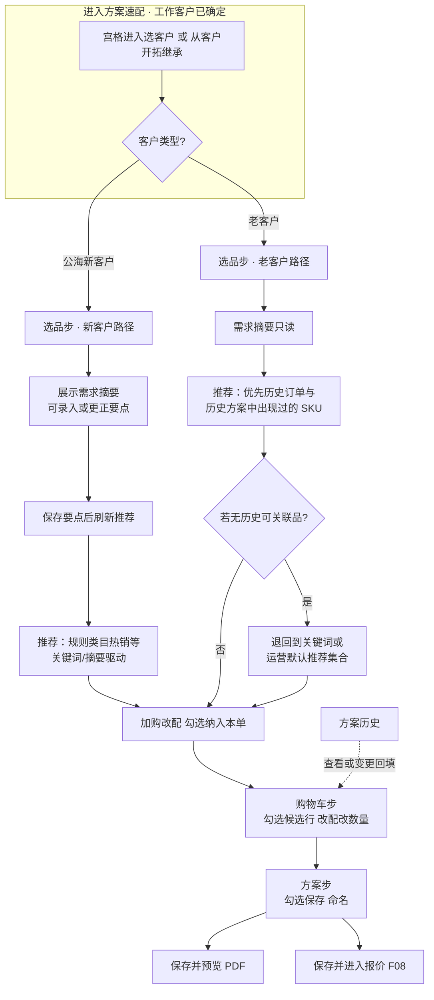

# 方案速配 · 业务需求说明（F05）

**文档受众**：产品经理、业务、UED、项目管理  
**说明**：描述销售从 **选商品 → 维护购物车 → 定稿方案 → 预览或去报价** 的完整业务闭环；技术实现选型另附。**不**在本篇展开 PDF 排版细节、报表、经营分析。总背景见 `.output/PRD.md`。

---

## 一、要解决什么问题

销售需要围绕 **某一个客户**，在会话或拜访过程中快速完成：**看到推荐或可卖品 → 加车并改规格数量 → 把其中一部分定型为「一份方案」→ 给客户看（预览/导出）或进入报价**。  
这些产品动作应 **集中在同一业务能力里连续完成**，避免拆成多个菜单让人迷路。

---

## 二、用户与典型场景

| 场景 | 期望 |
|------|------|
| 新客户只有口头需求 | 能补一段需求摘要，据此刷新可选商品列表 |
| 老客户有订单/历史方案 | 系统优先带出「和以前买过有关的」SKU，减少从零搜 |
| 现场改规格 | 在卡片上或购物车里一键改规格、改数量 |
| 只带部分 SKU 先做方案 | 购物车里可多行，但只有勾选的带进「定方案」这一步 |
| 方案要给客户过目 | 保存后直接去预览/导出 |
| 方案已定要算价 | 保存后直接去报价页面，后续链路与 PRD 主流程一致 |

---

## 三、业务能力拆成三块（对用户可见的三步）

产品内部可对应「选品 / 购物车 / 方案」三块界面；对销售来讲尽量 **少概念**，仅用 **顶部两个主 Tab：选品、方案**，购物车从选品页的「购物车」入口进入（避免 Tab 过多）。

### 业务流程图（新客户 vs 老客户）

以下从 **业务视角** 区分 **公海新客户** 与 **老客户** 在 **选品步** 的差异；**购物车 → 方案 → PDF/报价** 对两类客户 **主路径一致**。

### 第一步：选品

**始终展示**

- **当前是哪个客户**（可换客户，换客户后本页内容与购物车口径都应对齐到该客户）。  
- **客户需求摘要**：来自客户档案或会话沉淀的摘要文案。  

**对客户类型的差异**

- **公海新客户**：允许 **录入 / 更正需求要点**，保存后触发 **刷新推荐列表**（推荐引擎由企业服务决定；若暂无智能推荐，也需有「规则 / 类目 / 热销」类的可用结果）。  
- **老客户**：摘要 **只读**；推荐逻辑偏向 **关联其历史订单、历史方案里出现过的品**，没有再退回到关键词或运营的默认推荐集合。

**推荐呈现**

- 一次聚焦 **少量 SKU**（例如卡片轮换或滑动多条），每张卡上能看到：名称、价格与单位、当前规格简述、可选「改规格」与数量增减。  
- 支持：**勾选纳入本单**（表示打算把该 SKU 放进本单方案考量）、**一键加入购物车**（按当前规格与数量）。

**购物车入口**

- 显示购物车内 **件数**，点进购物车子界面。

**主行动**

- **生成方案**：在「既没有勾选的本单 SKU、购物车也是空的」时不可点；只要有其一即可进到 **「方案」定稿界面**「（具体是否自动把勾选的 SKU 先进购物车，以实现为准，但必须符合销售理解的「我带的东西就是这些」）。

### 第二步：购物车

列出 **当前客户购物车** 中的所有行：

- 每行：**是否带入本轮方案候选**（默认建议 **全勾选**，省事；销售可关掉某些行）。  
- 可调 **数量**，可 **删行**，可 **改配**。  

**两类金额概念（对用户说得清）**

- **本轮勾选行的金额小计**（即将参与方案的那一部分）。  
- **购物车全部行的合计**（避免销售误以为勾选就是全部）。

**主行动**

- **带所选进入方案**：若一行都没勾，不可用；勾选 **全部行**与勾选 **其中几行**，在下一步「方案页」默认勾选中应一致——即 **带谁进来，谁就默认在打勾清单里**，直到销售再改。

### 第三步：方案（定稿）

**前提**

若购物车已无商品：提示先去选品或加购，不要出现「空方案静默保存」这种体验。

**列表**

购物车中 **尚未被上一单保存清掉的行**，逐条展示并可 **再次勾选**：只有勾选的才会进入即将保存的方案。

每条可展示：品名、规格、数量单位、 **行金额小计**。支持 **改配**（最后一次机会把规格对齐现场沟通）。

**方案名称**

系统自动命名即可（例如：**方案-客户名-日期**，若这次是 **基于历史方案的改版**，名称上应能看出 **变更**语义，便于销售区分版本）。

**两个出口（业务关键）**

1. **保存方案并预览**：生成「当前客户下的一份正式方案」，并跳到 **预览/导出** 能力页，便于发客户或现场确认。  
2. **保存方案并生成报价**：方案落库成功后，携带 **这份方案的业务上下文进入报价**，后续必须遵守 PRD：**报价是下单前的必经语义环节**。

**保存之后对购物车**

- 已被本次方案采纳的行应从 **购物车**中移除（或等价业务处理），避免误以为还能再卖一遍同一购物车行不重存方案——若企业希望「复制一行继续改」，应由单独产品策略说明，本篇按 **当前已定稿**：保存即消费掉对应行。

---

## 四、与「方案历史 / 改版」的关系（业务口述）

销售在 **方案历史**中看到某一版方案，可选择 **改版**：

- 系统切换到 **该方案所属客户**；  
- 将该方案的行 **放回购物车**，销售在购物车 / 方案里继续改；  
- **新版本保存时必须能追溯是从哪一版改的**（对上账、对上客户沟通都很有用）。

方案速配页顶部应能 **跳到方案历史** 查看往期。

---

## 五、与设计/体验相关的统一要求（摘要）

- 本页面 **底部不再固定占一条「全局语音打字」**，避免和手机键盘、购物车操作抢位置；若在其它页保留全局输入，本产品内由统一交互规范规定。  
- 顶栏标题 **方案速配**；一侧提供 **历史方案** 入口。  

（字体层级、留白、无障碍等遵从全站 UI 定稿，不在这里展开像素。）

---

## 六、与报价、下单主流程的边界

- 方案速配 **不产生最终报价**，只产生 **可被报价引用的方案**。  
- 是否进入交期评审、是否在报价环节 **直接生成订单**，遵从 **`.output/REQ-产品报价-F06.md`**；交期评审细则见 **`.output/REQ-交期评审-F07.md`** 与 **`.output/PRD.md`**。

---

## 七、不做 / 不推荐在本能力里掺杂的事

- 用「智能」话术替销售 **自动定价、自动承诺交期、自动改写订单状态**。  
- 把推荐排序伪装成 AI 权威决策而不经企业引擎或规则兜底。  

---

## 八、验收时关注什么（业务侧）

- [ ] 新客户能录需求并重算推荐；老客户看到与历史有关的推荐或可接受的备选。  
- [ ] 加车、改配、改数量在销售路径上顺滑；购物车「候选勾选 vs 全车」两件事用户能理解。  
- [ ] 「带所选进入方案」后，方案页默认勾选的正是带进的那一批。  
- [ ] 保存方案后：方案在历史中可见；购物车处理符合「已采纳的行不再挂在待购物车」的规则；改版场景能追到父版本。  
- [ ] 两个出口：**预览 / 报价** 均能接上各自下一环业务。  
- [ ] 换客户后页面数据不会串客户。  

---

## 九、与其它文档的关系

- 主链路、合规与数据源：**`.output/PRD.md`**  
- 工作台入口：**`.output/REQ-首页-F03.md`**  
- 产品报价：**`.output/REQ-产品报价-F06.md`**  
- 交期评审：**`.output/REQ-交期评审-F07.md`**
