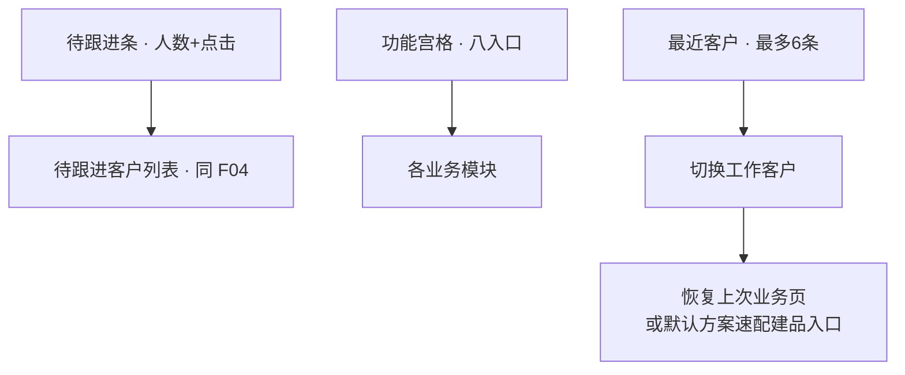
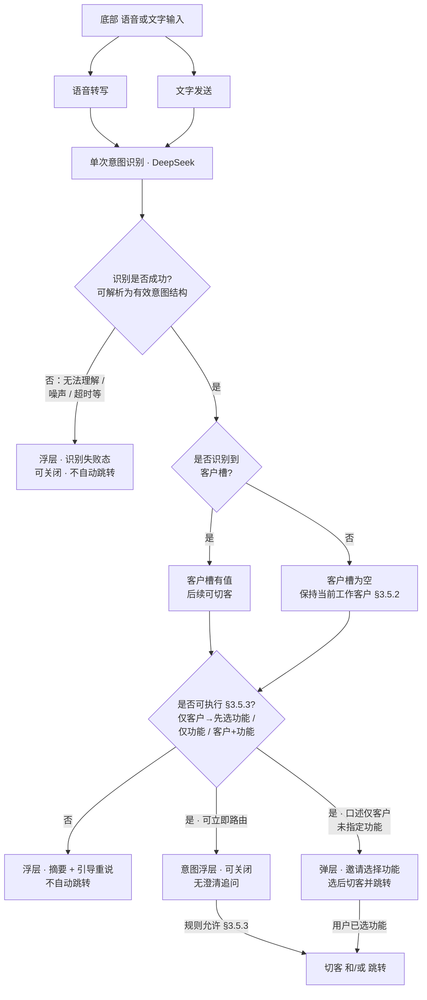

# 首页 · 业务需求说明（F03）

**文档受众**：产品经理、业务、UED、项目管理  
**说明**：描述 **智能销售助手首页** 作为工作台的能力：待跟进入口、功能宫格、最近客户恢复、底部语音/文字意图；技术实现另附。总背景见 `.output/PRD.md`。待跟进 **客户池与 Tab 分段规则** 以 `.output/REQ-客户开拓-F04.md` §3.1 为准，本文只约定首页侧 **如何展示与跳转**。底部意图识别 **计划采用 DeepSeek 大模型** 做语义解析（见 **§3.5.6**），业务侧只约束 **槽位语义与分支行为**。

---

## 一、功能定位

### 1.1 解决什么问题

一线销售打开 H5 后，需要在 **同一屏** 完成：

- **知道今天待办规模**：待跟进客户 **人数可感知**，并可 **一键进入列表**处理；  
- **快速进入各销售能力**：通过 **宫格** 进入方案、报价、订单等（是否先选客户由落地页承接）；  
- **接着上次的活干**：对常联系客户 **恢复上次停留的业务页面**；  
- **口述即达（可选能力）**：底部 **语音/文字** 做 **单次意图识别**，用 **客户（可选）+ 功能** 两槽位驱动切客或跳转，**无多轮澄清**。

首页 **不做** 重表单、不做客户主数据编辑、不做经营看板。

### 1.2 在整体产品里的位置

- **入口**：登录成功后的 **默认工作台**（账号体系决定未登录是否先进登录页）。  
- **出口 A**：**待跟进条** → `**/follow-ups` 待跟进客户列表**；与 **服务号每日摘要**（点击进 `**/development` 客户开拓**）、语音「待跟进」类结果 **同源客户池**（详 **F04**）。  
- **出口 B**：**功能宫格** → 各业务模块（方案速配、报价、交期、订单等）。  
- **出口 C**：**最近客户**点击 → 切换工作客户并 **恢复业务 URL**（或默认进方案速选配品）。  
- **出口 D**：**底部输入** 提交 → 意图浮层 → 在规则允许下 **切客 / 跳转**。

### 1.3 与待跟进、宫格的关系

- **待跟进条** 与 **宫格** 分工：待跟进解决 **「名单从哪来」** 的入口；宫格解决 **「我要办哪类事」**；**宫格不包含「待跟进」按钮**（避免与顶条重复）。  
- 待跟进 **人数** 与列表 **「全部」Tab** 下客户集合 **一致**（并集口径见 F04 §3.1.3）；若首页需展示「未读通知数」等，**另开需求**，不默认替代人数。  
- **不存在**单独「客户开拓列表」页；所有 **名单类** 落地均为 F04 中的 **待跟进客户列表**。

---

## 二、流程图（业务视角）

为减少连线交叉与节点堆叠，**拆成两张图**：图 2-1 描述 **工作台主出口**；图 2-2 单独展开 **底部语音／文字意图识别**链路（与 §3.5 对齐）。

### 图 2-1｜首页工作台 · 主出口（不含语义解析）

> 顶栏、底部输入区与本图 **并列存在于同一首页**；**底部语音／文字 → 意图识别** 见 **图 2-2**。

### 图 2-2｜底部输入 · 单次意图识别与分支

**说明**：

- **识别成功**：系统得到 **可用的意图结构**（至少能判断「要干嘛」或能进入「仅客户/仅功能/组合」的一条规则路径）；**失败**则 **不向用户自动执行切客或路由**，仅以 **识别失败态浮层** 提示并可关闭（可自愿再输入）。  
- **客户槽**：**识别到客户** = 口述中可 **映射到企业主数据客户**（或企业允许的别名）；**未识别到** = **不切换** 当前工作客户（与 §3.5.2「未提客户＝保持当前客户」一致）。  
- **可执行动作**：在 **识别成功** 前提下，若组合为 **仅客户**（未指定可映射功能）→ **先选功能** 再 **切客并跳转**（见 §3.5.3、流程图 `PICK`）；若为 **仅功能**、**客户+功能** 等可立即路由情形 → **意图浮层** 后直接 **切客/跳转**；**不具备**可执行路径 → **无法路由** 浮层（见 §3.5.8 文案基线）。  
- 顶栏宫格等路径 **不记录**「回到首页」为客户维度的 **业务恢复点**（见 §3.4），避免冲掉有效进度。

---

## 三、功能描述

### 3.1 待跟进条（强入口）

#### 3.1.1 页面结构

- 位于顶栏下方首块 **可点击条**（视觉为卡片/条均可，由 UED 定）。  
- **左侧文案**：待跟进客户（固定或企业文案配置）。  
- **右侧**：**人数 + 单位**（如「12 位」）。

#### 3.1.2 数据与查询逻辑（业务语言）

- 展示数字 = **待跟进客户列表中「全部」Tab 下的客户条数**（**老客户 ∪ 新客户** 去重后的数量，定义见 **F04 §3.1**）。  
- **不**在首页混合：交期待办数、插单数、业绩类指标。

#### 3.1.3 交互逻辑

- **整条可点** → 进入 `**/follow-ups`**（与服务号摘要 `**/development**` **同源池**，详 F04）。  
- 数字随 **列表数据源** 刷新（打开首页拉数、推送刷新、从列表返回后刷新等策略由产品/性能定，**口径不变**）。

---

### 3.2 顶栏

- **标题**：**智能销售助手**（全站顶栏规范一致）。  
- **无副标题**（按当前 UI 定稿）；不在此页承载用户姓名/角色长文案，避免挤占。

---

### 3.3 功能宫格

#### 3.3.1 页面结构

- **布局**：多列宫格（如 4 列换行），每格为 **主按钮**。  
- **数量与顺序**：固定 **8** 项如下（后续若 **权限** 隐藏部分格，见 §3.6）。

| 顺序  | 名称   | 业务含义（跳转目标） |
| --- | ---- | ---------- |
| 1   | 方案速配 | 进入方案速配能力   |
| 2   | 产品报价 | 进入报价能力     |
| 3   | 交期评审 | 进入交期评审能力   |
| 4   | 生成订单 | 进入下单能力     |
| 5   | 订单复制 | 进入复制订单能力   |
| 6   | 订单变更 | 进入订单变更能力   |
| 7   | 订单进度 | 进入订单进度列表   |
| 8   | 客户服务 | 进入客户服务能力   |

#### 3.3.2 交互逻辑

- 点击某一格 → **直接进入** 对应模块（**无**二次确认）。  
- **不在宫格中** 放「待跟进」「客户开拓」类 **名单入口**（已由 §3.1 承担）。  
- 若目标模块 **要求尚未选择客户**，由 **落地页** 提示选客或引导换客户，**不由首页拦截**。

---

### 3.4 「最近客户」

#### 3.4.1 数据与排序逻辑（业务语言）

- **名单范围**：从企业 **客户主数据可见集合** 中取；**最多展示 6 条**。  
- **排序**：  
  1. 优先展示 **「有业务恢复点记录」** 的客户，且按 **该记录最近活跃时间倒序**（谁最近被跟着做业务谁在前）；
- **恢复点**：指 **该客户维度** 下，销售 **上次离开业务功能时** 停留的 **页面路径（含子步骤参数）**；**不** 把 **进入首页**、**登录页**、**仅选客户页** 等写入为「业务恢复点」

#### 3.4.2 卡片信息结构

| 信息块       | 作用         |
| --------- | ---------- |
| 客户名称      | 主识别        |
| 联系人 · 最近访问页面 | 联系人由主数据带出；第二段为基于 **业务恢复点**（`fullPath`）映射的 **最近访问业务页**（如方案速配选品/购物车、产品报价等）。**不**展示新客户/老客户等 **分类标签**。 |

#### 3.4.3 交互逻辑

- 点击某客户卡片：  
  1. **当前工作客户** 切换为该客户；
  2. 打开 **已存储的恢复路径**；若无存储，则打开 **方案速配—选品** 作为默认。
- **不**在首页提供「编辑最近客户名单」；名单由 **排序规则** 自动形成。

---

### 3.5 底部语音／文字与意图识别

#### 3.5.1 能力形态

- 首页展示 **底部固定输入区**：支持 **语音**（上传转写）与 **文字** 发送（默认模式由全产品规范定，可 **单次进入页面临时切换**）。  
- 每次提交 → **单次意图识别** → **结果浮层**；**不**做 **多轮澄清、追问补槽**。  
- 浮层内用户点击 **前往建议页面**（或等效「跳转」操作）时：**先关闭浮层** 再 **执行路由跳转**（避免遮挡目标页）。

#### 3.5.2 槽位定义

| 槽位     | 必填？      | 含义                 | 示例（口述）     | DeepSeek / 服务端                                                     |
| ------ | -------- | ------------------ | ---------- | ------------------------------------------------------------------ |
| **客户** | **否**    | 是否切换到某 **工作客户**    | 公司名、简称     | 检索 **Top-K** 候选 → 模型 **仅选候选内 `customer_id` 或 null**（§3.5.6～§3.5.7） |
| **功能** | 依 §3.5.3 | 要去的 **业务能力**（闭合编码） | 方案、报价、待跟进… | 模型输出 `**intent_code` ∈ 映射表**；服务端 **白名单校验**                         |

**总原则**：**未提客户＝保持当前客户**；**不得**因缺客户槽位而 **拒绝** 已识别清楚的 **功能类跳转**。必须先选客的模块由 **落地页** 提示。

#### 3.5.3 组合时的业务规则

- **仅客户**（已填客户槽、**未**得到可映射的 **功能** 槽）：**不**自动进入某一业务模块；以 **弹层/弹窗** 邀请用户 **点选功能**（入口集合与 **§3.3 宫格** 对齐，可 **折叠** 为高频项，由 UED/产品定稿）。用户选定后：**切客 → 跳转**；用户关闭弹层：**不切客**（保持进入本次识别前的当前工作客户）。  
- **仅功能**：**直接跳转**；**不换客户**；下游缺客由 **落地页** 处理。  
- **客户+功能**：一般 **先切客再跳转**（与 §3.4 恢复策略的优先级在实现方案中约定，避免覆盖用户显式口述客户）。  
- **无法路由**（识别成功但 **功能** 无法映射到产品内入口，或槽位组合不构成上述任一类）：浮层 **展示识别摘要** + **引导重试**（文案基线见 **§3.5.8**）；**不自动跳转**、**不澄清追问**。

#### 3.5.4 与宫格、待跟进的语义对齐

- **功能** 槽位说法应与 **§3.3 八宫格**、**待跟进列表**、**写跟进** 等产品入口 **同一套「能去哪」**，避免「说了认不出」。  
- **客户** 槽位与 **主数据客户** 对齐（简称、别名等若企业维护则更好）。

#### 3.5.5 边界（与 PRD 一致）

- 意图结果 **仅** 用于 **导航与切客**；**不** 自动改写报价、交期、订单结论；**不** 替代业务引擎。

