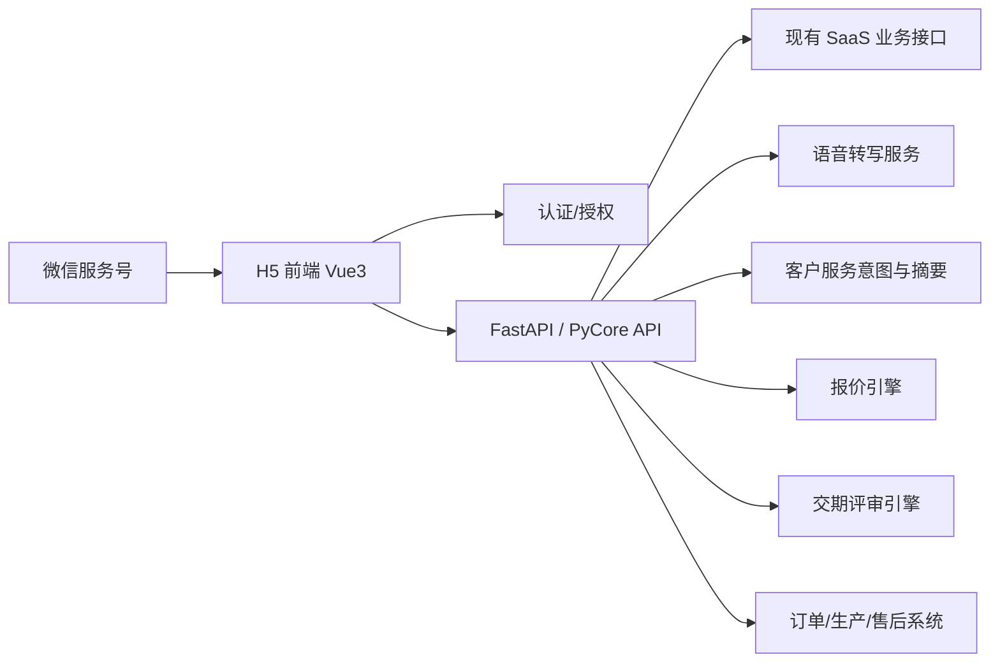
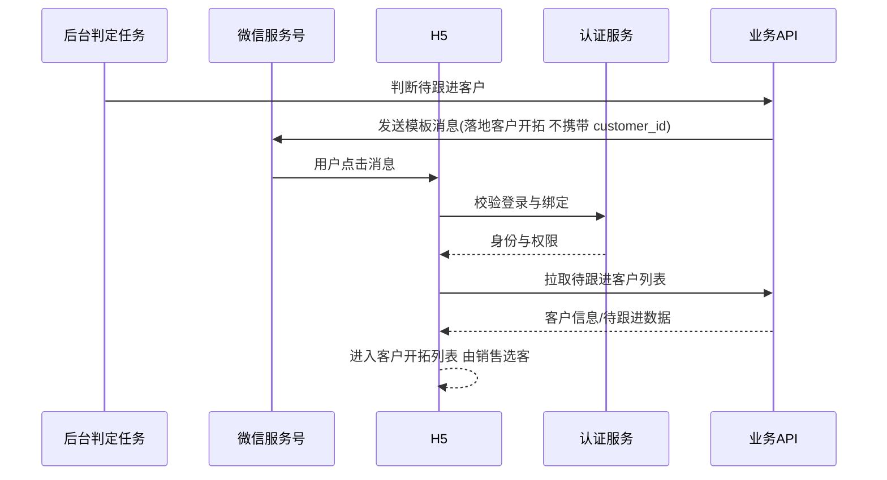
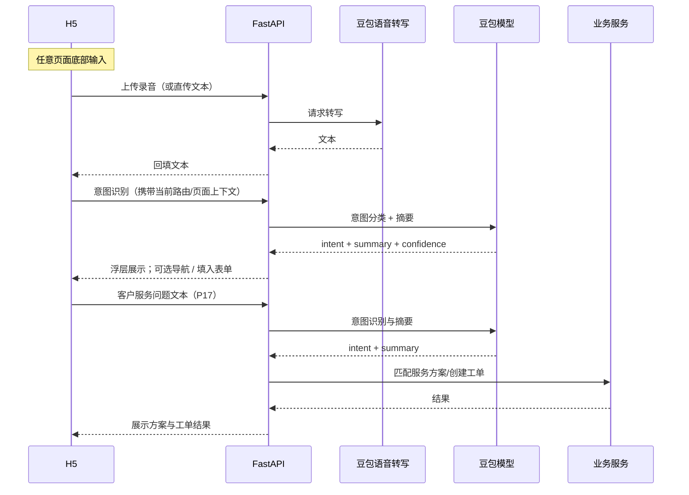

# 架构蓝图：H5 客服智能体系统

> 技术栈约束：前端 Vue 3 + TypeScript；后端 Python 3.11+ / FastAPI / PyCore。  
> 数据源：现有制造业 SaaS 同源数据。  
> 模型：豆包大模型，仅用于语音转写、客户服务意图识别与摘要。

---

## 1. 系统分层



---

## 2. 前端模块

| 模块 | 职责 |
|------|------|
| Auth Shell | 登录态、服务号深链回跳、Token 过期处理 |
| App Home | 功能宫格、待跟进客户入口、最近客户（按客户记录上次业务路由并恢复） |
| Customer Context | 客户条、客户切换、上下文继承 |
| Voice Dock（全局） | **全页面**底部固定：语音/文字输入、转写回填；提交后展示意图识别结果浮层；可选导航建议与「填入当前页」 |
| Intent（全局） | 对用户 utterance 做意图识别与一句摘要；与 F14 客户服务意图能力同栈、不同展示策略；**不参与**报价/交期/订单决策 |
| Flow Router | 客户、购物车、方案、报价、评审、订单上下文传递 |
| Business Pages | F04–F14 各业务页面 |
| Permission Menu | 按后端权限配置渲染宫格 |

---

## 3. 后端服务边界

| 服务 | 职责 |
|------|------|
| Auth API | 复用 SaaS 登录与权限 |
| WeChat API | openid 绑定、模板消息、深链参数 |
| Customer API | 客户列表、待跟进客户、跟进回写 |
| Product API | 产品目录、历史产品、推荐结果 |
| Cart API | 按客户维护购物车 |
| Proposal API | 方案保存、方案列表 |
| Quote API | 报价模型、报价保存 |
| Delivery API | 交期评审、问题清单、插单提交 |
| Order API | 订单创建、复制、变更、进度查询 |
| Service API | 客户服务匹配、工单创建 |
| Voice API | 录音上传、服务端语音转写 |
| Model API | 语音转写后的文本意图识别（全页）、客户服务意图识别与摘要 |

---

## 4. 核心上下文

```typescript
type FlowContext = {
  customer_id: string
  cart_id?: string
  proposal_id?: string
  quote_id?: string
  delivery_review_id?: string
  order_draft_id?: string
  from_task_id?: string
}
```

传递规则：

1. **方案速配（F05）**起至 F10，存在 `customer_id` 时不重复选客户。
2. 保存方案后生成 `proposal_id`。
3. 保存报价后生成 `quote_id`。
4. 生成订单必须携带 `quote_id`，并可追溯 `proposal_id`。
5. 服务号深链进入客户开拓时必须校验客户权限。

---

## 5. 服务号消息链路



---

## 6. 语音与模型链路



约束：

- 语音转写可用于任意自由文本输入。
- **全页意图识别**：任意页面提交输入后，模型返回意图标签与摘要，用于导航建议或填表辅助；**不得**自动改写报价、交期、订单状态或推荐排序。
- 客户服务（P17）在意图与摘要基础上匹配方案并创建工单。
- 报价、交期、订单、推荐排序不使用模型直接决策。
- 初始化 httpx/openai 等网络客户端时不继承环境变量代理配置。

---

## 7. 安全与审计

| 场景 | 要求 |
|------|------|
| 登录 | 复用 SaaS Token；过期回 P01 |
| 数据权限 | 后端强校验 customer_id、proposal_id、quote_id 权限 |
| 服务号 | openid 与 user_id 绑定关系由既有能力维护 |
| 录音文件 | 上传与访问均需鉴权 |
| 交期风险下单 | 记录风险确认用户、时间、方案、报价 |
| 插单申请 | 记录理由、用户、客户、方案/报价上下文 |
| 异常订单 | 记录异常原因、备注、提交人、时间 |

---

## 8. 接口原则

1. H5 只调用 API，不直接访问数据库。
2. API 返回统一错误码与可读错误信息。
3. 写操作需要幂等键或后端幂等保护。
4. 页面刷新后可通过 URL / state 恢复上下文。
5. 所有关联 ID 均以后端返回为准。

---

## 9. 开发顺序建议

1. H5 壳、路由、权限菜单、客户上下文。
2. 服务号深链与待跟进客户入口。
3. 客户开拓与语音转写。
4. 方案速配（选品、购物车、保存方案）。
5. 报价、交期、订单主链路。
6. 订单复制、变更、进度。
7. 客户服务匹配与工单。
8. 全链路审计、异常态、验收测试。

---

## 10. 非功能验收

- 首屏功能入口可见。
- 列表分页和懒加载。
- 触控目标不小于 44×44px。
- 录音失败可改手输。
- 弱网下不丢失已输入文本。
- 禁止出现 PRD 未定义的经营指标与底部全局导航。

