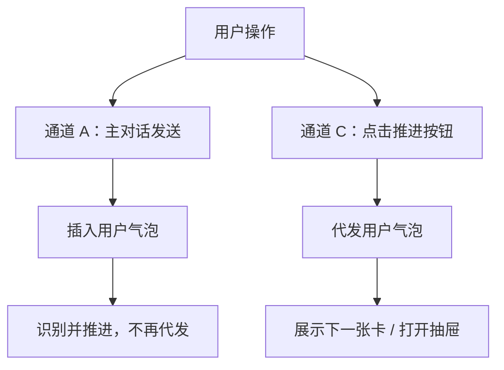
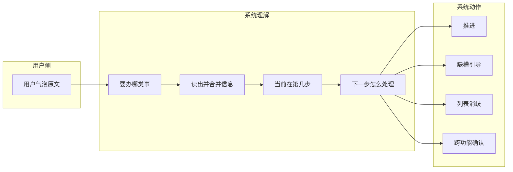

# 用户输入与意图填槽需求（v1.2.0）

> **读者**：产品、业务、测试、实施顾问。  
> **本文说明**：各**输入通道**下的用户操作、填槽方式与验收要点。  
> **处理逻辑概要**：[《用户输入与意图处理逻辑》](./用户输入与意图处理逻辑.md)  
> **字段与缺槽文案**：《数据填槽需求》｜**步骤路由**：《意图路由穷举》

---

## 一、设计目标

1. **可追溯**：用户点过的按钮、选过的行、发送过的话，应在主对话时间线中可见（用户自己发的气泡，或由系统代为展示的同文气泡）。
2. **一步一槽**：系统根据「当前正在办哪件事、当前屏幕上哪张卡/哪个抽屉可操作」来理解一句话，避免用已完成步骤的规则去解析新话。
3. **三种填槽方式一致**：说话填槽、在界面上勾选/输入填槽、缺槽时的引导填槽，最终写入的业务字段与《数据填槽需求》一致。
4. **抽屉话术仅走主对话**：方案模板、报价单模板、逐项报价等抽屉**不设底部输入条**；待填时用户在**页面底部主对话输入区**说话/打字，先出现用户气泡，再按「当前打开的抽屉」规则填槽。

---

## 二、输入通道

### 2.1 通道总览


| 输入通道 | 操作入口 | 主对话是否产生用户气泡 | 系统处理 | 典型填槽方式 |
| -------- | -------- | -------------------- | -------- | ------------ |
| **A. 主对话** | 页面底部输入区（**唯一话术入口**） | **是**（用户原文） | 展示用户原话；**抽屉待填时优先按抽屉规则解析**（§2.5），否则按当前步骤识别 | 选客户、筛选、改价；抽屉打开时「第 1 个」「第一项报价 4200」 |
| **C. 控件点击** | 业务卡、技能条、列表行、抽屉确认按钮 | **是**（多为系统代发） | 代发用户话术后推进；见 §2.3 | 「预览方案」「保存方案」「下一步：选择模板」 |
| **D. 界面填槽** | 勾选、下拉、抽屉表内数字等 | **否** | 不触发话术识别，直写流程草稿 | 勾选产品、改规格、表内改单价 |
| **E. 表单提交** | 写跟进、订单确认等 | 视场景 | 表单校验后落库 | 整单必填项校验 |

#### 2.1.1 为何无通道 B

| 编号 | v1.2.0 状态 | 说明 |
|------|-------------|------|
| **B. 抽屉内话术入口** | **已废止（本版不提供）** | 早期方案曾在方案模板、逐项报价等抽屉底部设独立输入条/语音条，编号为通道 B。 |
| **能力归属** | 并入 **通道 A** | 抽屉待填时，用户在**页面底部主对话输入区**发送话术；解析范围仍锁定当前打开的抽屉（§2.5），填槽语义不变，仅**操作入口**统一为主对话。 |

文档与验收中若出现「通道 B」「抽屉底栏话术」，均指上述已废止设计；实现与标注以 **A + §2.5** 为准。

**说明**：没有「边打字边自动提交」；均需用户明确发送（点发送、语音松手、点按钮）。

### 2.2 主对话（通道 A）

**触发**：输入文字后点发送或按回车键；按住说话后松手。

**处理逻辑（业务顺序）**：

1. 在主对话右侧插入**一条用户气泡**（内容为该句原文）。
2. **若此时有抽屉正打开且待填**（选模板、逐项报价等），**优先**按 §2.5 理解本句并填入抽屉字段（解析范围锁定抽屉，不改变用户要办的业务能力）。
3. **识别功能意图**（并列业务能力，见 §3.0）：待跟进、写跟进、方案速配、产品报价、确认下单、查看历史等**同级**，按本句与当前界面判定用户要办哪一类事。
4. **全局门槛（仅选定客户）**：当意图为方案速配 / 产品报价 / 确认下单（及须绑定客户的查看、办理类操作），且顶栏**尚未选定当前客户**时，先完成选客户（话术唯一直切、多家出列表、未命中则提示）；**不**将选客户称为与待跟进、写跟进并列的「前置功能」。
5. 若意图为**待跟进**（含子步**写跟进**）：按 §4.0 处置，**不**进入方案/报价/下单分步链；写跟进未带客户时先选客户再开抽屉。
6. 若意图为**方案 / 报价 / 下单**（且客户已满足）：进行**分步识别**——结合当前步骤与活跃界面，从话里读出业务字段、合并流程草稿，判定推进 / 缺槽引导 / 消歧等（见 §3.1～§3.2）。
7. 若无法识别或必填项未齐：缺槽引导或能力说明；不擅自跳步。

### 2.3 控件点击（通道 C）

用户通过**控件点击**（业务卡、技能条、列表行、抽屉确认按钮）推进时，系统以**代发用户气泡**记录等效话术，再推进流程。代发文案须与按钮语义一致，便于主对话时间线追溯。

#### 2.3.1 通用规则：推进下一步须代发（弹出下一张卡 / 打开关键抽屉时）


| 规则 | 说明 |
|------|------|
| **何时代发** | **仅通道 C**（纯点击推进）：进入下一步前须代发 1 条用户气泡，再展示下一张业务卡或打开抽屉。 |
| **代发写什么** | 与按钮语义一致或略扩展（示例：点「预览方案」→「伺服电机，预览方案」；点「保存方案」→「保存方案」）。 |
| **为何不重复（实现方式）** | 演示**未**做「检测主对话是否已说过同义句」的去重。避免双气泡靠**通道分工**：**通道 A** 发送时已写入用户气泡，后续推进在代码里标记「不再代发」，或插入下一张助手卡时**不传**第二句代发话术。 |
| **易误解场景** | 用户**先**在主对话说「预览方案」（已有 1 条气泡），**再点**选品卡「预览方案」→ 当前实现**仍会**再代发一条（常为带品名扩展句），时间线可能出现 **2 条用户气泡**。验收若要求严格「说+点不重复」，须补同义句判断（现状未做）。 |
| **通道 A / C 分工（常态）** | **只说话、不点按钮** → 仅 1 条用户气泡；**只点按钮、不说** → 须 1 条代发；**不要**把两种操作各走一遍同一步。 |




**说明**：上图两条路径**择一**完成同一步即可；不存在「先 A 再 C 点同一按钮仍不代发」的自动去重（见上表「易误解场景」）。


#### 2.3.2 典型代发示例（方案 / 报价 / 下单主流程）

> 与 v1.2.0 演示版技能逻辑实现中的「代发用户话术」「插入助手卡（可附带代发）」对齐；**不含**仅主对话推进、代码侧标记为「不再代发」的行。

| 用户操作（点击） | 代发用户气泡（示例） | 下一步界面 |
|------------------|----------------------|------------|
| **方案** | | |
| 方案入口 · 查看历史 / 创建新方案 | 「查看历史数据」/「创建新方案」 | 历史列表 / 选品或需求卡 |
| 方案选品卡 · **预览方案** | 「{已选品名}，预览方案」或「预览方案」 | 方案预览卡 |
| 方案预览卡 · **返回选品** | 「返回选品」 | 方案选品卡 |
| 方案预览卡 · **生成方案** | 「生成方案」 | 方案模板抽屉 |
| 方案选品卡 · **修改需求** | 「修改需求」 | 待补充需求提示卡 |
| 方案模板抽屉 · **保存方案** | 「保存方案」 | 方案卡（保存时代发；出卡不再代发） |
| 方案卡 · **去报价** | 「按方案 {模板名或编号} 报价」 | 逐项报价抽屉（单方案直进） |
| 历史方案列表 · 点行（查看） | 「查看方案 {名称}」或「第 N 条」 | 方案卡 |
| **报价** | | |
| 报价入口 · 查看历史 / 新建报价 | 「查看历史报价单」/「新建报价」 | 历史列表 / 来源或选品卡 |
| 报价来源卡 · **按方案报价** | 「按方案 {名称或编号} 报价」/「按方案报价」 | 选方案列表或逐项报价 |
| 报价来源卡 · **直接选品报价** | 「直接选品报价」 | 选品报价卡 |
| 选择方案卡（报价办理）· 点行 | 「选择方案 {名称或编号}」 | 逐项报价抽屉 |
| 选品报价卡 · **下一步**（报价） | 「{品名}，逐项报价」或「下一步：逐项报价」 | 逐项报价抽屉 |
| 选品报价卡 · **返回** | 「返回报价选品」 | 选品报价卡（回退） |
| 报价选品确认卡 · **下一步：选择模板**（直选路径） | 「生成报价单」 | 报价单模板抽屉 |
| 逐项报价抽屉 · **下一步**（报价模式） | 「下一步：选择模板」 | 报价单模板抽屉 |
| 逐项报价抽屉 · **下一步**（下单模式） | 「确认下单」 | 下单确认抽屉 |
| 报价单模板抽屉 · **生成报价单** | 「生成报价单」 | 报价单卡 |
| 历史报价单列表 · 点行（查看） | 「查看报价单 {编号}」或「第 N 条」 | 报价单卡 |
| 报价单卡 · **生成订单** | 「按报价单 {编号} 生成订单」/「生成订单」 | 下单确认或选报价单列表 |
| **下单** | | |
| 下单来源卡 · **按报价单** | 「按报价单 {编号} 生成订单」/「生成订单」 | 下单确认或选择报价单卡 |
| 下单来源卡 · **直接选品下单** | 「直接选品下单」 | 选品报价卡（下单模式） |
| 选择报价单卡 · 点行 | 「按报价单 {编号} 下单」 | 下单确认抽屉 |
| 下单选品 · **下一步** | 同报价「{品名}，逐项报价」 | 逐项报价抽屉（下单模式） |
| 下单选品 · **返回** | 「返回下单选品」 | 下单选品卡 |

#### 2.3.3 其他通道 C 场景

| 类型 | 代发用户气泡（示例） | 业务行为 |
|------|----------------------|----------|
| 跨功能弹窗 · **是** | 「是」 | 沿用数据进入目标功能 |
| 跨功能弹窗 · **否** | 「否」 | 清空后重新选客户等 |
| 技能条 / 欢迎区 · 方案速配 | 方案入口标准口令（如「配个方案」） | 方案入口卡 |
| 技能条 / 欢迎区 · 产品报价 | 报价入口标准口令（如「报价」） | 报价入口卡 |
| 技能条 / 欢迎区 · 确认下单 | 下单入口标准口令（如「下单」） | 下单来源或选品 |
| 待跟进 / 写跟进 / 切换客户等 | 见 **§4.0.5** | 待跟进能力子步 |
| 复制订单 · 做方案 | 「复制订单 {单号} 做方案」 | 方案流程 |
| 变更订单 / 查看进度 | 「变更订单 {单号}」/「查看订单 {单号} 进度」 | 对应附属弹层 |

#### 2.3.4 覆盖说明（是否写全）

| 类别 | 是否已在本文档 |
|------|----------------|
| 方案 / 报价 / 下单主流程点击推进 | **§2.3.2** 概要表；分能力明细见 **§4.1.5 / §4.2.5 / §4.3.5** |
| 待跟进（含写跟进子步） | **§4.0.5**（未并入 2.3.2，避免与主流程表混在一起） |
| 主对话发送后仅解析、不再代发 | **不写进代发表**（属通道 A，实现侧「不再代发」） |
| 勾选、筛选、改下拉、版式预览按钮 | **无代发**（通道 D 或纯展示；按钮原文可为「预览 PDF」） |
| 写跟进抽屉 **提交成功** | 用户气泡「已提交跟进记录」（**通道 E** 提交反馈，非推进代发） |
| 交期 / 客服工单 / 写跟进表单内改字段 | 多为打开抽屉或通道 D，**无**统一代发表行 |

**结论**：§2.3.2 + §2.3.3 + §4.0.5 + §4.1.5 + §4.2.5 + §4.3.5 合起来覆盖 v1.2.0 演示**已实现**的通道 C 代发；若产品需求新增按钮，须同步增行。口令「按方案报价」「按报价单下单」从主对话进入时走通道 A（已有用户气泡），不在 §2.3.2 重复列出。

**原则**：一次点击推进对应**至多一条**代发；历史查看点选已在列表行代发，结果卡处不再叠一条。

### 2.4 界面填槽（通道 D）

不产生用户气泡、不触发话术识别：

- 选品卡：勾选产品、改规格、筛选框输入  
- 逐项报价抽屉：直接改表格里的数字或下拉（未点发送前）  
- 顶栏切换客户：点选客户行（可另有系统提示「已切换至某某客户」）

### 2.5 抽屉待填时，主对话话术填槽

**场景**：用户已打开某抽屉（方案模板 / 报价单模板 / 逐项报价），或仅有「待补充需求」提示卡；界面**无抽屉底部输入条**，须在**主对话输入区**发送话术完成填槽。  
**要求**：填槽语义与历史「抽屉底栏」方案一致——先产生用户气泡，再按当前抽屉规则写入，并在抽屉内回显；**操作入口**仅为通道 A（主对话）。

#### 2.5.1 判定原则


| 原则               | 说明                                               |
| ---------------- | ------------------------------------------------ |
| **以「当前打开的抽屉」为锚** | 抽屉未关闭期间，主对话输入默认服务于该抽屉，而非重新进入别的功能入口               |
| **先抽屉、后全局**      | 先尝试按抽屉语义解析；仅当本句明显不是补当前抽屉（如改口说「配个方案」）时，才走跨功能或全局规则 |
| **同样要有用户气泡**     | 主对话补充也须在时间线展示用户原话，便于业务核对                         |
| **填入结果要回显**      | 模板选中、行价变更等应在抽屉界面即时可见，并可有简短助手确认                   |


#### 2.5.2 适用界面与可填内容


| 当前待填界面                | 主对话示例                                 | 填入结果                     |
| --------------------- | ------------------------------------- | ------------------------ |
| **选择方案模板抽屉**          | 第 1 个 / 标准技术方案 / 保存方案                 | 选中模板；说保存则生成方案卡           |
| **选择报价单模板抽屉**         | 第 2 个 / 标准销售报价单 / 生成报价单               | 选中版式；可说「生成报价单」完成报价       |
| **逐项报价抽屉**（报价）        | 第一项报价 4200 / 伺服电机报价 4200 / 第 1 项数量 10 | 对应行本单报价、数量、规格            |
| **逐项报价抽屉**（下单）        | 同上 + 确认下单 / 生成订单                      | 行级字段更新；可说进入订单确认          |
| **待补充需求提示卡**（无抽屉、无表单） | 伺服电机和齿轮箱各 2 台                         | 整句写入采购需求，进入选品（同类「主对话补填」） |


**说明**：逐项报价时，若只有一行明细，可说「报价 4200」直接填该行；多行时须带「第 N 项」或品名，否则提示未找到对应行。

#### 2.5.3 与通道 A、D 的关系

- **通道 A**：抽屉打开时，主对话话术**优先**按抽屉规则解析（上表）。  
- **通道 D**：抽屉内直接改表格数字，不产生用户气泡，与主对话话术可并存。  
- **通道 C**：点抽屉内「保存方案」「生成报价单」等按钮走代发，不替代主对话自由表述。

#### 2.5.4 不应发生的情况

- 抽屉仍打开、用户已在主对话说「第 1 个」选模板，系统却当作重新「配个方案」从头开始。  
- 主对话已改价成功，抽屉内表格不更新。  
- 主对话补充有效信息，但时间线无用户气泡。

---

## 三、意图识别与填槽模型

### 3.0 业务能力分层（与「前置」说法对照）

产品上的**业务能力（技能）彼此同级**，不存在「待跟进、写跟进是方案/报价前置」的包含关系。文档处理顺序里的用词应对齐下表：

| 类型 | 含义 | 包含 | 与其他的关系 |
|------|------|------|--------------|
| **并列业务能力** | 用户要办的独立技能，彼此无包含关系 | 待跟进、方案速配、产品报价、确认下单、查看历史、交期等 | 识别到哪一个进入该能力；**写跟进不是与待跟进并列的顶层能力**（见 §4.0） |
| **能力内子步** | 某一业务能力内部的界面与填槽顺序 | **待跟进**：列表 → 企业详情 → 写跟进（§4.0 第 1～3 步）；方案/报价/下单：§4.1～4.3 | 写跟进隶属于**待跟进**流程，也可由主对话口令直达子步 |
| **全局门槛** | 进入部分能力之前须满足的条件，**不是**独立技能 | **选定当前客户**（顶栏当前客户） | 方案/报价/下单及写跟进子步等**须绑定客户**的操作适用；**今日待跟进列表本身不要求先选客户** |

**说明**：旧稿将「待跟进、写跟进」与方案/报价并列，且统称「前置场景」，易误解。本版约定——**仅「选定当前客户」为全局门槛**；**写跟进是待跟进能力下的子步**（须确定跟进对象企业）；方案、报价、下单与待跟进为同级业务能力。

### 3.1 单句处理流水线




| 概念        | 业务含义                                               |
| --------- | -------------------------------------------------- |
| **功能意图**  | 用户当前要办的**并列业务能力**：待跟进（含写跟进子步）、方案速配、产品报价、确认下单、查看历史等（见 §3.0、§4.0） |
| **已读槽位**  | 本句读出的客户、品名、数量、方案名称/编号、报价单号、筛选词、某行单价等；若本句写明则覆盖会话里旧值 |
| **当前步骤**  | 结合「正在办的功能」+「对话里最新可操作的卡片或打开的抽屉」判断                   |
| **下一步类型** | 推进 / 缺槽引导 / 消歧（多选一列表）/ 跨功能确认 / 能力说明                |


### 3.2 当前步骤怎么判定（优先级）

用户只说半句话时，系统**以当前屏幕上最相关的界面为准**。


| 优先级 | 当前界面状态                | 本句主要按什么理解                      |
| --- | --------------------- | ------------------------------ |
| 1   | 正在选方案模板（抽屉打开）         | 选第几个、模板名称、保存方案                 |
| 2   | 正在选报价单模板（抽屉打开）        | 选第几个、模板名称、生成报价单                |
| 2b  | 正在逐项报价（抽屉打开，明细已展示）    | 第 N 项或品名 + 报价、数量、规格；可说下一步或确认下单 |
| 3   | 等待新客户补充采购需求（仅提示卡、无表单） | 整句当作需求正文                       |
| 4   | 停在方案/报价「入口选择卡」未选分支    | 查看历史 或 创建新建                    |
| 5   | 正在历史/选择列表（方案或报价单多张）   | 「第 N 条」或名称、编号点选                |
| 6   | 正在选报价来源 / 下单来源        | 按方案报价、按报价单下单、直接选品等             |
| 7   | 已在方案速配流程中（选品、预览等）     | 筛选、选品、预览、改数量等                  |
| 8   | 已在报价或下单流程中            | 改价、选品、生成报价单等                   |
| 9   | 仅说出功能入口口令             | 进入对应功能入口卡或来源卡                  |


**原则**：**后出现的助手消息、后打开的抽屉**代表用户当前关注点；从该步向后检查还缺哪些必填项，而不是跳回已经完成的步骤。

### 3.3 三种填槽方式


| 方式       | 说明                 | 业务数据示例             |
| -------- | ------------------ | ------------------ |
| **话术填槽** | 从用户气泡原文识别关键词、编号、序号 | 需求描述、筛选词、方案编号、某行报价 |
| **界面填槽** | 点击、勾选、下拉、数字框       | 勾选的产品、规格、数量、抽屉内单价  |
| **缺槽引导** | 必填项未齐时提示并定位到对应界面   | 【待填写】+ 打开对应卡片/抽屉   |


字段清单与缺失话术见《数据填槽需求》；路由类型见《意图路由穷举》。

---

## 四、分功能：用户输入在各步骤的作用

### 4.0 待跟进（含写跟进子步）

> **界面与查询规则**（待跟进企业列表、新老客户判定）：见标注文档《首页与待跟进》（v1.2.0 演示沿用）。  
> **表单字段与缺槽文案**：见《数据填槽需求》标注文档（今日待跟进、写跟进行）。  
> **与方案/报价关系**：待跟进列表**不要求**顶栏已选客户；子步「做方案」切换客户后**跳入**方案速配（§4.1），不经过方案入口卡的「查看历史」分支。

#### 4.0.1 功能结构

```text
待跟进（并列业务能力）
├── 进入步：查看今日待跟进列表（无需当前客户）
├── 列表步：选择一家待跟进企业
├── 详情步：企业详情卡 + 下一步引导（写跟进 / 做方案 / 稍后再说）
└── 写跟进子步：写跟进抽屉填表并提交（须确定跟进对象企业）
```

| 概念 | 说明 |
|------|------|
| **待跟进** | 查询并展示「今日待跟进企业列表」，支持从首屏、技能条、服务号模板、主对话口令进入。 |
| **写跟进** | 在某一企业上**录入跟进记录**；为待跟进能力下的**子步**，不是与待跟进平级的另一条主流程。 |
| **当前跟进对象** | 列表点选或话术带出客户后记入「当前跟进对象」与顶栏当前客户；写跟进子步依赖该企业。 |

底部技能条可同时展示「今日待跟」「写跟进」入口：点「写跟进」时仍归属**待跟进**能力（当前活跃技能为待跟进），只是**直达写跟进子步**。

#### 4.0.2 本功能涉及的输入通道

| 输入通道 | 操作入口 | 典型场景 |
|----------|----------|----------|
| **A 主对话** | 底部输入区 | 「今日待跟进」「写跟进」「给华东精密写跟进…」 |
| **C 控件点击** | 待跟进摘要、列表行、下一步按钮、服务号模板按钮、欢迎区功能格 | 展开列表、选企业、写跟进/做方案 |
| **D 界面填槽** | 写跟进抽屉内下拉、日期等（未点提交前） | 改跟进状态、时间（不产生用户气泡） |
| **E 表单提交** | 写跟进抽屉「提交」 | 校验必填后落库（演示为前端确认） |

**说明**：写跟进抽屉**无**底部话术输入条；抽屉内补充说明走主对话（与方案模板抽屉相同，§2.5 规则适用时解析范围锁定抽屉）。

#### 4.0.3 分步：用户输入与系统处置

| 步骤 | 当前界面 | 操作入口 | 用户输入 / 操作示例 | 填槽与系统处置 |
|------|----------|----------|---------------------|----------------|
| **进入步** | 对话页首屏 / 技能条 / 左侧服务号模板 | A / C | 「今日待跟进」「今天要跟进哪些客户」；点摘要卡「今日待跟进」；点模板「查看待跟进列表」 | **功能意图=待跟进**；主对话 **1 条用户气泡**（点击代发「今日待跟进」）；展示**待跟进列表卡**（家数 = 今日待跟进查询结果，可为 0） |
| **列表步** | 待跟进列表卡 | C | 点某企业行 | 用户气泡「选择客户 {企业名}」；**静默切换**顶栏当前客户；追加**企业详情卡** + **下一步引导卡** |
| **详情步** | 企业详情 + 下一步引导 | C | 点「写跟进」「做方案」「稍后再说」 | **写跟进** → 进入**写跟进子步**（代发「写跟进」）；**做方案** → 代发「配个方案」并进入方案速配创建路径（§4.1，已绑定该企业）；**稍后再说** → 助手短句确认，不打开抽屉 |
| **写跟进子步** | 写跟进抽屉 | A / E | 主对话：「写跟进」「给某某写跟进，今天下午电话沟通过…」；抽屉内填联系人、跟进信息、时间等后点提交 | 见 §4.0.4；提交成功 → 用户气泡「已提交跟进记录」+ 助手确认；关闭抽屉 |

**列表再次展开**：摘要卡、话术「今日待跟进」可多次触发**进入步**，每次追加列表卡（业务允许重复查看）。

#### 4.0.4 写跟进子步：话术填槽与缺槽

**触发**（识别为写跟进子步，非完整待跟进列表流程）：

- 主对话：含「写跟进」「记录跟进」「给/为/帮 {企业名} 写跟进」等（见演示版写跟进意图识别规则）。  
- 控件：技能条/欢迎区「写跟进」、下一步引导「写跟进」、列表行未点但已有当前客户时直达抽屉。

**处置顺序**：

1. 主对话插入用户气泡（原文或代发「写跟进」）。  
2. 从话术解析：**跟进对象企业**（句中企业名唯一匹配）、**跟进信息正文**（冒号后或去企业名后的剩余）、**跟进状态**（「跟进完成」等 → 完成态）。  
3. **跟进对象**：  
   - 话术唯一命中企业 → 切换顶栏客户并打开抽屉，预填跟进信息；  
   - 顶栏已有客户（含刚在列表步选中）→ 直接打开抽屉；  
   - 均无 → 展示**选客户引导卡**（待续跑技能为写跟进），用户下一句点选或说客户名后继续写跟进子步。  
4. 抽屉打开后：联系人、联系方式由档案默认带入；用户可在抽屉改字段（通道 D）或通过主对话补充跟进信息（通道 A，回显到表单）。  
5. 点提交（通道 E）：校验联系人、联系方式、跟进信息、跟进时间等必填；失败提示见《数据填槽需求》。

| 槽位 | 界面 | 必填 | 话术填槽示例 |
|------|------|------|--------------|
| 跟进对象企业 | 选客户引导 / 顶栏 | 是 | 「给华东精密机械写跟进」 |
| 跟进信息 | 写跟进抽屉 | 是 | 「写跟进：已电话沟通，下周报价」 |
| 跟进状态 | 写跟进抽屉 | 否 | 「标记跟进完成」→ 状态完成 |
| 联系人、联系方式、跟进时间等 | 写跟进抽屉 | 是（见 04 文档） | 以界面选择/输入为主 |

**与进入步的差异**：「今日待跟进」**不要求**顶栏客户；写跟进子步**必须**确定跟进对象（全局门槛在**子步内**，不是整能力门槛）。

#### 4.0.5 代发与气泡（通道 C）

| 用户操作（点击） | 代发用户气泡（示例） | 下一步 |
|------------------|----------------------|--------|
| 待跟进摘要 / 展开 | 「今日待跟进」 | 待跟进列表卡 |
| 服务号模板按钮 | （进入演示页后）「今日待跟进」 | 同上 |
| 列表行选企业 | 「选择客户 {企业名}」 | 详情 + 下一步引导 |
| 下一步 · 写跟进 | 「写跟进」 | 写跟进抽屉 |
| 下一步 · 做方案 | 「配个方案」 | 方案速配（该企业） |
| 技能条 · 今日待跟 | 「今日待跟进」 | 列表卡 |
| 技能条 / 欢迎区 · 写跟进 | 「写跟进」 | 抽屉或选客户引导 |

#### 4.0.6 验收要点（待跟进）

| # | 场景 | 预期 |
|---|------|------|
| 待-1 | 主对话「今日待跟进」 | 1 条用户气泡；列表卡家数与查询一致 |
| 待-2 | 点列表一行 | 1 条「选择客户 …」；详情 + 下一步引导；顶栏切到该企业 |
| 待-3 | 下一步点「写跟进」 | 1 条「写跟进」；打开写跟进抽屉，标题含企业名 |
| 待-4 | 无客户时主对话「写跟进」 | 选客户引导卡；选定后打开抽屉 |
| 待-5 | 「给 {企业名} 写跟进：{内容}」 | 1 条用户气泡；直达该企业抽屉且跟进信息预填 |
| 待-6 | 写跟进抽屉提交成功 | 用户确认气泡；抽屉关闭 |
| 待-7 | 下一步点「做方案」 | 进入方案流程且当前客户为所选企业（不回到待跟进列表） |

---

### 4.1 方案速配

> **界面与主链路**：见标注文档《方案报价下单》§二。  
> **字段与缺槽文案**：见《数据填槽需求》方案相关行。  
> **与待跟进关系**：待跟进详情步点「做方案」→ 切换客户后**直达创建新方案**（可跳过入口选择卡）；列表/写跟进本身不要求顶栏客户。  
> **全局门槛**：本能力**须先选定当前客户**（§3.0）。

#### 4.1.1 功能结构

```text
方案速配（并列业务能力）
├── 门槛步：选定当前客户（顶栏；话术可唯一切换）
├── 入口步：入口选择卡（查看历史方案 / 创建新方案）
├── 需求子步：待补充需求提示卡（仅新客户「创建新方案」路径）
├── 选品步：方案选品卡（筛选、勾选、改规格）
├── 预览步：方案预览卡（改购买数量与规格）
├── 模板子步：方案模板抽屉（选版式、保存方案）
└── 结果步：方案卡（版式预览、去报价）
```

| 概念 | 说明 |
|------|------|
| **方案速配** | 为客户选配产品并保存**无单价**的方案；金额仅在后续报价阶段出现。 |
| **需求子步** | 新客户创建路径专用：用户在主对话发**一条气泡**作为采购需求，再出选品卡；老客户跳过。 |
| **查看历史** | 入口分支之一：只出方案卡，**不自动**打开版式预览（须点卡内「预览 PDF」）。 |
| **一句话捷径** | 单句含客户+品名+数量等时，可跳过选品/模板，直接出方案卡（见《增量验收》）。 |

#### 4.1.2 本功能涉及的输入通道

| 输入通道 | 操作入口 | 典型场景 |
|----------|----------|----------|
| **A 主对话** | 底部输入区 | 「配个方案」、筛选/选品/预览/保存、抽屉内「第 1 个」 |
| **C 控件点击** | 入口卡、选品/预览卡按钮、模板抽屉「保存方案」、方案卡「去报价」、历史列表行 | 推进各步；见 §4.1.5 |
| **D 界面填槽** | 选品勾选、规格下拉、预览卡数量、筛选框（点筛选按钮前） | 不写用户气泡 |
| **E 表单提交** | （本功能无独立整单提交抽屉） | 保存方案 = 通道 C 代发 + 落库展示方案卡 |

**说明**：方案模板抽屉、逐项报价类抽屉**无**底部话术条；待填话术走主对话（§2.5）。

#### 4.1.3 分步：用户输入与系统处置

| 步骤 | 当前界面 | 操作入口 | 用户输入 / 操作示例 | 填槽与系统处置 |
|------|----------|----------|---------------------|----------------|
| **门槛步** | 任意（未选客户） | A | 「给深圳创源配个方案」；句首客户名 | 唯一命中 → 切换顶栏客户后继续；多家 → 选客户列表；未命中 → 提示 |
| **入口步** | 方案入口选择卡 | A / C | 「查看历史方案」「创建新方案」；点两条全宽按钮 | 查看 → 历史方案列表（办理/查看模式见 §6.2）；新建 → 清空方案草稿，新客户走需求子步，老客户进选品步 |
| **需求子步** | 待补充需求提示卡（无表单） | A | 「伺服电机和齿轮箱各 2 台」 | **整句**写入采购需求（1 条用户气泡）→ 出选品卡；推荐区按本次需求匹配 |
| **选品步** | 方案选品卡 | A / C / D | 「筛选 伺服」「选品 电机」；勾选、改规格、点「预览方案」 | 筛选词/勾选写入流程草稿；预览 → 预览步（点击时代发，见 §4.1.5） |
| **预览步** | 方案预览卡 | A / C / D | 「数量改成 3」；点「生成方案」「返回选品」 | 改数量/规格；生成方案 → 打开模板子步 |
| **模板子步** | 方案模板抽屉 | A / C | 「第 1 个」「标准技术方案」「保存方案」 | 锁定抽屉解析；保存 → 方案卡 |
| **结果步** | 方案卡 | C | 「预览 PDF」「去报价」 | 版式预览无代发；去报价 → 跳入产品报价（§4.2） |

**入口捷径**：技能条/欢迎区「方案速配」→ 代发「配个方案」→ **入口步**。待跟进「做方案」→ 代发「配个方案」→ **选品步或需求子步**（已绑定该企业）。

#### 4.1.4 关键子步：话术填槽与缺槽

**需求子步（新客户）**

1. 主对话插入用户气泡（采购需求原文）。  
2. 写入**采购需求描述**后展示选品卡。  
3. 点选品卡「修改需求」→ 新提示卡，用户**再发一条**主对话气泡覆盖需求（演示规则见标注 02 §2.2）。

**方案模板子步（抽屉打开）**

| 槽位 | 必填 | 话术填槽示例 | 缺槽时 |
|------|------|--------------|--------|
| 方案模板 | 是 | 「第 2 个」「标准技术方案」 | 提示先点选或说出模板名 |
| 保存确认 | — | 「保存方案」 | 未选模板时轻提示，不生成方案卡 |

**选品 / 预览缺槽（摘要）**

| 场景 | 缺槽引导要点 |
|------|----------------|
| 未勾选点预览 | 提示先勾选产品 |
| 未预览点生成方案 | 提示先预览方案 |
| 未选模板点保存 | 提示在抽屉内选模板 |

字段级文案见《数据填槽需求》。

#### 4.1.5 代发与气泡（通道 C）

| 用户操作（点击） | 代发用户气泡（示例） | 下一步 |
|------------------|----------------------|--------|
| 技能条 / 欢迎区 · 方案速配 | 「配个方案」 | 入口选择卡 |
| 入口 · 查看历史 | 「查看历史数据」 | 历史方案列表 |
| 入口 · 创建新方案 | 「创建新方案」 | 需求子步或选品步 |
| 选品卡 · 预览方案 | 「{品名}，预览方案」或「预览方案」 | 方案预览卡 |
| 预览卡 · 返回选品 | 「返回选品」 | 方案选品卡 |
| 预览卡 · 生成方案 | 「生成方案」 | 方案模板抽屉 |
| 选品卡 · 修改需求 | 「修改需求」 | 待补充需求提示卡 |
| 模板抽屉 · 保存方案 | 「保存方案」 | 方案卡 |
| 方案卡 · 去报价 | 「按方案 {名称或编号} 报价」 | 逐项报价抽屉等（§4.2） |
| 历史列表 · 点行（查看） | 「查看方案 {名称}」或「第 N 条」 | 方案卡 |

**无代发**：筛选按钮（仅刷新卡片）、勾选/改规格/改数量（通道 D）、「预览 PDF」（纯展示层）。

#### 4.1.6 验收要点（方案速配）

| # | 场景 | 预期 |
|---|------|------|
| 方-1 | 无客户时说「配个方案」 | 先选客户或句中带出名切换 |
| 方-2 | 入口未选分支时说「选品」 | 引导先选查看历史或创建新方案 |
| 方-3 | 新客户需求子步发一句需求 | 1 条气泡；下一张为选品卡 |
| 方-4 | 选品卡主对话「筛选 伺服」 | 不回到入口卡；列表按词过滤 |
| 方-5 | 选品卡**点击**「预览方案」（未说过） | 1 条代发 + 方案预览卡 |
| 方-6 | 模板抽屉打开主对话「第 1 个」 | 1 条气泡；对应模板选中 |
| 方-7 | 模板抽屉**点击**「保存方案」 | 1 条「保存方案」+ 方案卡 |
| 方-8 | 历史列表点行（查看） | 1 条查看类气泡；不自动版式预览 |
| 方-9 | 三个模板/逐项类抽屉界面 | **无**抽屉底栏话术入口 |

---

### 4.2 产品报价

> **界面与主链路**：见标注文档《方案报价下单》§三。  
> **字段与缺槽文案**：见《数据填槽需求》报价相关行。  
> **与方案关系**：可从方案卡「去报价」跳入；无方案时来源卡可跳过，直进选品报价。  
> **全局门槛**：**须先选定当前客户**。

#### 4.2.1 功能结构

```text
产品报价（并列业务能力）
├── 门槛步：选定当前客户
├── 入口步：入口选择卡（查看历史报价单 / 新建报价）
├── 来源步：报价来源卡（按方案报价 / 直接选品；无已保存方案时可跳过）
├── 选方案步：选择方案卡（多方案办理时）
├── 选品步：选品报价卡 → 可选「报价选品确认卡」（直选路径）
├── 逐项子步：逐项报价抽屉（行级本单报价、数量、规格）
├── 模板子步：报价单模板抽屉
└── 结果步：报价单卡（版式预览、生成订单）
```

| 概念 | 说明 |
|------|------|
| **报价来源** | 「按方案报价」载入已保存方案行；「直接选品报价」从选品步开始。 |
| **办理 vs 查看** | 历史列表点行：查看只出报价单卡；办理进入填价或模板流程（§6.2）。 |
| **口令捷径** | 主对话「按方案报价」→ **不经过入口步**，直达选方案步或逐项子步。 |
| **与下单** | 生成报价单**不**自动建单；须结果步点「生成订单」或另开确认下单（§4.3）。 |

#### 4.2.2 本功能涉及的输入通道

| 输入通道 | 操作入口 | 典型场景 |
|----------|----------|----------|
| **A 主对话** | 底部输入区 | 「报价」「按方案报价」、行级「第一项报价 4200」、模板名 |
| **C 控件点击** | 入口、来源、选品、逐项「下一步」、生成报价单、历史行 | §4.2.5 |
| **D 界面填槽** | 选品勾选、逐项表内改价、确认卡行内输入 | 不产生用户气泡 |
| **E 表单提交** | 无独立提交抽屉；生成报价单 = 模板确认后出卡 | 主对话可说「生成报价单」 |

#### 4.2.3 分步：用户输入与系统处置

| 步骤 | 当前界面 | 操作入口 | 用户输入 / 操作示例 | 填槽与系统处置 |
|------|----------|----------|---------------------|----------------|
| **门槛步** | 未选客户 | A | 同 §4.1 | 选定客户后继续 |
| **入口步** | 报价入口选择卡 | A / C | 「查看历史报价单」「新建报价」 | 查看 → 历史列表；新建 → 有方案则来源步，无方案则选品步 |
| **来源步** | 报价来源卡 | A / C | 「按方案报价」「直接选品报价」 | 按方案 → 单方案直进逐项子步，多方案 → 选方案步；直选 → 选品步 |
| **选方案步** | 选择方案卡（办理） | A / C | 「第 2 条」「标准技术方案」、方案编号 | 选定方案 → 逐项子步；查看模式见 §6.2 |
| **选品步** | 选品报价卡 | A / C / D | 「选品 某关键词」；下一步 | 勾选品项 → 逐项子步或确认卡（直选） |
| **逐项子步** | 逐项报价抽屉 | A / D / C | 「第一项报价 4200」；点「下一步：选择模板」 | 行价写入待确认报价；下一步 → 模板子步 |
| **模板子步** | 报价单模板抽屉 | A / C | 「标准销售报价单」「生成报价单」 | 选定版式 → 报价单卡 |
| **结果步** | 报价单卡 | C | 「看 PDF」「生成订单」 | 预览无代发；生成订单 → §4.3 下单确认 |

**例外**：方案卡「去报价」且仅一张方案时，可**跳过**来源步与选方案步。

#### 4.2.4 关键子步：话术填槽与缺槽

**逐项报价子步（抽屉打开，§2.5.2）**

| 槽位 | 话术填槽示例 | 说明 |
|------|--------------|------|
| 行本单报价 | 「第一项报价 4200」「{品名} 报价 3680」 | 须能匹配到行（序号或品名） |
| 行数量/规格 | 「第一项数量 5」 | 多行时须带项次或品名 |
| 推进 | 「下一步」「下一步：选择模板」 | 报价模式 → 模板子步；下单模式见 §4.3 |

**属性检索**（方案名称、方案编号、报价单号、报价单模板名）：0 条缺槽引导 / 1 条推进 / 多条消歧列表。

#### 4.2.5 代发与气泡（通道 C）

| 用户操作（点击） | 代发用户气泡（示例） | 下一步 |
|------------------|----------------------|--------|
| 技能条 / 欢迎区 · 产品报价 | 「报价」等入口口令 | 入口选择卡 |
| 入口 · 查看历史 | 「查看历史报价单」 | 历史列表 |
| 入口 · 新建报价 | 「新建报价」 | 来源步或选品步 |
| 来源 · 按方案报价 | 「按方案 {名称或编号} 报价」/「按方案报价」 | 选方案步或逐项子步 |
| 来源 · 直接选品 | 「直接选品报价」 | 选品报价卡 |
| 选择方案卡 · 点行（办理） | 「选择方案 {名称或编号}」 | 逐项报价抽屉 |
| 选品卡 · 下一步 | 「{品名}，逐项报价」或「下一步：逐项报价」 | 逐项子步 |
| 选品卡 · 返回 | 「返回报价选品」 | 选品报价卡 |
| 确认卡 · 下一步选模板 | 「生成报价单」 | 报价单模板抽屉 |
| 逐项抽屉 · 下一步（报价） | 「下一步：选择模板」 | 报价单模板抽屉 |
| 模板抽屉 · 生成报价单 | 「生成报价单」 | 报价单卡 |
| 历史列表 · 点行（查看） | 「查看报价单 {编号}」或「第 N 条」 | 报价单卡 |
| 报价单卡 · 生成订单 | 「按报价单 {编号} 生成订单」/「生成订单」 | 下单确认或选报价单（§4.3） |

**无代发**：表内直接改价（通道 D）、「看 PDF」。

#### 4.2.6 验收要点（产品报价）

| # | 场景 | 预期 |
|---|------|------|
| 报-1 | 主对话「按方案报价」 | 不经过报价入口卡；进入办理流程 |
| 报-2 | 逐项抽屉打开，主对话「第一项报价 4200」 | 1 条气泡；该行价格更新 |
| 报-3 | 逐项抽屉**点击**「下一步：选择模板」 | 1 条代发 + 打开报价单模板抽屉 |
| 报-4 | 历史报价单列表点行（查看） | 1 条查看类气泡；不重复叠泡 |
| 报-5 | 无方案新建报价 | 不出现来源卡，直进选品报价 |
| 报-6 | 报价单卡点「生成订单」 | 代发后打开下单确认（§4.3） |

---

### 4.3 确认下单

> **界面与主链路**：见标注文档《方案报价下单》§四。  
> **字段与缺槽文案**：见《数据填槽需求》下单相关行。  
> **与报价关系**：优先「按报价单」；直选品须先逐项填价。  
> **全局门槛**：**须先选定当前客户**。  
> **不支持**：「按方案直接下单」；须已有报价单或走直选品 + 逐项子步。

#### 4.3.1 功能结构

```text
确认下单（并列业务能力）
├── 门槛步：选定当前客户
├── 来源步：下单来源卡（按报价单 / 直接选品；无报价单时可跳过）
├── 选报价单步：选择报价单卡（多报价单办理时）
├── 选品步：选品报价卡（下单模式，规则同报价选品）
├── 逐项子步：逐项报价抽屉（下单填价模式，按钮为「确认下单」）
├── 确认子步：下单确认抽屉
└── 结果步：订单成功卡
```

| 概念 | 说明 |
|------|------|
| **下单来源** | 有报价单时可按单下单；否则直选品后必须逐项报价。 |
| **与报价单卡** | 卡上「生成订单」带编号时，多报价单场景**不再**弹出选择卡。 |
| **口令捷径** | 「按报价单下单」可不经过来源步（§五 优先级 10）。 |

#### 4.3.2 本功能涉及的输入通道

| 输入通道 | 操作入口 | 典型场景 |
|----------|----------|----------|
| **A 主对话** | 底部输入区 | 「下单」「按报价单 xxx 下单」、逐项改价 |
| **C 控件点击** | 来源卡、选品下一步、逐项「确认下单」、确认抽屉「确认下单」 | §4.3.5 |
| **D 界面填槽** | 选品、逐项表内改数 | 无用户气泡 |
| **E 表单提交** | 下单确认抽屉「确认下单」 | 校验后落库 → 订单成功卡 + 用户确认类反馈 |

#### 4.3.3 分步：用户输入与系统处置

| 步骤 | 当前界面 | 操作入口 | 用户输入 / 操作示例 | 填槽与系统处置 |
|------|----------|----------|---------------------|----------------|
| **门槛步** | 未选客户 | A | 句中带客户名 | 同 §4.1 |
| **来源步** | 下单来源卡 | A / C | 「按报价单下单」「直接选品下单」 | 按单 → 单张直开确认子步，多张 → 选报价单步；直选 → 选品步 |
| **选报价单步** | 选择报价单卡 | A / C | 「第 1 条」、报价单号 | 选定 → 确认子步 |
| **选品步** | 选品报价卡（下单模式） | A / C / D | 同报价选品；「下一步：逐项报价」 | 勾选 → 逐项子步（下单模式） |
| **逐项子步** | 逐项报价抽屉（下单） | A / D / C | 行级改价；点「确认下单」 | 填齐行价 → 确认子步 |
| **确认子步** | 下单确认抽屉 | E / C | 点「确认下单」 | 写入订单（待排产）→ 结果步 |
| **结果步** | 订单成功卡 | — | 只读展示订单号、明细、金额 | — |

#### 4.3.4 关键子步：话术填槽与缺槽

**逐项子步（下单模式）**

- 填价规则与 §4.2.4 相同；抽屉标题为「逐项报价（下单）」。  
- 点「确认下单」或主对话等价口令 → 代发后打开**确认子步**（非报价单模板）。

**确认子步**

| 槽位 | 说明 |
|------|------|
| 订单来源摘要 | 展示报价单号+金额，或直选行数+合计 |
| 提交 | 通道 E；成功后在主对话出现确认类用户气泡（演示文案见实现） |

#### 4.3.5 代发与气泡（通道 C）

| 用户操作（点击） | 代发用户气泡（示例） | 下一步 |
|------------------|----------------------|--------|
| 技能条 / 欢迎区 · 确认下单 | 「下单」等入口口令 | 来源步或选品步 |
| 来源 · 按报价单 | 「按报价单 {编号} 生成订单」/「生成订单」 | 确认子步或选报价单步 |
| 来源 · 直接选品 | 「直接选品下单」 | 选品报价卡（下单模式） |
| 选择报价单卡 · 点行 | 「按报价单 {编号} 下单」 | 下单确认抽屉 |
| 选品 · 下一步 | 「{品名}，逐项报价」 | 逐项子步（下单模式） |
| 选品 · 返回 | 「返回下单选品」 | 下单选品卡 |
| 逐项抽屉 · 确认下单（下单模式） | 「确认下单」 | 下单确认抽屉 |

**无代发**：确认子步内仅只读展示时；表内改价为通道 D。

#### 4.3.6 验收要点（确认下单）

| # | 场景 | 预期 |
|---|------|------|
| 单-1 | 主对话「按报价单下单」 | 不经过下单来源卡（有单时） |
| 单-2 | 无报价单点「确认下单」技能 | 直进选品（下单模式），不出现空来源卡 |
| 单-3 | 直选品未填价点确认 | 缺槽引导先逐项报价 |
| 单-4 | 报价单卡「生成订单」 | 代发 + 打开下单确认；不自动重复气泡 |
| 单-5 | 确认抽屉提交成功 | 订单成功卡；抽屉关闭 |

---

## 五、主对话识别：与上文的分工（避免重复阅读）

**结论**：原「1～19 条优先级清单」与 **§3.2（界面焦点）**、**§4.0～4.3（分能力分步）**、**§6（跨功能与历史）** 内容大量重叠，**不宜再维护两套平行条文**。阅读与验收请以 §4 分能力章节为主；本节只说明**两层怎么配合**，并保留实现/测试常用的**口令索引**。

### 5.1 两层规则（先范围，后意图）

| 层 | 回答的问题 | 详见 |
|----|------------|------|
| **第一层：解析范围** | 这句话主要填**哪张卡 / 哪个抽屉**？ | **§3.2**（抽屉 > 需求提示 > 入口卡 > 列表 > 来源卡 > 流程内卡片 > 入口口令） |
| **第二层：功能意图与分步** | 用户要办**哪类能力**、在当前步**推进还是缺槽**？ | **§4.0～4.3** 各能力分步表；处置类型见 §3.1 表 |

**与 §2.2 主对话处理顺序的对应**：

1. 插入用户气泡。  
2. **第一层**：有抽屉打开 → 按 §2.5 + §3.2 锁定抽屉；否则按 §3.2 定当前焦点界面。  
3. **句中含客户名** → 可先切换/选定客户（早于方案/报价/下单分步）。  
4. **第二层**：识别并列能力（§3.0）→ 进入 §4 对应分步链；须客户且未选 → **全局门槛**（§3.0）。  
5. 缺槽 / 消歧 / 跨功能确认 → §3.1「下一步类型」；跨功能细则 → **§6.1**。

### 5.2 口令与捷径索引（第二层补充）

下列口令在 §4 各节已有分步说明，此处仅作**检索表**（不与 §3.2 竞争优先级）。

| 用户说法（摘要） | 能力 / 去向 | 细则位置 |
|------------------|-------------|----------|
| 今日待跟进、今天要跟进哪些客户 | 待跟进 · 进入步 | §4.0.3 |
| 写跟进、给 {企业} 写跟进 | 待跟进 · 写跟进子步 | §4.0.4 |
| 配个方案、查看历史方案 | 方案速配 | §4.1.3、§6.2 |
| 报价、查看历史报价单、新建报价 | 产品报价 | §4.2.3 |
| **按方案报价**（可带方案名/编号） | 报价 · **跳过报价入口步** | §4.2.3、§4.2.1 |
| 下单、**按报价单下单** | 确认下单 | §4.3.3、§4.3.1 |
| 一句含客户+品名+数量+单价等 | 一句话出方案/报价卡（捷径） | §4.1.1、§4.2.1、《增量验收》 |
| 交期、复制订单做方案等 | 附属能力 | 各能力标注；**不**走 §4.1～4.3 主链 |

**属性检索**（方案名、方案编号、报价单号等）：0 / 1 / N 条规则见《处理逻辑》§3.2 末段，与 §6.2 查看历史一致。

> **旧稿说明**：原编号 1～19 的线性清单已收敛进 §3.2 + §4 + §6；《意图路由穷举》中的层级 0～12 亦同此分工，实现时以**界面焦点表**与**当前能力分步**为准，勿再单独维护第三套顺序表。

---

## 六、跨功能与历史查看

### 6.1 跨功能切换

- **触发**：在当前流程中说/点另一主功能（方案 ↔ 报价 ↔ 下单），或通过技能条切换。  
- **条件**：已选客户，且当前与目标不是同一功能。  
- **弹窗**：询问是否沿用当前客户及已选品、明细等；用户选「是」或「否」会在主对话各出现一条代发气泡。  
- **选「否」**：清空当前客户与方案/报价/下单草稿，需重新选客户后从目标功能第一步开始。  
- **选「是」**：保留可兼容数据，按目标功能规则进入（详见《方案报价下单》跨功能说明）。

### 6.2 查看历史

- **入口**：方案速配 / 产品报价 **入口卡** → 查看历史；或主对话说「查看历史方案」「看看报价单」等。  
- **列表**：多张时出「历史方案」「历史报价单」列表（样式与「选择方案/报价单」相同，但**只查看、不进入报价/下单**）。  
- **点选或说「第 N 条」**：主对话 1 条用户气泡 + 展示方案卡/报价单卡；**不自动**打开版式预览，须用户在卡上点「预览 PDF」「看 PDF」（界面按钮原文）。  
- **检索**：可说方案编号、方案名称、报价单号等；唯一命中直出卡，多条命中只列匹配项，零命中提示后列全量供选。  
- **与报价/下单列表的区别**：同一列表组件；「查看」只出结果卡，「报价/下单」选中后进入填价或确认流程。

---

## 七、验收要点（建议）

分能力用例已写入 **§4.0.6（待跟进）**、**§4.1.6（方案）**、**§4.2.6（报价）**、**§4.3.6（下单）**。下表为跨能力共性检查，与各节不重复罗列。

| # | 场景 | 预期 |
|---|------|------|
| 共-1 | 方案/报价/报价单/逐项类抽屉界面 | **无**抽屉底栏话术入口（仅主对话底栏） |
| 共-2 | 主对话已发推进口令后再点同义按钮 | 演示**可能**出现第二条气泡（无自动去重，见 §2.3.1） |
| 共-3 | 跨功能切换（方案 ↔ 报价 ↔ 下单） | 有可沿用数据时弹窗；选「是/否」各 1 条代发气泡 |
| 共-4 | 历史查看点选方案/报价单 | 1 条查看类气泡；不自动版式预览 |

**分能力明细**：待-1～待-7（§4.0.6）｜方-1～方-9（§4.1.6）｜报-1～报-6（§4.2.6）｜单-1～单-5（§4.3.6）


---

## 八、相关文档


| 文档                                    | 内容                          |
| ------------------------------------- | --------------------------- |
| **[《用户输入与意图处理逻辑》](./用户输入与意图处理逻辑.md)** | 操作入口分类、会话上下文与焦点、五种处置、代发规则 |
| 《数据填槽需求》（标注文档 04）          | 各界面必填字段与缺失时引导话术             |
| 《意图路由穷举》（标注文档 05）          | 推进 / 缺槽 / 消歧 / 跨功能类型与步骤摘要   |
| 《方案报价下单》（标注文档 02）          | 主流程、页面跳转、跨功能带入规则            |
| 《首页与待跟进》（标注文档 01）   | 待跟进列表查询、首屏、服务号模板、界面模块说明      |
| 演示页界面标注（开标注对照模式）                    | 各卡片/抽屉的查询、校验、数据处理业务规则       |
| 《v1.2.0 增量验收》（标注文档 03）     | 一句话捷径、历史不自动打开版式预览等           |


---

*文档版本：v1.2.0 业务说明稿（抽屉无底部输入条；话术仅主对话；通道 C 推进须代发用户气泡）。*