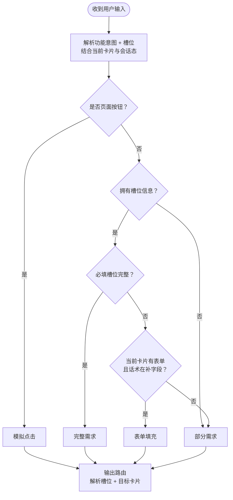

# 交互模式判定流程图（v1.2.0）

> 与 [`意图识别-技术实现规则-v1.2.0.md`](意图识别-技术实现规则-v1.2.0.md) §2.1 一致。  
> **浏览器预览**：打开 [`交互模式判定流程图.html`](交互模式判定流程图.html)  
> **PNG 图片**：[`diagrams/交互模式判定.png`](diagrams/交互模式判定.png)  
> **源文件**：[`diagrams/交互模式判定.mmd`](diagrams/交互模式判定.mmd)

## 判定顺序

**页面按钮** → **拥有槽位信息** → **必填槽位完整** →（未完整时）**表单补填** → 否则 **部分需求**

**解析槽位优先于上下文**；上下文 = 当前卡片 + 会话态（如是否已选客户）。

## 流程图

## 术语

| 流程图问句 | 含义 |
|------------|------|
| 是否**页面按钮**？ | 用户输入等价于点按页面按钮/可操作控件，**不携带新业务槽位** |
| 是否**拥有槽位信息**？ | 从话术（及档案默认）解析出与本能力相关的槽位，**至少有一项** |
| 是否**必填槽位完整**？ | 当前能力下**全部必填槽位**均已满足（与目标卡片名称无关） |

## 四种交互模式

| 模式 | 何时选用 |
|------|----------|
| **模拟点击** | 判定为页面按钮 |
| **完整需求** | 拥有槽位信息 **且** 必填槽位完整 |
| **表单填充** | 拥有槽位信息、必填未完整，且在当前表单卡补字段 |
| **部分需求** | 无槽位信息；或有槽位但必填未完整且非表单补填 |

## 必填槽位完整（四并列能力）

| 能力 | 必填须齐全 |
|------|------------|
| 方案速配 | 客户 + 需求/品名 + 数量 + 方案模板 等 |
| 方案报价 | 客户 + 方案或品名 + 各行本单报价 + 报价单模板 等 |
| 确认订单 | 客户 + 报价单标识或选品+本单报价 等 |
| 待跟进·写跟进 | 跟进对象企业 + 跟进信息 + 跟进时间（联系人/方式可默认） |
