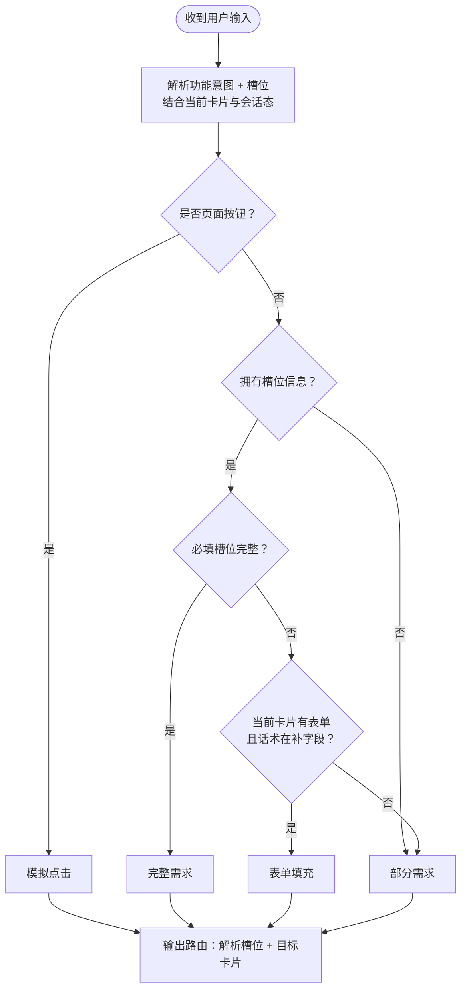

# 意图识别 · 技术实现规则（v1.2.0）

> **用途**：供 NLU / 对话路由研发实现的**规则摘要**；完整话术样例见 [`意图识别说明-v1.2.0.md`](./意图识别说明-v1.2.0.md)（由 `scripts/generate-state-transition-matrix.py` 生成，当前约 191 条去重路由）。  
> **业务细节**：卡片字段、推荐计分、UI 分支见 [`功能描述-方案报价下单-v1.2.0.md`](./功能描述-方案报价下单-v1.2.0.md)。

---

## 1. 路由模型

每次用户输入（语音/文本）在当前会话状态下，输出一条**路由结果**：

| 字段 | 含义 |
|------|------|
| **所属功能** | `初始化页面` / `待跟进` / `方案速配` / `方案报价` / `确认订单` |
| **当前卡片** | 用户说话/点击时所在的界面（上下文） |
| **交互模式** | 见 §2 |
| **解析槽位** | 本次解析出的 `槽位=值`；缺项写 `缺：xxx` |
| **目标卡片** | 处理后的落点；与当前卡片相同表示停留 |

**去重约定（文档层）**：`所属功能 + 当前卡片 + 交互模式 + 解析槽位 + 目标卡片` 相同视为**同一路由**，用户话术不同不重复登记。

---

## 2. 交互模式（判定顺序）

| 模式 | 判定条件 | 典型落点 |
|------|----------|----------|
| **完整需求** | 方案/报价/订单/待跟进·写跟进 四并列能力之一，**必填槽位完整**（话术 + 档案默认） | 方案→**方案卡**；报价→**报价单卡**；订单→**下单确认卡**；待跟进→**写跟进表单卡**（字段已齐可提交；不含提交成功回对话页） |
| **部分需求** | 有意图但**未拥有足够槽位信息**，或**必填槽位未完整**且非表单补填 | 缺槽引导卡 / 入口卡 / 列表消歧卡 |
| **表单填充** | **拥有槽位信息**，在当前含表单字段的卡片上补填字段，且**必填槽位未完整** | 通常停留本卡或进入下一步 |
| **模拟点击** | 用户输入等价于点按**页面按钮**（含按钮文案、列表序号、多步链 `A -> B -> C` 等） | 按按钮/控件跳转 |

**写跟进**是**待跟进**能力内的子步；**必填槽位完整**时可标**完整需求**并直达 **写跟进表单卡**。进入今日列表、列表选行、下一步引导等页面按钮操作用**模拟点击**；仅有意图或槽位不全用**部分需求**。

### 2.1 交互模式判定流程图（研发）

> **独立预览**：[`交互模式判定流程图.html`](交互模式判定流程图.html) · [`交互模式判定流程图.md`](交互模式判定流程图.md) · PNG [`diagrams/交互模式判定.png`](diagrams/交互模式判定.png) · 源图 [`diagrams/交互模式判定.mmd`](diagrams/交互模式判定.mmd)

> **建议判定顺序**：页面按钮 → 拥有槽位信息 → 必填槽位完整 → 表单补填，否则部分需求。  
> **解析槽位优先于上下文**；上下文只提供会话态（当前卡片、是否已选客户等）。

**术语（与流程图节点一一对应）**

| 流程图问句 | 含义 |
|------------|------|
| 是否**页面按钮**？ | 用户输入等价于点按当前页（或链式）上的按钮/可操作控件，**不携带新业务槽位** |
| 是否**拥有槽位信息**？ | 从话术（及档案默认）解析出与本能力相关的槽位字段，**至少有一项** |
| 是否**必填槽位完整**？ | 当前能力下，**全部必填槽位**均已满足（与目标卡片名称无关，完整即应走完整需求路由） |



**四能力「必填槽位完整」检查项（话术 + 档案默认）**

| 能力 | 必填槽位须齐全 | 完整需求典型落点 |
|------|----------------|------------------|
| 方案速配 | 客户 + 需求/品名 + 数量 + 方案模板 等 | 方案卡 |
| 方案报价 | 客户 + 方案或品名 + 各行本单报价 + 报价单模板 等 | 报价单卡 |
| 确认订单 | 客户 + 报价单标识或选品+本单报价 等 | 下单确认卡 |
| 待跟进·写跟进 | 跟进对象企业 + 跟进信息 + 跟进时间（联系人/方式可默认） | 写跟进表单卡 |

**易混对照**

| 用户说法 | 应选模式 | 原因 |
|----------|----------|------|
| 给华东精密配伺服电机和齿轮箱各2台，标准技术方案 | 完整需求 | 拥有槽位信息且必填槽位完整 |
| 给华东精密配伺服电机 | 部分需求 | 有槽位但必填未完整 |
| 伺服电机 数量 3 | 表单填充 | 有槽位、必填未完整，且在表单卡补字段 |
| 第1条 | 模拟点击 | 页面按钮（列表行点选） |
| 发送 / 返回 / 创建新方案 | 模拟点击 | 页面按钮 |
| 我要报价 | 部分需求 | 有意图，未拥有槽位信息 |
| 给华东精密写跟进：已电话沟通，跟进完成 | 完整需求 | 必填槽位完整 |
| 写跟进（无客户） | 部分需求 | 有跟进意图，必填未完整 |

---

## 3. 处理流水线（推荐实现顺序）

```
1. 读取上下文：当前卡片、顶栏客户、进行中主流程（方案/报价/下单/无）
2. 解析功能意图 + 槽位（客户、品名、数量、方案/报价单编号、需求文本…）
3. 全局能力拦截（§4）：跨功能切换、切换客户
4. 按「当前卡片」查本卡允许的跳转规则（§5～§8）
5. 缺槽 → 选最相关引导卡；槽位齐 → 完整需求直达或本流程下一步
6. 写入/更新流程草稿；渲染目标卡片
```

---

## 4. 全局规则

### 4.1 客户（顶栏）

**解析槽位**只写从话术里识别出的内容（如句中出现客户名 → `客户=xxx`）。顶栏是否已选客户、进行中主流程等**会话态不写进解析槽位**，由路由层根据**当前卡片**判断。

| 场景 | 条件（路由层） | 目标 |
|------|------|------|
| 说功能无意图客户 | 话术仅含功能意图；**会话**未选客户 | **选客户引导卡**（保留上文功能意图） |
| 说功能且带客户名 | 解析出客户 + 功能意图，缺业务明细 | 对应 **·入口卡** |
| 切换客户（模糊） | 「切换客户 / 换客户」 | **选客户卡** |
| 切换客户（指名） | 解析出 `客户=xxx` | 见 §4.2 |
| 选客户引导补全 | 客户 + 上文功能意图 | 对应功能 **·入口卡** 或 **写跟进表单卡** |
| 选客户卡选定 | 选定一行 | **对话页**（顶栏更新；无功能意图则停留对话） |

### 4.2 切换客户（已选客户时）

| 上下文 | 行为 |
|--------|------|
| **对话页 / 首屏**，无进行中主流程 | 更新顶栏客户，**停留对话页** |
| **已进入某主流程**的业务卡 | 更新客户，**清空当前功能草稿**，回到该功能 **·入口卡** |
| **任意业务卡** + 说**另一主流程** | **功能切换确认弹窗**（见 §4.3） |

### 4.3 跨功能切换

| 上下文 | 条件 | 目标 |
|--------|------|------|
| 对话页，**无进行中主流程** | 话术含功能意图 B | 直接进 **B·入口卡** |
| **任意业务卡**，已在流程 A | 话术含功能意图 B（B≠A） | **功能切换确认弹窗** |
| 弹窗·保留客户 | 确认沿用顶栏客户 | 清空各流程草稿 → **目标功能·入口卡** |
| 弹窗·重新选客户 | 否定沿用 | 清空客户与草稿 → **选客户引导卡** |

> 切换客户、跨功能切换在实现上登记为「**任意业务卡**」能力，业务章节内不重复展开。

### 4.4 口令意图 vs UI

| 类型 | 规则 |
|------|------|
| **口令 / 语音** | 方案、报价、下单：**不区分新老客户**；路由只取决于**已解析槽位**（客户名、需求文本、品名等） |
| **UI 模拟点击** | 允许因页面状态分岔（如无需求→需求引导、跳过需求→选品）；标注 `UI …` / `口令不走此路径` |

---

## 5. 待跟进（含写跟进子步）

**待跟进**与方案/报价/下单为**并列业务能力**；**写跟进**是待跟进内的子步（录入跟进记录），不是与待跟进平级的第四条主流程。

```
进入步（首屏/技能条/话术「今日待跟进」）→ 待跟进列表卡（不要求顶栏已选客户）
列表步（点行）→ 待跟进详情卡 + 下一步引导卡
下一步引导 ─┬─ 写跟进 → 写跟进表单卡
            ├─ 做方案 → 方案速配·入口卡（带当前客户，跳出待跟进）
            └─ 稍后再说 → 对话页
主对话直达写跟进子步 ─┬─ 缺跟进对象企业 → 选客户引导卡 → 写跟进表单卡
                    └─ 有句中客户+跟进信息 → 写跟进表单卡（完整需求）
写跟进表单卡 ──填槽──→ 停留本卡；──提交──→ 对话页（提交成功）
```

**写跟进必填槽位**（见数据填槽 04）：跟进对象企业、联系人、联系方式、跟进信息、跟进时间。缺企业走选客户引导；联系人/时间等可由档案默认带入。

---

## 6. 方案速配 · 主流程

### 6.1 卡片顺序

`入口卡 → 历史方案列表 | 需求引导卡 → 方案选品卡 → 方案预览卡 → 方案模板选择卡 → 方案卡`

### 6.2 入口路由（口令）

| 已解析槽位 | 目标 |
|------------|------|
| 仅功能意图 / 缺路径 | **入口卡**（停留，提示二选一） |
| 客户 + **方案编号/名称**唯一命中 | **方案卡** |
| 客户 + **部分品名/需求**，可匹配 | **方案选品卡**（推荐区按需求/品名文本匹配） |
| 客户 + 功能意图，**缺需求/品名** | **需求引导卡** |
| 查看历史 | **历史方案列表**；多条需序号/编号消歧 |

### 6.3 新建方案链

| 步骤 | 缺槽则引导 | 齐槽则进入 |
|------|------------|------------|
| 需求 | 需求引导卡 | 方案选品卡 |
| 选品勾选 | 方案选品卡 | 方案预览卡 |
| 预览改规格/数量 | — | 停留预览卡 |
| 生成方案 | 缺模板→模板选择卡；模板唯一→**方案卡** | **方案卡** |

### 6.4 对话页一句完整需求

槽位齐：`客户 + 品名 + 数量 + 方案模板`（及必要需求描述）→ 直达 **方案卡**。

---

## 7. 产品报价 · 主流程

### 7.1 卡片顺序

`入口卡 → 历史报价单列表 | 报价来源卡 → 选择方案卡? → 需求引导卡? → 选品报价卡 → 报价选品确认卡 / 逐项报价卡 → 报价单模板选择卡 → 报价单卡`

（`?` 表示按分支可选）

### 7.2 入口与来源

| 路径 | 条件 | 目标 |
|------|------|------|
| 查看历史 | — | 历史报价单列表 → 第 N 条 → 报价单卡 |
| 新建·按方案 | 本客户方案=0 | 改直选 → 报价来源卡 / 选品报价卡 |
| 新建·按方案 | 方案=1 | 报价选品确认卡 |
| 新建·按方案 | 方案≥2 | 选择方案卡 |
| 新建·直选 | 缺需求/品名 | 需求引导卡 |
| 新建·直选 | 有需求描述 | 选品报价卡 |

### 7.3 填价与出单

选品 → 填本单报价（确认卡或逐项卡）→ 选报价单模板 → **报价单卡**。  
对话页完整需求：按方案/按品名+单价+模板等槽位齐 → 直达 **报价单卡**。

### 7.4 从报价单下单

报价单卡「生成订单」→ **下单确认卡**（跨功能链，非 §4.3 弹窗）。

---

## 8. 确认订单 · 主流程

### 8.1 卡片顺序

`入口卡 → 历史订单列表 | 下单来源卡 → 选择报价单卡? → 选品报价卡（下单模式）→ 逐项报价卡? → 下单确认卡 → 订单成功卡`

### 8.2 来源路由

| 路径 | 条件 | 目标 |
|------|------|------|
| 按报价单 | 报价单=0 | 改直选 |
| 按报价单 | 报价单=1 | 下单确认卡 |
| 按报价单 | 报价单≥2 | 选择报价单卡 |
| 直选下单 | 缺需求/品名 | 需求引导卡（同选品规则） |
| 直选下单 | 有选品 | 选品报价卡（下单模式）→ 填价 → 下单确认卡 |

对话页完整需求：客户 + 报价单编号 / 或品名+数量+本单报价 → **下单确认卡**。

---

## 9. 缺槽引导（通用）

实现时按「**已有什么 → 缺什么 → 去哪**」查表，不必穷举话术。

| 缺槽 | 常见目标 |
|------|----------|
| 客户 | 选客户引导卡 |
| 需求描述 / 品名（选品前） | 需求引导卡 |
| 入口二选一（历史/新建） | 停留对应入口卡 |
| 列表序号 / 编号（多条） | 停留列表卡或选择方案/报价单卡 |
| 选品勾选 | 停留选品卡 |
| 本单报价 / 折扣 | 停留报价确认卡或逐项卡 |
| 方案模板 / 报价单模板 | 模板选择卡 |
| 有效方案/报价单（检索失败） | 停留当前列表/选择卡，提示重选 |

**带客户名的部分句**：只补业务缺槽，不因客户档案新老分路由。

---

## 10. 推荐与选品（口令）

适用于方案选品卡、选品报价卡、下单选品卡：

1. **有需求文本**（卡片确认或对话发送）：全库模糊匹配 → 匹配分排序 → 推荐区最多 10 条（规则见功能描述 §1.2.3.2.2.3）。
2. **仅有品名/数量、无完整需求**：仍进选品卡，推荐区按品名/需求文本匹配；缺需求时先 **需求引导卡**。
3. **筛选词**：同时作用于推荐区与更多产品区；不改变路由，仅过滤展示。
4. **意图层不区分新老客户**；UI 层「历史订单推荐 / 跳过需求」不参与口令路由。

---

## 11. 其他

| 项 | 规则 |
|----|------|
| 待跟进入口 | 首屏/技能条/话术「今日待跟进」→ **待跟进列表卡** |
| 最近访问 | 解析客户+功能 → 对应 **·入口卡** |
| PDF 预览 | 关闭返回来源方案卡/报价单卡 |
| 非最新页按钮 | 模拟点击失效，停留当前卡并提示 |
| 订单成功页 | 完整需求终点是 **下单确认卡**；成功页仅提交后展示 |

---

## 12. 研发对齐清单

- [ ] 上下文：`currentCard`、`selectedCustomer`、`activeMainFlow`（null | plan | quote | order）
- [ ] 全局拦截优先于卡片内规则（§4）
- [ ] 三主流程口令路由**不读**客户新老字段
- [ ] 跨功能：idle 对话页直进入口；流程中走确认弹窗
- [ ] 写跟进单独子流程，缺客户走选客户引导（非方案/报价/下单引导）
- [ ] 完整需求校验各功能必填槽位集合后再直达最终页
- [ ] 同路由多话术：实现一层即可，测试用 [`意图识别说明-v1.2.0.md`](./意图识别说明-v1.2.0.md) 抽样

---

## 附录 A · 必填槽位（完整需求）

| 功能 | 必填槽位（一次说齐） | 最终页 |
|------|----------------------|--------|
| 方案速配 | 客户、品名、数量、方案模板；（常含需求描述） | 方案卡 |
| 产品报价 | 客户、本单报价明细、报价单模板；（按方案时含方案标识） | 报价单卡 |
| 确认订单 | 客户、下单明细或报价单标识 | 下单确认卡 |

## 附录 B · 文档关系

```
功能描述-方案报价下单-v1.2.0.md     业务/UI/推荐计分
        ↓
意图识别-技术实现规则-v1.2.0.md    ← 本文（路由逻辑）
        ↓
意图识别说明-v1.2.0.md             去重后路由样例表（验收用）
scripts/generate-state-transition-matrix.py
```

**版本**：v1.2.0 · 与演示 H5 [`index.html`](./index.html) 对齐
