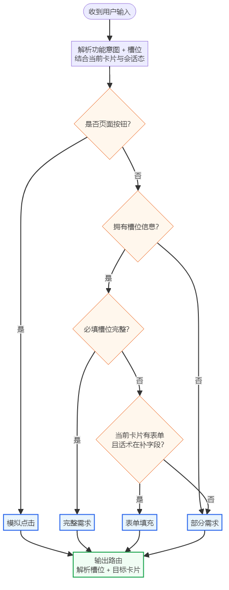

# 意图识别说明（v1.2.0）

> 覆盖：全局能力、初始化页面、待跟进（含写跟进）、方案速配、方案报价、确认订单。
> 依据 [`功能描述-方案报价下单-v1.2.0.md`](./功能描述-方案报价下单-v1.2.0.md) 穷举用户输入及路由结果；**不按当前卡片分列**。
> 生成脚本：`scripts/generate-state-transition-matrix.py`

**合计 175 行**（每功能一章、**单表**；按 交互模式 + 解析槽位 + 上下文 + 目标卡片 去重，同路由仅保留一条用户输入示例）

## 表格列说明

| 列 | 说明 |
|----|------|
| **上下文** | **当前卡片**（用户说话时所处界面）+ **会话态**（如顶栏已选客户、历史方案仅1条、是否已录需求、列表条数等）。**不写**按钮/触发/动作；点击类输入用「交互模式=模拟点击」区分。与解析槽位冲突时以解析槽位为准；连续行可写 **同上** + 差异段 |
| **用户输入** | 用户**说出口**的口语；多步用 ` -> ` 连接 |
| **交互模式** | `完整需求` / `部分需求` / `表单填充` / `模拟点击`（见下表） |
| **解析槽位** | **仅从用户输入**解析的槽位（`槽位=值` 或 `缺：xxx`）；路由时 **优先于上下文** |
| **目标卡片** | 结合解析槽位与上下文后，槽位链能触达的**最后一个页面**（最终落点） |

### 交互模式定义

| 模式 | 定义 |
|------|------|
| 完整需求 | **拥有槽位信息**且**必填槽位完整**（四并列能力：方案/报价/订单/待跟进·写跟进） |
| 部分需求 | 无槽位信息；或有槽位但必填未完整且非表单补填；引导缺槽或消歧 |
| 表单填充 | **拥有槽位信息**、必填未完整，在含表单字段的卡片上补填字段 |
| 模拟点击 | 用户输入等价于点按**页面按钮**（含按钮文案、列表序号、多步链 ` -> `） |

> **编排顺序**：`全局能力` → `初始化页面` → `待跟进` → `方案速配` → `方案报价` → `确认订单`；**每章仅一张表**；章内按**上下文卡片**（用户说话时所处步骤）主流程顺序排列，同一上下文卡片的多条输入相邻。

> **全局能力**：**切换客户**、**跨功能切换**仅在 **§零** 登记；其余章节不重复。

> **同功能 + 同用户输入 + 同交互模式** → **解析槽位必须相同**；会话分岔写在 **上下文** 列（多行）。

---

## 零、全局能力（各业务卡共用）

| 上下文 | 用户输入 | 交互模式 | 解析槽位 | 目标卡片 |
| --- | --- | --- | --- | --- |
| 已在方案/报价/下单某一业务步骤中（非对话页空闲态） | 帮我确认下单 | 部分需求 | 功能意图=确认下单 | 功能切换确认弹窗 |
| 同上 | 我想做方案速配 | 部分需求 | 功能意图=方案速配 | 功能切换确认弹窗 |
| 同上 | 我要做产品报价 | 部分需求 | 功能意图=产品报价 | 功能切换确认弹窗 |
| 同上 | 帮我切换一下客户 | 模拟点击 | — | 选客户卡 |
| 同上 | 帮我切换客户到深圳创源 | 模拟点击 | 客户=深圳创源；流程中切换→清空当前功能草稿并回该功能入口；对话页/顶栏→停留对话页 | 当前功能·入口卡或对话页 |

## 一、初始化页面（对话壳 / 选客户）

> 本功能不含方案/报价/下单主流程卡片；跨主流程跳转见 **§零**。

| 上下文 | 用户输入 | 交互模式 | 解析槽位 | 目标卡片 |
| --- | --- | --- | --- | --- |
| 首屏欢迎区 | 帮我确认下单 | 模拟点击 | 功能意图=确认下单 | 选客户引导卡 |
| 同上 | 帮我给华东精密做报价 | 模拟点击 | 客户=华东精密 | 产品报价·入口卡 |
| 同上 | 我想做方案速配 | 模拟点击 | 功能意图=方案速配 | 选客户引导卡 |
| 同上 | 我要做产品报价 | 模拟点击 | 功能意图=产品报价 | 选客户引导卡 |
| 对话页；无进行中主流程 | 帮我切换客户到华东精密 | 模拟点击 | 客户=华东精密 | 对话页 |
| 同上 | 帮我确认下单 | 模拟点击 | 功能意图=确认下单 | 确认下单·入口卡 |
| 同上 | 我想做方案速配 | 模拟点击 | 功能意图=方案速配 | 方案速配·入口卡 |
| 同上 | 我要做产品报价 | 模拟点击 | 功能意图=产品报价 | 产品报价·入口卡 |
| 同上 | 给华东精密报价 | 模拟点击 | 客户=华东精密；缺：报价明细 | 产品报价·入口卡 |
| 同上 | 给华东精密确认下单 | 模拟点击 | 客户=华东精密；缺：下单来源或选品 | 确认下单·入口卡 |
| 同上 | 给深圳创源配个方案 | 模拟点击 | 客户=深圳创源；缺：入口操作 | 方案速配·入口卡 |
| 未选择客户 | 给深圳创源配个方案 | 模拟点击 | 客户=深圳创源；缺：入口操作 | 方案速配·入口卡 |
| 同上；保留上文功能意图 | 帮我切换到华东精密，确认下单 | 模拟点击 | 客户=华东精密；功能意图=确认下单 | 确认下单·入口卡 |
| 同上 | 帮我切换到华东精密，要报价 | 模拟点击 | 客户=华东精密；功能意图=产品报价 | 产品报价·入口卡 |
| 同上 | 帮我切换到深圳创源，配个方案 | 模拟点击 | 客户=深圳创源；功能意图=方案速配 | 方案速配·入口卡 |
| 选客户列表抽屉/卡片 | 帮我搜一下华东的客户 | 表单填充 | 筛选词=华东 | 选客户卡 |
| 同上 | 帮我切换客户到华东精密 | 模拟点击 | 客户=华东精密 | 对话页 |
| 同上 | 帮我切换客户到深圳创源 | 模拟点击 | 客户=深圳创源；缺：功能意图 | 对话页 |
| 跨功能切换确认弹窗已打开；仅保留顶栏客户 | 就保留当前这个客户 | 模拟点击 | — | 目标功能·入口卡 |
| 跨功能切换确认弹窗已打开；清空客户与流程草稿 | 重新帮我选个客户 | 模拟点击 | — | 选客户引导卡 |

## 二、待跟进（含写跟进）

> **并列能力**：与方案/报价/下单同级。**主流程**：进入步（今日列表）→ 列表步 → 详情步 → 下一步引导 → **写跟进子步**（表单）。列表**不要求**顶栏已选客户；写跟进子步**须**确定跟进对象企业。

| 上下文 | 用户输入 | 交互模式 | 解析槽位 | 目标卡片 |
| --- | --- | --- | --- | --- |
| 首屏欢迎区 | 帮我写一下跟进 | 部分需求 | 功能意图=写跟进；缺：跟进对象企业 | 选客户引导卡 |
| 同上 | 看看今天有哪些待跟进 | 部分需求 | 功能意图=待跟进 | 待跟进列表卡 |
| 同上 | 看看今天有哪些待跟进 | 模拟点击 | 功能意图=待跟进 | 待跟进列表卡 |
| 对话页；无进行中主流程 | 给华东精密写跟进，今天下午电话沟通了报价意向，下周再联系，跟进完成 | 完整需求 | 客户、跟进信息、跟进状态；联系人/联系方式/跟进时间由档案默认带入 | 写跟进表单卡 |
| 同上 | 给华东精密写跟进：已电话沟通需求并约定下周报价，标记跟进完成 | 完整需求 | 客户、跟进信息、跟进状态 | 写跟进表单卡 |
| 同上 | 今天要跟进哪些客户 | 部分需求 | 功能意图=待跟进 | 待跟进列表卡 |
| 同上 | 帮我写一下跟进 | 部分需求 | 功能意图=写跟进；缺：跟进对象企业 | 选客户引导卡 |
| 同上 | 给华东精密写跟进 | 部分需求 | 客户=华东精密；缺：跟进信息 | 写跟进表单卡 |
| 未选择客户；保留上文功能意图 | 帮我切换到华东精密，写跟进 | 模拟点击 | 客户=华东精密；功能意图=写跟进 | 写跟进表单卡 |
| 待跟进列表 | 看看第一个待跟进的客户 | 模拟点击 | 列表所选客户 | 待跟进详情卡 |
| 下一步引导（写跟进/做方案/稍后再说） | 帮我写一下跟进 | 模拟点击 | 当前卡片客户已绑定 | 写跟进表单卡 |
| 同上 | 帮这个客户做个方案 | 模拟点击 | 当前卡片客户已绑定 | 方案速配·入口卡 |
| 同上 | 稍后再说 | 模拟点击 | 当前卡片客户已绑定；不打开写跟进抽屉 | 对话页 |
| 写跟进表单已打开 | 今天电话沟通了需求，下周再联系 | 表单填充 | 跟进信息=… | 写跟进表单卡 |
| 同上 | 跟进完成 | 表单填充 | 跟进状态=完成 | 写跟进表单卡 |
| 同上；表单必填已齐 | 发送 | 模拟点击 | — | 对话页 |

## 三、方案速配

| 上下文 | 用户输入 | 交互模式 | 解析槽位 | 目标卡片 |
| --- | --- | --- | --- | --- |
| 对话页；无进行中主流程 | 给华东精密配精密轴承组件A型3套、传动齿轮箱M3各2台，投标方案简版 | 完整需求 | 客户、品名、数量、方案模板 | 方案卡 |
| 同上 | 给深圳创源配伺服电机和传动齿轮箱各2台，用标准技术方案 | 完整需求 | 客户、需求描述、品名、数量、方案模板 | 方案卡 |
| 同上；推荐区按品名匹配 | 给华东精密配伺服电机 | 部分需求 | 客户、品名 | 方案选品卡 |
| 方案速配·入口 | 帮我配个方案 | 部分需求 | 缺：查看历史方案 或 创建新方案 | 方案速配·入口卡 |
| 同上 | 看看历史方案 | 部分需求 | 客户；历史方案仅1条 | 方案卡 |
| 同上 | 给深圳创源配个方案 | 部分需求 | 客户、功能意图；缺：需求描述/品名 | 需求引导卡 |
| 同上 | 预览方案 PL20260501001 | 部分需求 | 客户、方案编号=PL20260501001 | 方案卡 |
| 同上 | 帮我新建一个方案 | 模拟点击 | — | 需求引导卡 |
| 同上 | 帮我新建一个方案 -> 确认一下需求 -> 勾选 -> 先预览一下方案 -> 生成方案吧 -> 保存这个方案 | 模拟点击 | 客户、需求、选品、方案模板 | 方案卡 |
| 同上 | 按钮已失效时点创建新方案 | 模拟点击 | — | 方案速配·入口卡 |
| 同上；推荐区按文本匹配 | 给华东精密配液压泵站 | 部分需求 | 客户、部分品名 | 方案选品卡 |
| 方案速配·入口；顶栏已选客户 | 看看历史方案 | 模拟点击 | — | 历史方案列表 |
| 历史方案列表 | 先预览一下方案 | 部分需求 | 缺：方案序号或编号（多条） | 历史方案列表 |
| 同上 | 预览方案 不存在的方案名 | 部分需求 | 缺：有效方案；提示重新选择 | 历史方案列表 |
| 同上；列表序号=1 | 第1条 | 模拟点击 | — | 方案卡 |
| 历史方案列表；列表序号=2 | 第2条 | 模拟点击 | — | 方案卡 |
| 需求引导（方案或报价直选路径） | 发送 | 部分需求 | 缺：需求描述（空内容） | 需求引导卡 |
| 同上 | 伺服电机和传动齿轮箱各2台 | 表单填充 | 需求描述=… | 方案选品卡 |
| 同上 | 我想修改一下需求 | 模拟点击 | 预填已有需求文本 | 需求引导卡 |
| 同上 | 确认一下需求 | 模拟点击 | 需求描述=卡片内已填 | 方案选品卡 |
| 同上 | 跳过需求，按最近订单推荐 | 模拟点击 | — | 方案选品卡 |
| 方案选品 | 先预览一下方案 | 部分需求 | 功能意图=预览方案 | 方案选品卡 |
| 同上 | 选品 伺服电机 | 部分需求 | 缺：至少勾选1个产品 | 方案选品卡 |
| 同上 | 伺服电机 规格 AC380V | 表单填充 | 规格=AC380V | 方案选品卡 |
| 同上 | 筛选 伺服 | 表单填充 | 筛选词=伺服 | 方案选品卡 |
| 同上 | 选品 伺服电机 | 表单填充 | 选品+=伺服电机 | 方案选品卡 |
| 同上 | 勾选伺服电机 | 模拟点击 | 选品+=伺服电机 | 方案选品卡 |
| 同上 | 我补充一下用户需求 | 模拟点击 | 尚未录入需求 | 需求引导卡 |
| 同上 | 筛选一下 | 模拟点击 | 筛选词=已输入 | 方案选品卡 |
| 同上；已勾选选品 | 先预览一下方案 | 模拟点击 | — | 方案预览卡 |
| 方案选品；已录需求；推荐区按匹配分降序 | 伺服电机和传动齿轮箱各2台 | 部分需求 | — | 方案选品卡 |
| 方案选品；推荐区与更多区同步重算 | 筛选 电机 | 表单填充 | 筛选词=电机 | 方案选品卡 |
| 方案选品；推荐区按匹配分降序 | 给华东精密配液压泵站 | 部分需求 | 客户、部分品名 | 方案选品卡 |
| 方案预览 | 伺服电机 数量 3 | 表单填充 | 数量=3 | 方案预览卡 |
| 同上 | 伺服电机 规格 AC380V | 表单填充 | 规格=AC380V | 方案预览卡 |
| 同上 | 第1项 数量 5 | 表单填充 | 行序号=1；数量=5 | 方案预览卡 |
| 同上 | 生成方案吧 | 模拟点击 | 功能意图=生成方案 | 方案模板选择卡 |
| 同上 | 返回去选品 | 模拟点击 | 保留已改规格/数量 | 方案选品卡 |
| 方案模板选择 | 保存这个方案 | 部分需求 | 缺：方案模板 | 方案模板选择卡 |
| 同上 | 标准技术方案 -> 保存这个方案 | 模拟点击 | 方案模板=标准技术方案 | 方案卡 |
| 同上 | 第1个 -> 保存这个方案 | 模拟点击 | 方案模板=列表第1项 | 方案卡 |
| 方案成果卡 | 按方案给我报个价 | 部分需求 | 客户、方案=当前；缺：各行本单报价、报价单模板 | 报价选品确认卡 |
| 同上 | 去报价吧 | 模拟点击 | 功能意图=去报价 | 报价选品确认卡 |
| 同上 | 预览一下PDF | 模拟点击 | 方案编号=当前 | PDF预览 |
| PDF/版式预览层 | 返回 | 模拟点击 | 来源=方案PDF时 | 方案卡 |

## 四、方案报价

| 上下文 | 用户输入 | 交互模式 | 解析槽位 | 目标卡片 |
| --- | --- | --- | --- | --- |
| 对话页；无进行中主流程 | 给华东精密按方案报价，伺服电机4200…标准销售报价单 | 完整需求 | 客户、方案、本单报价、报价单模板 | 报价单卡 |
| 同上 | 给深圳创源报伺服电机10台单价2180打九折，标准销售报价单 | 完整需求 | 客户、品名、数量、单价/折扣、报价单模板 | 报价单卡 |
| 同上 | 给深圳创源按方案报价，标准技术方案…标准销售报价单 | 完整需求 | 客户、方案、各行本单报价、报价单模板 | 报价单卡 |
| 同上 | 按方案给我报个价 | 部分需求 | 功能意图=按方案报价 | 报价来源卡 |
| 同上；推荐区按品名匹配 | 报伺服电机10台 | 部分需求 | 品名、数量 | 选品报价卡 |
| 产品报价·入口 | 我要报价 | 部分需求 | 缺：查看历史报价单 或 新建报价 | 产品报价·入口卡 |
| 同上 | 预览报价单 QT20260510001 | 部分需求 | 客户、报价单编号 | 报价单卡 |
| 同上 | 帮我新建一份报价 | 模拟点击 | 功能意图=新建报价 | 报价来源卡 |
| 同上 | 帮我新建一份报价 -> 我直接选品报价 -> 勾选 -> 下一步 -> 填价 -> 选择模板 -> 生成报价单 | 模拟点击 | 客户、选品、本单报价、报价单模板 | 报价单卡 |
| 同上 | 帮我新建一份报价 -> 按方案给我报个价 -> 填价 -> 下一步：选择模板 -> 生成报价单 | 模拟点击 | 客户、方案=自动唯一、本单报价、报价单模板 | 报价单卡 |
| 同上 | 帮我新建一份报价 -> 按方案给我报个价 -> 第1条 -> 填价 -> 下一步：选择模板 -> 生成报价单 | 模拟点击 | 客户、方案、本单报价、报价单模板 | 报价单卡 |
| 同上；顶栏已选客户 | 看看历史报价单 | 模拟点击 | — | 历史报价单列表 |
| 历史报价单列表 | 预览报价单 QT99999999 | 部分需求 | 缺：有效报价单 | 历史报价单列表 |
| 同上；列表序号=1 | 第1条 | 模拟点击 | — | 报价单卡 |
| 历史报价单列表；列表序号=2 | 第2条 | 模拟点击 | — | 报价单卡 |
| 报价来源选择 | 我直接选品报价 | 部分需求 | 缺：需求描述/品名 | 需求引导卡 |
| 同上 | 我要报价 | 部分需求 | 缺：按方案报价 或 直接选品报价 | 报价来源卡 |
| 同上 | 按方案 PL20260501001 报价 | 部分需求 | 客户、方案编号；缺：各行本单报价、报价单模板 | 报价选品确认卡 |
| 同上 | 按方案给我报个价 | 部分需求 | 缺：本客户方案；改直选 | 选品报价卡 |
| 同上 | 我直接选品报价 | 模拟点击 | 功能意图=直选报价 | 需求引导卡 |
| 同上 | 按方案给我报个价 | 模拟点击 | 功能意图=按方案报价 | 报价选品确认卡 |
| 同上 | 按钮已失效时按方案报价 | 模拟点击 | — | 报价来源卡 |
| 同上；推荐区按需求匹配 | 直接选品报价 伺服电机10台 | 部分需求 | 需求描述=伺服电机 | 选品报价卡 |
| 多方案消歧 | 按方案 不存在的方案名 报价 | 部分需求 | 缺：有效方案 | 选择方案卡 |
| 同上 | 按方案给我报个价 | 部分需求 | 缺：方案名称/编号 | 选择方案卡 |
| 同上 | 选择方案 华东精密-伺服方案 | 部分需求 | 方案名称；缺：各行本单报价、报价单模板 | 报价选品确认卡 |
| 同上；列表序号=1 | 第1条 | 模拟点击 | — | 报价选品确认卡 |
| 多方案消歧；列表序号=2 | 第2条 | 模拟点击 | — | 报价选品确认卡 |
| 需求引导（方案或报价直选路径） | 伺服电机和传动齿轮箱各2台 | 表单填充 | 需求描述=…（直选报价路径） | 选品报价卡 |
| 选品报价 | 下一步：逐项报价 | 部分需求 | 缺：选品勾选 | 选品报价卡 |
| 同上 | 先预览一下方案 | 部分需求 | 功能意图=预览方案 | 需求引导卡 |
| 同上 | 选品 不存在的产品XYZ | 部分需求 | 缺：可匹配产品 | 选品报价卡 |
| 同上 | 伺服电机 规格 AC380V | 表单填充 | 规格=AC380V | 选品报价卡 |
| 同上 | 筛选 电机 | 表单填充 | 筛选词=电机 | 选品报价卡 |
| 同上 | 选品 伺服电机 | 表单填充 | 选品+=伺服电机 | 选品报价卡 |
| 同上；已勾选选品 | 下一步：逐项报价 | 模拟点击 | — | 报价选品确认卡 |
| 选品报价；已录需求；推荐区按匹配分降序 | 伺服电机和传动齿轮箱各2台 | 部分需求 | — | 选品报价卡 |
| 报价选品确认 | 下一步：选择模板 | 部分需求 | 缺：每项本单报价 | 报价选品确认卡 |
| 同上 | 传动齿轮箱 报价 3800 | 表单填充 | 行=传动齿轮箱；本单报价=3800 | 报价选品确认卡 |
| 同上 | 伺服电机 报价 4200 | 表单填充 | 本单报价=4200 | 报价选品确认卡 |
| 同上 | 打九折 | 表单填充 | 折扣=0.9 | 报价选品确认卡 |
| 同上 | 下一步：选择模板 | 模拟点击 | 各行本单报价已填 | 报价单模板选择卡 |
| 同上 | 保存为方案 -> 下一步：选择模板 | 模拟点击 | saveAsScheme=true；本单报价已齐 | 报价单模板选择卡 |
| 同上 | 返回去选品 | 模拟点击 | 保留已填价格 | 选品报价卡 |
| 逐项报价 | 下一步：选择模板 | 部分需求 | 缺：每项本单报价 | 逐项报价卡 |
| 同上 | 伺服电机 报价 4200 / 打九折 | 表单填充 | 本单报价/折扣 | 逐项报价卡 |
| 同上 | 伺服电机改4200 | 表单填充 | 行=伺服电机；本单报价=4200 | 逐项报价卡 |
| 同上 | 第1项 规格 AC380V | 表单填充 | 行序号=1；规格=AC380V | 逐项报价卡 |
| 同上 | 第2项 数量 8 | 表单填充 | 行序号=2；数量=8 | 逐项报价卡 |
| 同上 | 下一步：选择模板 | 模拟点击 | 本单报价已齐 | 报价单模板选择卡 |
| 报价单模板选择 | 生成报价单 | 部分需求 | 缺：报价单模板 | 报价单模板选择卡 |
| 同上 | 第1个 | 模拟点击 | 报价单模板=列表第1项 | 报价单卡 |
| 同上 | 选标准销售报价单 -> 生成报价单 | 模拟点击 | 报价单模板=标准销售报价单 | 报价单卡 |
| 报价单成果卡 | 按这份报价下单 | 完整需求 | 客户、报价单=当前（报价明细已齐） | 下单确认卡 |
| 同上 | 生成订单 | 模拟点击 | 客户、报价单=当前（跳过下单入口） | 下单确认卡 |
| 同上 | 生成订单 -> 帮我确认下单 | 模拟点击 | 客户、报价单=当前 | 订单成功卡 |
| 同上 | 看一下报价单PDF | 模拟点击 | 报价单编号=当前 | PDF预览 |
| PDF/版式预览层 | 返回 | 模拟点击 | 来源=报价PDF时 | 报价单卡 |

## 五、确认订单

| 上下文 | 用户输入 | 交互模式 | 解析槽位 | 目标卡片 |
| --- | --- | --- | --- | --- |
| 对话页；无进行中主流程 | 给华东精密按报价单 QT20260510001 下单 | 完整需求 | 客户、报价单编号 | 下单确认卡 |
| 同上 | 给深圳创源下单，配伺服电机5台单价2180 | 完整需求 | 客户、品名、数量、本单报价 | 下单确认卡 |
| 同上 | 给深圳创源按报价单下单 | 完整需求 | 客户、报价单标识 | 下单确认卡 |
| 同上 | 按报价单下单 | 部分需求 | 功能意图=按报价单下单 | 下单来源卡 |
| 确认下单·入口 | 帮我确认下单 | 部分需求 | 功能意图=确认下单 | 确认下单·入口卡 |
| 同上 | 看看历史订单 | 部分需求 | 功能意图=查看历史订单 | 订单卡 |
| 同上 | 帮我确认下单 | 模拟点击 | 功能意图=确认下单 | 下单来源卡 |
| 同上 | 帮我确认下单 -> 我直接选品下单 -> 下一步：逐项报价 -> 填价 -> 生成订单 -> 帮我确认下单 | 模拟点击 | 客户、选品、本单报价 | 订单成功卡 |
| 同上 | 帮我确认下单 -> 按报价单下单 -> 第1条 -> 帮我确认下单 | 模拟点击 | 客户、报价单 | 订单成功卡 |
| 同上 | 看看历史订单 | 模拟点击 | 功能意图=查看历史订单 | 历史订单列表 |
| 历史订单列表 | 第1条 | 模拟点击 | 订单=列表第1条 | 订单卡 |
| 同上 | 第2条 | 模拟点击 | 订单=列表第2条 | 订单卡 |
| 下单来源选择 | 按报价单 QT20260510001 下单 | 完整需求 | 客户、报价单编号 | 下单确认卡 |
| 同上 | 按报价单下单 | 部分需求 | 缺：本客户报价单；改直选 | 选品报价卡 |
| 同上 | 生成订单 | 部分需求 | 缺：按报价单 或 直接选品 | 下单来源卡 |
| 同上 | 我直接选品下单 | 模拟点击 | 客户；quotePickForOrder=1 | 选品报价卡 |
| 同上 | 按报价单下单 | 模拟点击 | 功能意图=按报价单下单 | 下单确认卡 |
| 多报价单消歧 | 按报价单 QT99999999 下单 | 部分需求 | 缺：有效报价单 | 选择报价单卡 |
| 同上 | 按报价单下单 | 部分需求 | 缺：报价单编号/模板 | 选择报价单卡 |
| 同上 | 第1条 | 模拟点击 | 报价单=列表第1条 | 下单确认卡 |
| 同上 | 第2条 | 模拟点击 | 报价单=列表第2条 | 下单确认卡 |
| 选品报价（下单模式） | 先预览一下方案 | 部分需求 | 功能意图=预览方案 | 需求引导卡 |
| 同上 | 生成订单 | 部分需求 | 缺：选品勾选 | 选品报价卡（下单模式） |
| 同上 | 保存为方案 | 模拟点击 | saveAsScheme=true | 选品报价卡（下单模式） |
| 同上；已勾选选品；下单模式 | 下一步：逐项报价 | 模拟点击 | — | 逐项报价卡 |
| 选品报价（下单模式）；已录需求；推荐区按匹配分降序 | 伺服电机和传动齿轮箱各2台 | 部分需求 | — | 选品报价卡（下单模式） |
| 选品报价（下单模式）；推荐区与更多区同步重算 | 筛选 电机 | 表单填充 | 筛选词=电机 | 选品报价卡（下单模式） |
| 订单购物车（遗留） | 下一步：逐项报价 | 模拟点击 | 选品、规格、数量 | 逐项报价卡 |
| 逐项报价 | 生成订单 | 模拟点击 | 模式=下单填价；本单报价已齐 | 下单确认卡 |
| 下单确认 | 帮我确认下单 | 部分需求 | 缺：订单来源与明细 | 下单确认卡 |
| 同上 | 帮我确认下单 | 模拟点击 | 订单明细、来源已齐 | 订单成功卡 |
