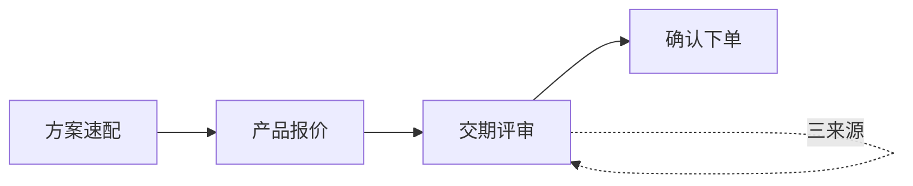

# PRD · v1.3.0（增量）

> **基于**：[v1.2.0 PRD](../v1.2.0/PRD.md)  
> **版本目录**：`.output/v1.3.0/` · **入口**：[index.html](./index.html)  
> **功能描述**：[功能描述-交期与订单运营-v1.3.0.md](./功能描述-交期与订单运营-v1.3.0.md)  
> **公共资产**：[架构](../shared/architecture.md) · [UI 基线](../shared/design-spec.md)

## 本版目标

在 v1.2.0 主链路之上，交付 **交期评审**（三来源 + 完整评审表单）、**复制订单 / 订单变更 / 订单进度**，并以统一 **订单类型** 驱动列表与详情展示（纯前端模拟）。

## 变更摘要（相对 v1.2.0）

| 维度 | v1.2.0 | v1.3.0 |
|------|--------|--------|
| 交期评审 | 仅绑定当前报价单；演示级 | **三来源**：按报价单 / **按订单** / 自选商品；**完整表单**；通过后 **生成订单** |
| 下单卡点 | 可不经过交期 | **交期评审与下单并列**；结果卡「生成订单」为便捷入口，**不阻塞**报价/下单主链路 |
| 订单状态 | 待排产、生产中、已发货等 | **五类**：未审核、销售审核、已审核、已完成、异常 |
| 复制/变更/进度 | 演示级 | 完整验收 + 标注 05 |

## 主功能定义（A2）

### 1. 交期评审（对齐「产品报价 / 确认下单」交互）

| 项 | 说明 |
|----|------|
| **做什么** | 先选 **评审来源（三选一）**，再填写评审参数并提交；展示齐套结论（按期 / 无法按时交付）；通过后允许 **生成订单**。 |
| **来源 A · 按报价单** | 当前会话报价单或从历史报价单中选择；明细只读，来自报价行。 |
| **来源 B · 按订单** | 从当前客户 **未排程** 订单中选一单；明细只读，来自订单行（品名·规格·数量）。 |
| **来源 C · 自选商品** | 直选品 + 规格 + 数量（复用选品/购物车），作为评估明细。 |
| **不做什么** | 不接真实 APS/MRP；采购计划仅演示勾选结果文案，不下发 ERP。 |
| **完成标准** | 三来源选毕 → 评审表单 → 结果卡；结果卡**统一引导**下一步：「生成订单」或「查看订单进度」（主次因来源而异，见下）。 |
| **依赖** | `sourceType` + 对应 id/lines；与报价/下单主链路**并列**，不阻塞生成订单。 |

**入口结构**

```
Skill「交期评审」
  → card-delivery-entry
      →「评估交期」→ card-delivery-source（三选项）
           ├─ 按报价单 → quote / card-delivery-quote-pick
           ├─ 按订单   → card-delivery-order-pick
           └─ 自选商品 → 选品 → 确认选品 → 评审表单
      → sheet-delivery（评审表单，见下）
      → card-delivery（评审结果 + 引导「生成订单」「查看订单进度」）
```

#### 评审表单 `sheet-delivery`（已确认字段）

| 字段 | 类型 | 必填 | 说明 |
|------|------|------|------|
| 来源摘要 | 只读 | — | 报价单号/订单号/行项目条数 + 金额或品项摘要 |
| **期望交期** | date | ✅ | 客户期望整单交付日 |
| **工艺版本（按货品）** | 明细表每行 select | ✅ | 默认 SKU `processVersion`，`processVersionOptions` 候选项 |
| **是否生成采购计划** | radio / switch | ✅ | 是 / 否；影响结果卡说明文案 |
| **开始时间** | date | ✅ | 计划开工日 |
| **结束时间** | date | ✅ | 计划完工日；须 ≥ 开始时间 |
| 提交评审 | button | — | 校验通过后写入 `ctx.delivery` |

**校验（演示）**

- 表单仅含期望交期、工艺版本、是否生成采购计划；开始/结束时间在结果卡展示（系统默认 +7 / +14 天）。
- 期望交期可与计划结束日独立（用于齐套模拟：期望交期早于结束时间可能判「无法按时交付」）。
- 工艺版本：交期表单内**按货品行**下拉，候选项 `DemoData.processVersionOptions(product, skuId)`；每行必填。

**写入上下文（示例）**

```javascript
ctx.delivery = {
  sourceType: 'quote' | 'order' | 'lines',
  quoteId?, orderId?, lines?, // lines[].processVersion 按行
  generateProcurementPlan: true | false,
  expectedDate,
  planStartDate,
  planEndDate,
  status, detail, confirmed: true
};
```

### 2. 复制订单

选历史单 → **`card-order-copy` 可点击明细确认** → `sheet-order` 结算确认 → 提交。

### 3. 订单变更

（不变）选单 → 原因 + 备注 → 提交；**仅「已审核」及之后状态**可发起变更（演示规则，异常单需先处理异常）。

### 4. 订单进度

| 项 | 说明 |
|----|------|
| **做什么** | 列表展示订单号、**订单类型**、说明、品项、日期；详情含类型说明与 **审核/履约时间轴**（按类型裁剪）。 |
| **订单类型** | 见下表（全产品统一枚举，列表徽章 + 筛选演示可选） |

#### 订单类型（已确认）

| 类型 | 含义（演示） | 列表徽章建议 |
|------|----------------|--------------|
| **未审核** | 新建/刚提交，待内勤处理 | 中性灰 |
| **销售审核** | 销售主管审核中 | 主色描边 |
| **已审核** | 审核通过，可排产/履约 | 成功绿 |
| **已完成** | 整单关闭 | 弱化灰 |
| **异常** | 缺料、交期冲突、变更驳回等 | 警告色 |

**详情时间轴（按类型）**

- **未审核** → 销售审核 → 已审核 → 已完成（当前节点高亮）
- **异常**：在轴上标注异常节点及 `statusDetail` 说明
- **已完成**：全节点打勾

## 页面与视图（A4）

| 视图 / 卡片 | 承载功能 |
|-------------|----------|
| `card-delivery-entry` | 交期技能首页（对齐 `card-quote-entry`） |
| `card-delivery-source` | 选择：按报价单 / **按订单** / 自选商品 |
| `card-delivery-quote-pick` | 多报价单时选一单 |
| `card-delivery-order-pick` | 多订单时选一单（按订单路径） |
| 选品卡 `card-order-pick` | 自选商品勾选；**下一步：确认选品** 直达评审表单 |
| `sheet-delivery` | 评审表单（期望交期、工艺版本、采购计划、开始/结束时间） |
| `card-delivery` | 评审结果 + **双 CTA**（生成订单 / 查看订单进度） |
| `card-order-copy` | 复制订单 · 可点击明细确认 |
| `card-order-pick` | 复制 / 变更选单 |
| `sheet-change` | 变更表单 |
| `card-order-progress-list` | 进度列表（五类状态） |
| `card-order-progress-detail` | 详情 + 时间轴 |
| `sheet-order` | 下单确认（含交期行、来源摘要） |

### 主链路



- 报价/下单完成后可引导「评估交期」；**未交期不可生成订单**。
- **按订单**交期：适用于已有 SO、复评交期或变更前评估；**不**等同于「复制订单」（复制走方案购物车）。

## 关键链路（A5）

### 交期 · 按报价单

1. 当前会话报价单或本客户仅 **1** 份历史报价单 → 直接进入 `sheet-delivery`；多份 → `card-delivery-quote-pick`。
2. 表单默认工艺版本：报价行 SKU 众数或首行 `processVersion`。
3. 提交 → `sourceType:'quote'`, `quoteId`, 表单字段, `confirmed:true`。

### 交期 · 按订单

1. `deliveryOrdersForCustomer`（未排程）→ 仅 **1** 笔 → 直接进入 `sheet-delivery`；多笔 → `card-delivery-order-pick`。
2. 选单后只读展示订单号、状态、品项摘要。
3. 表单默认工艺版本：来自订单行 SKU（演示可用订单 `productIds` 映射）。
4. 提交 → `sourceType:'order'`, `orderId`, …

### 交期 · 自选商品

1. 选品 → 购物车 → `sheet-delivery`。
2. 提交 → `sourceType:'lines'`, `lines`, …

### 评审结果卡 `card-delivery`（三来源统一）

结果区展示：齐套结论、期望交期、计划区间、工艺版本、是否生成采购计划、来源摘要。

**下一步引导**（同一张卡内，两个按钮均展示）：

| 按钮 | data-action | 说明 |
|------|-------------|------|
| **生成订单** | `delivery-to-order` | 进入确认下单；`quote` 预填报价单，`lines` 预填直选明细；`order` 可基于评审明细 **新建一单**（演示） |
| **查看订单进度** | `delivery-to-progress` | `order` 来源：直达该 `orderId` 详情；`quote`/`lines`：进入订单进度列表（或最近一单） |

**主按钮强调（演示）**

| 来源 | 主按钮（实心） | 次按钮（线框） |
|------|----------------|----------------|
| 按报价单 | 生成订单 | 查看订单进度 |
| 自选商品 | 生成订单 | 查看订单进度 |
| 按订单 | 查看订单进度（绑定所选 SO） | 生成订单 |

文案示例：`评审完成，您可以生成订单或查看订单进度。`

### 生成订单（从结果卡）

1. 结果卡「生成订单」预填 `orderPending` 并打开下单确认卡；确认页可回显本会话交期参数（如有）。
2. 从报价卡等其它入口「生成订单」**无需**先完成交期评审，直达下单确认卡。

### 订单进度

- `DemoData.orderStatuses` 五类枚举；`orders[].status` 必为其中之一。
- 新下单默认 **未审核**（除非演示指定）。

## 业务规则

| 规则 | 说明 |
|------|------|
| 客户必选 | 四模块均需已选客户 |
| 交期三来源 | 按报价单 / 按订单 / 自选商品，三选一；按订单仅未排程订单 |
| 评审表单 | 期望交期、工艺版本、是否生成采购计划、开始/结束时间均必填 |
| 结果卡双 CTA | 三来源均在 `card-delivery` 展示「生成订单」「查看订单进度」；按订单时默认高亮「查看订单进度」 |
| 交期与下单 | **并列能力**；报价/逐项/复制等入口生成订单**不**要求先交期；下单确认页仅**展示**本会话交期摘要（如有） |
| 订单类型 | 仅五类；UI 徽章颜色与 `orderStatusMeta` 映射 |
| 变更限制 | 建议：`未审核` 可撤改提示；`已完成` 不可变更 |
| 对话失效 | 同 v1.2.0 |

## 数据（演示）

```javascript
// demo-data.js（规划）
orderStatuses, orderStatusMeta, orders[],
// 交期工艺版本已按货品行：processVersionOptions(product, skuId)
procurementPlanOptions: [{ value: true, label: '是' }, { value: false, label: '否' }]
```

## 意图与话术（增量）

| 话术示例 | 行为 |
|----------|------|
| 查交期、评估交期 | 交期入口卡 |
| 按报价单查交期 | 报价单路径 |
| 按订单查交期、这个单什么时候能交 | 订单路径 |
| 自选商品交期 | 自选路径 |
| 复制订单 / 变更 / 查进度 | 对应技能 |

## 标注（05）

| spec-id | 说明 |
|---------|------|
| `card-delivery-entry` | 交期首页 |
| `card-delivery-source` | 三来源选择 |
| `card-delivery-order-pick` | 按订单选单 |
| `sheet-delivery` | 完整评审表单 |
| `card-delivery` | 结果 + 双 CTA 引导 |
| `card-order-progress-list` / `detail` | 五类状态列表与详情 |

## 验收标准

- [ ] 三来源：选来源 → 评审 → 结果卡含「生成订单」「查看订单进度」
- [ ] 按订单：查看进度直达该单；生成订单可继续下单流
- [ ] 从结果卡生成订单时确认页含交期参数
- [ ] 未交期时点击「生成订单」被拦截并引导
- [ ] 订单列表/详情展示五类状态及时间轴
- [ ] 复制订单、订单变更链路可用
- [ ] `?spec=1` 文档 05 标注完整

## 不在本版

- 真实齐套运算、跨客户交期
- 多级审批配置后台

---

**已确认**  
- 交期三来源：按报价单、按订单、自选商品。  
- 表单：期望交期、工艺版本、是否生成采购计划、开始时间、结束时间。  
- 订单类型五类：未审核、销售审核、已审核、已完成、异常。
