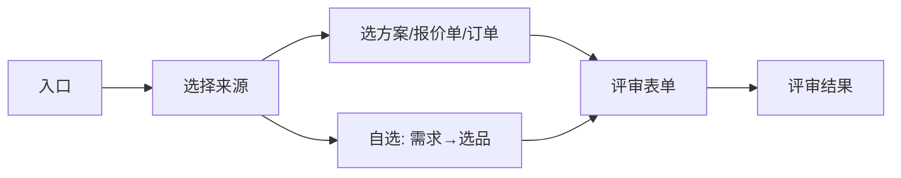

# 功能需求说明 · 交期与订单运营（v1.4.0）

## 0. 文档元信息

| 项 | 内容 |
|----|------|
| 版本 | v1.4.0 |
| 状态 | 已与演示实现对齐 |
| 依赖 | [功能描述-方案报价下单-v1.2.0.md](./功能描述-方案报价下单-v1.2.0.md)；[需求描述编写规范](../docs/需求描述编写规范.md) |
| 标注 | [annotation-docs/05-交期与订单运营.md](./annotation-docs/05-交期与订单运营.md) |
| 实现目录 | `v1.4.0/` |

| 日期 | 变更 |
|------|------|
| 2026-06-10 | 按《需求描述编写规范》七章重排；进度改为需求→选单→详情；变更改为确认卡 |
| 2026-06-10 | 复制流程对齐需求筛选；交期结果去掉评审单号行 |

---

## 1. 一句话与边界

本模块包含四项 **并列能力**：交期评审、复制订单、订单变更、订单进度。均须在顶栏已选客户后使用。

| 能力 | 做什么 | 不做什么 | 完成标准 |
|------|--------|----------|----------|
| 交期评审 | 按方案/报价单/订单/自选品评估能否按期 | 不替代正式排产；不阻塞下单主链路 | 提交评审后展示结果卡，可按来源跳转下单或进度 |
| 复制订单 | 从历史单复制明细，改价后下单 | 新客户不可用；非「一键原样重提」 | 老客户走完需求→选单→明细确认→下单确认并成功落单 |
| 订单变更 | 对未完成单发起变更申请 | 已完成单不可变更；无复杂变更单表单 | 选单→确认→已提交卡；已审核单回销售审核 |
| 订单进度 | 查单笔订单履约进度 | 非列表批量运营屏 | 选单后展示订单头、PC 明细表、时间轴 |

---

## 2. 角色与前置

| 规则 | 说明 |
|------|------|
| 客户必选 | 四项能力均须顶栏已选当前客户 |
| 老客户 / 新客户 | 客户类型影响交期自选、复制门禁；规则同方案速配 |
| 复制门禁 | **仅老客户**；新客户 toast 并引导方案/报价；复制流程下切换客户 **仅展示老客户** |
| 与主链路 | 交期、复制 **不要求** 先完成报价/下单；结果卡「生成订单」仅为便捷入口 |

---

## 3. 流程总览

### 3.1 交期评审

| 步骤 | 用户动作 | 界面 | 下一跳 | 可跳过 |
|------|----------|------|--------|--------|
| 1 | 点交期评审 / 话术 | 交期评审 · 入口（可跳过） | 选择来源 | 技能条直达来源 |
| 2 | 选来源 | 交期评审 · 选择来源 | 选单 / 需求 / 表单 | 仅 1 条数据时直达表单 |
| 3 | 选方案/报价单/订单 | 对应选单卡 | 评审表单 | — |
| 3b | 自选商品 | 需求引导 → 交期自选选品 | 评审表单 | 老客户可跳过需求 |
| 4 | 提交评审 | 交期评审 · 表单 | 评审结果 | — |
| 5 | 结果操作 | 交期评审 · 结果 | 下单确认 / 进度详情 / 方案速配 | — |

### 3.2 复制订单

| 步骤 | 用户动作 | 界面 | 下一跳 | 可跳过 |
|------|----------|------|--------|--------|
| 1 | 点复制订单 | 复制订单 · 需求筛选 | 选择历史单 | 话术唯一订单号直达明细确认 |
| 2 | 确认/跳过需求 | 复制订单 · 选择历史单 | 明细确认 | 同上 |
| 3 | 确认复制 | 复制订单 · 明细确认 | 下单确认 | — |
| 4 | 确认下单 | 下单确认（见文档 02） | 订单成功 | — |

### 3.3 订单变更

| 步骤 | 用户动作 | 界面 | 下一跳 | 可跳过 |
|------|----------|------|--------|--------|
| 1 | 点订单变更 | 订单变更 · 选择历史单 | 确认变更 | — |
| 2 | 确认变更 | 订单变更 · 确认变更 | 变更已提交 | — |

### 3.4 订单进度

| 步骤 | 用户动作 | 界面 | 下一跳 | 可跳过 |
|------|----------|------|--------|--------|
| 1 | 点订单进度 / 交期查看进度 | 订单进度 · 需求筛选 | 选择订单 | 话术唯一订单号直达详情 |
| 2 | 确认/跳过 | 订单进度 · 选择订单 | 进度详情 | 同上 |
| 3 | 重选订单（可选） | 订单进度 · 详情 | 选择订单 | — |

---

## 4. 分支与异常

| 场景 | 行为 |
|------|------|
| 无历史订单（复制） | 对话提示，不推选单卡 |
| 新客户复制 | toast + 引导方案/报价 |
| 已完成订单变更 | toast「已完成订单不可变更」 |
| 交期来源无数据 | 对应来源选项置灰 + 数量副文案 |
| 评审未选期望交期 | toast「请选择期望交期」 |
| 评审未选工艺版本 | toast「请为每项选择工艺版本」 |
| 话术「第 N 条」 | 复制/变更/进度选单卡内生效 |
| 修改需求 | 复制/进度选单卡内可回到需求筛选 |

---

## 5. 卡片规格

### 5.1 交期评审 · 入口

| 块 | 说明 |
|----|------|
| 出现 | 技能「交期评审」、话术「评估交期」等 |
| 展示 | 标题、当前客户、客户类型标签；主按钮「评估交期」 |
| 操作 | 评估交期 → 选择来源 |
| 数据 | 顶栏当前客户 |
| 校验 | 未选客户走全局选客户引导 |
| 关联 | 技能条直达来源时可不经本卡 |

### 5.2 交期评审 · 选择来源

| 块 | 说明 |
|----|------|
| 展示 | 分组：已有单据（按方案 / 按报价单 / 按订单）+ 从头评估（自选商品，主色） |
| 操作 | 按方案 → 选方案或表单；按报价单 → 选报价单或表单；按订单 → 选订单或表单；自选 → 需求或选品 |
| 数据 | 方案数、报价单数、未排程订单数决定置灰 |
| 校验 | 无数据项置灰 |

### 5.3 交期评审 · 选方案 / 选报价单 / 选订单

| 选单 | 列表展示 | 数据从哪来 |
|------|----------|------------|
| 选方案 | 方案名称、编号、品项摘要 | 当前客户已保存方案 |
| 选报价单 | 报价单号、金额、模板名 | 客户全部报价单，生成时间倒序 |
| 选订单 | 订单号、日期·金额、品项摘要 | **未排程**订单，下单日期倒序 |

操作：点选一行 → 载入明细 → 评审表单（订单行只读）。

### 5.4 交期评审 · 需求引导（自选路径）

| 块 | 说明 |
|----|------|
| 出现 | 自选商品 · 交期路径 |
| 展示 | 需求输入；老客户显示「跳过，按最近订单推荐」 |
| 操作 | 确认需求 / 跳过 → 交期自选选品卡 |
| 数据 | 新老客户规则同方案直选需求引导 |
| 关联 | 对话完整需求句可跳过本卡 |

### 5.5 订单选单卡（多场景共用）

同一张对话卡宿主，**标题与下一步因场景而异**：

| 场景 | 标题 | 列表列 | 点选后 | 附加 |
|------|------|--------|--------|------|
| 交期自选 | 交期评审 · 自选商品 | 选品推荐区（非订单列表） | 评审表单 | 主按钮「下一步：确认选品」 |
| 复制订单 | 复制订单 · 选择历史单 | 序号、订单号、日期·金额、品项（**无状态徽章**） | 明细确认 | 检索、加载更多、需求回显与修改 |
| 订单变更 | 订单变更 · 选择历史单 | 同复制 | 确认变更 | 检索、加载更多 |
| 订单进度 | 订单进度 · 选择订单 | 同复制 | 进度详情 | 检索、加载更多、需求回显与修改 |

数据：复制/变更/进度均为 **本客户历史订单，按下单日期倒序**；复制与进度可按需求筛品项摘要。

### 5.6 交期评审 · 表单

| 块 | 说明 |
|----|------|
| 展示 | 来源摘要（只读）；期望交期（必填）；工艺版本明细表（每行下拉）；是否生成采购计划（默认后台带入，可改） |
| 不展示 | 开始时间、结束时间（在结果卡） |
| 操作 | 提交评审 → 结果卡 |
| 数据 | 明细来自报价行 / 订单行 / 自选汇总；工艺版本候选项按货品规格 |

### 5.7 交期评审 · 结果

| 块 | 说明 |
|----|------|
| 展示 | 结论徽章；按期/无法按时 **均有** 结论文案区；无法按时另有「无法交付原因」分条（**无评审单号行**）；参数摘要（开始/结束时间、期望交期、工艺版本、采购计划）只读 |
| 操作 | 按期+报价/自选：生成订单；无法按时：调整方案（回显评审表单）；无法按时次按钮：仍要生成订单（报价/自选）；**本版无查看订单进度** |
| 关联 | 不展示「评审完成，可以生成订单。」 |

### 5.8 复制订单 · 需求筛选

| 块 | 说明 |
|----|------|
| 展示 | 描述要复制的订单特征；可跳过 |
| 操作 | 确认 → 选择历史单；跳过 → 按最近下单展示全部 |
| 关联 | 唯一订单号话术可跳过本卡与选单 |

### 5.9 复制订单 · 明细确认

| 块 | 说明 |
|----|------|
| 展示 | 来源订单号、下单日期（无类型徽章）、客户名；手风琴明细；合计金额 |
| 操作 | 点行展开改规格/数量/单价；**重选订单**；**确认复制** → 下单确认 |
| 关联 | 下单确认负责结算/发货与提交 |

### 5.10 订单变更 · 确认变更

| 块 | 说明 |
|----|------|
| 展示 | 订单号、日期·金额、品项、客户；说明文案 |
| 操作 | 重选订单；确认变更 → 变更已提交 |
| 校验 | 已完成订单不可进入 |

### 5.11 订单变更 · 变更已提交

| 块 | 说明 |
|----|------|
| 展示 | 订单号、受理说明（已审核变更时提示回退销售审核） |
| 操作 | 停留对话页，无强制跳转 |

### 5.12 订单进度 · 需求筛选

同 **§5.8** 逻辑；确认/跳过 → 选择订单；唯一订单号直达 **进度详情**。

### 5.13 订单进度 · 详情

| 块 | 说明 |
|----|------|
| 展示 | 标题：订单号 + 状态徽章；订单头（客户、单据日期、工单生产状态、发货日期、业务员、备注、状态说明）；PC 宽表明细（序号、存货编码/名称/规格、销售单位、单价、税后单价、税额、未税/税后金额、下单数量、累计退货、实际发货日期、生产单号、行备注）；进度时间轴 |
| 操作 | 重选订单 → 进度选单卡 |
| 数据 | 订单主档 + 明细行；时间轴来自订单进度节点 |

---

## 6. 数据与状态

### 6.1 订单类型（进度详情徽章 / 演示）

| 类型 | 含义（演示） |
|------|--------------|
| 未审核 | 新建待处理 |
| 销售审核 | 主管审核中 |
| 已审核 | 可排产/履约 |
| 已完成 | 整单关闭 |
| 异常 | 缺料、交期冲突等 |

**待提交**：报价转单草稿，不在交期「按订单」选单中展示。

### 6.2 时间轴

标准节点：**未审核 → 销售审核 → 已审核 → 已完成**；当前节点高亮；已完成节点打勾；异常节点标红。

### 6.3 新单状态（复制提交后）

v1.4.0 演示：**未审核**，并写入进度时间轴种子。

### 6.4 未排程订单（交期按订单）

非「待提交」、非「已完成」；演示层见主数据未排程判定规则。

---

## 7. 版本差异

| 项 | v1.3.0 | v1.4.0（本文） |
|----|--------|----------------|
| 复制提交后新单状态 | 待排产 | **未审核** |
| 其余流程 | 与本文 §3～§6 一致 | — |

经营分析（产能、业务分析等）见 [功能描述-经营分析-v1.4.0.md](./功能描述-经营分析-v1.4.0.md)，不在本文范围。

研发标识与验收面板映射见 [annotation-docs/05-交期与订单运营.md](./annotation-docs/05-交期与订单运营.md)。
