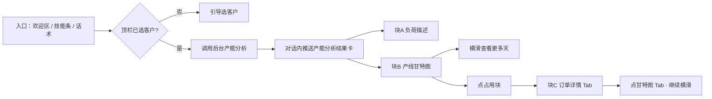
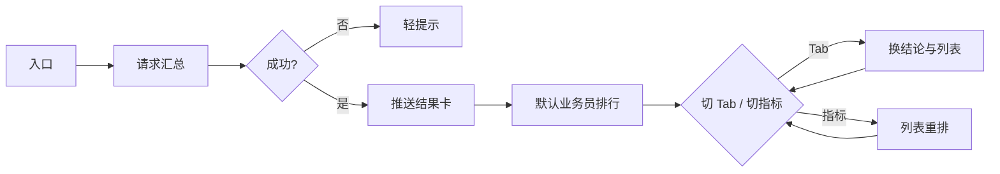

# 功能描述 · 经营分析（v1.4.0）

> **范围**：经营分析四能力；本版详细展开 **产能分析**（§1.1）、**业务分析**（§1.3，已实现原型）；库存查询、回款分析见 §1.2、§1.4  
> **对应实现**：`.output/v1.4.0/` · 标注详见 `annotation-docs/06-经营分析.md`（规划）  
> **书写约定**：本文档为 **产品/业务需求**，使用 **业务名称** 描述数据与规则；不写 JSON/API/代码字段名。标注标识、接口字段映射见 **附录 B** 及开发文档。

---

## 1.1 产能分析

### 1.1.1 功能定位

| 项 | 说明 |
|----|------|
| **用户** | 外勤销售（拜访途中快速判断「工厂还能不能接单、大概排到哪天」） |
| **做什么** | 在已选客户前提下，展示 **负荷描述**（排产至日期 + 平均负荷率）+ **产线占用甘特图**（只读） |
| **不做什么** | 不接真实 MES/APS 排程引擎；不支持拖拽改排、锁单/解锁、预排下达、工序级编辑 |
| **与交期评审关系** | 交期评审看「某单/某品能否按期」；产能分析看「全厂/产线整体排到哪、忙不忙」——**并列能力，互不阻塞** |

---

### 1.1.2 业务流程



| 步骤 | 说明 |
|------|------|
| 1. 选客户 | **前置条件**：顶栏当前客户已选定；未选则走与其它技能一致的选客户引导 |
| 2. 触发 | 用户点击「产能分析」或说「产能分析」「排到哪天了」等 |
| 3. 请求 | 携带 **当前客户、当前企业**；后台 **一次聚合返回**：甘特与占用详情走已有能力直返，负荷描述按 §1.1.10 **查询/计算** |
| 4. 展示 | 对话气泡内一张 **结果卡**，含负荷描述 + 甘特图；无跳转全屏页 |
| 5. 看占用详情 | 点击占用块 → **自动切「订单详情」Tab**；点「甘特图」Tab 回甘特，保留横滑位置 |

---

### 1.1.3 入口

| 入口 | 行为 |
|------|------|
| 欢迎区功能格「产能分析」 | 等同技能条 |
| 底部技能条「产能分析」 | 与欢迎区一致，进入本流程 |
| 话术 | 「产能分析」「查产能」「排到哪天了」「产线负荷」等 → 进入本流程 |

**AI 引导语（可选，结果卡前一行）**：

> 为 **{客户名}** 查询产能排程：

---

### 1.1.4 结果卡 · 整体结构

**卡片**：产能分析（标注标识见 §1.1.12）

**出现时机**：后台返回成功后，以对话内嵌卡片展示。

| 区域 | 说明 |
|------|------|
| 卡片标题 | **「产能分析」** |
| 块 A · 负荷描述 | 2～4 行摘要，由后台 **基于甘特数据计算**（§1.1.10） |
| 块 B · 产线甘特图 | **已有排程接口直返**（§1.1.9）；一行一产线；首屏 **1 天**，可横滑 |
| 块 C · 占用详情 | **已有能力直返**，随占用块一并带回订单字段；点击后切 Tab（§1.1.7） |
| 图例（可选） | 占用块色块含义、非工作时段、当前时刻线 |
| 操作提示 | 甘特区下方小字：「点击占用块查看订单详情；点「甘特图」继续浏览」 |

> 结果展示为 **负荷描述 + 产线甘特图 + 订单详情 Tab** 一张结果卡。

---

### 1.1.5 块 A · 负荷描述（展示）

**目标**：用自然语言告诉销售「订单已经排到哪天、整体忙不忙」。

> **数据来源**：本节为 **展示规格**。排产至日期、平均负荷率等值的 **查询/计算逻辑见 §1.1.10**；甘特原始数据来自 §1.1.9 已有接口。

| 字段 | 说明 | 来源 |
|------|------|------|
| **排产至日期** | 当前已排产任务的最晚结束日（全厂维度） | §1.1.10 计算 |
| **平均负荷率** | 自 **今日** 至 **排产至日期**，全厂所有产线 **工作实际小时数 ÷ 可工作小时数**（见 §1.1.10） | §1.1.10 计算 |

**展示文案示例**（后台给出 **2 行负荷摘要**，前端逐行展示）：

```
4 条线自今日起已排至 02/27（最晚产线：测试1127）
平均负荷率 82%
```

**样式建议**：

- **首行**：一句概括产线数、统计起点（今日）、排产至日期与最晚产线；加粗或主色，置于块 A 最上方
- **第二行**（平均负荷率）：数字突出；≥90% 可用警告色提示「高负荷」

**负荷率色阶（演示 / 可选）**：

| 区间 | 含义 | 徽章 |
|------|------|------|
| &lt; 60% | 相对空闲 | 成功绿 |
| 60%～89% | 正常 | 中性 |
| ≥ 90% | 高负荷 | 警告橙 |

---

### 1.1.6 块 B · 产线甘特图（展示）

**目标**：对齐 ERP 排程甘特参考图，在 H5 窄屏内 **只读** 展示各产线占用。

> **数据来源**：**已有后台排程/甘特接口，字段直返**，销售助手不做二次计算（§1.1.9）。

**结构原则（重要）**：

- **一行 = 一条产线**（产线行），不是「一行一个订单」。
- 产线行右侧时间轴上，按起止时间排列多个 **占用块**（每个块对应一段排程占用，通常关联一张订单/工序任务）。
- 左列仍可按 **分类** 分组展示多条产线行。

#### 布局（双区）

```
┌──────────┬──────────────────────────────────→ 横滑（查看更多天）
│ 分类     │  2026/12/08（周四）                 ← 首屏默认 1 天
│ 产线     │  01  02  03 … 22  23               ← 小时刻度
├──────────┼────────────────────────────────────
│ 分类1    │
│  产线1   │  [占用块A][占用块B]  ░休息░  [占用块C]
│  产线2   │      [占用块D] …
│ 分类2    │
│  产线3   │  …
└──────────┴────────────────────────────────────
     ↑ 左列固定              ↑ 右区：产线行 × 时间网格
```

| 分区 | 内容 |
|------|------|
| **左列（固定）** | **分类**（分组标题行）+ **产线名**（每条产线占 **一行**） |
| **右区（横滑）** | 与左列行对齐的 **产线行** 时间网格 + **占用块** |
| **首屏视口** | **默认 1 天**（24 小时）；向右横滑查看后续日期 |
| **顶栏时间轴** | 第一行：**日期**（含星期）；第二行：**小时**（01:00～23:00） |
| **时间轴粒度** | 默认 **小时**；**页面不提供** 日/周/月等粒度切换控件（仅需求约定，用户不可选） |

#### 时间轴粒度（需求约定）

| 项 | 说明 |
|----|------|
| **默认粒度** | **小时**——占用块按计划起止映射到小时刻度；网格竖线按小时划分 |
| **页面** | **不展示** 粒度选择器，不支持切换为「按天汇总」等其它视图 |
| **与首屏** | 首屏仍默认可见 **1 天** 的小时轴；横滑可查看更多天的小时刻度 |

#### 网格与辅助线

| 元素 | 说明 |
|------|------|
| **非工作时段** | 纵向灰带（休息/换班）；由排程接口 **直返** |
| **当前时刻线** | 绿色虚线竖线；由排程接口 **直返** |
| **小时竖线** | 浅色网格 |

#### 占用块（产线行内的时间块）

每个占用块 = 一条产线在 **计划开始～计划结束** 上的一段占用。

| 属性 | 说明 |
|------|------|
| 所在行 | 归属 **某条产线** |
| 起止 | **计划开始时间、计划结束时间** → 决定色块宽度与位置 |
| 块内文案 | 可显示订单号缩写或留空（窄块仅色块）；**详情在订单详情 Tab 展示** |
| 颜色 | 由 **占用状态** 决定（正常 / 延误 / 预排等） |
| 锁 / 预 | 块首锁图标、「预」标记（只读展示） |
| 维护块 | 无订单号的保养/停机块（可选） |

#### 交互（只读）

| 操作 | 结果 |
|------|------|
| 横向滑动 | 首屏 1 天后，继续查看后续日期 |
| 点击占用块 | 填入详情并 **切至「订单详情」Tab**（§1.1.7） |
| 拖拽 / 改长度 | **禁止** |

#### 空态

| 场景 | 展示 |
|------|------|
| 某产线行无占用 | 该行时间轴为空网格 |
| 全无数据 | 「暂无排程数据」 |
| 后台失败 | 轻提示失败，不展示结果卡 |

---

### 1.1.7 块 C · 占用详情（Tab 切换）

**目标**：在 **同一张产能分析结果卡** 内查看参考 ERP 的订单字段，并能 **切回甘特 Tab 继续横滑/点其它块**。

#### 展示形式：卡片内 Tab（方案 B）

负荷描述下方增加 **Tab 栏**，两个 Tab 互斥展示：

```
┌─ 产能分析 ──────────────────────────┐
│ 负荷描述 …                          │
│ [ 甘特图 ]  [ 订单详情 ·000003 ]    │  ← Tab 栏
│ ┌─ 当前 Tab 内容 ──────────────────┐ │
│ │  甘特：产线行 + 占用块（默认）    │ │
│ │  或 详情：订单字段列表（可滚动）  │ │
│ └──────────────────────────────────│
└────────────────────────────────────┘
```

**为何用 Tab 而非浮层**：更符合 H5 报表/卡片常见交互；字段多时可读；切 Tab 时甘特仍保留在卡片内，**横滑位置不丢失**。

#### 占用详情字段（已有能力直返）

对齐参考 ERP 卡片，**标签 - 值** 两列只读；**随所点占用块一并返回**，页面不再单独发起查询。

| 字段 | 示例 |
|------|------|
| 订单号 | XSD2026022500000003 |
| 客户名称 | CZH-KH001 |
| 下单时间 | 2026-02-25 10:39:15 |
| 交货时间 | 2026-02-25 00:00:00 |
| 产品编码 | 2323 |
| 产品名称 | 2323 |
| 工艺版本 | 1.0 |
| 生产数量 | 100 |
| 完工数量 | 0 |
| 计划开始时间 | 2026-02-26 17:06 |
| 计划结束时间 | 2026-02-27 15:25 |
| 产线 | 测试1127 |
| 工序 | 开料-切割（工序1-New） |
| 模具 | — |
| 生产时长(分钟) | 1000 |

#### 交互与「返回甘特」

| 机制 | 说明 |
|------|------|
| **默认 Tab** | 「甘特图」 |
| **点占用块** | 填入详情字段 → **自动切到「订单详情」Tab**；Tab 上显示订单号后 6 位徽章 |
| **详情摘要行** | 「当前查看：{订单号} · {产线}」 |
| **回甘特** | 点 **「甘特图」Tab**；甘特 **横滑位置不变** |
| **选中态** | 切回甘特后，刚查看的占用块 **高亮闪烁** 约 2s |
| **未选块点详情 Tab** | 轻提示「请先点击甘特图中的占用块」 |
| **首屏提示** | 甘特 helper：「点击占用块查看订单详情；点「甘特图」继续浏览」 |

#### 标注

标注标识见 §1.1.12。

---

### 1.1.8 后台数据来源分工

| 数据域 | 来源方式 | 说明 |
|--------|----------|------|
| **块 B · 产线甘特** | **已有后台能力，直返** | 产线分类、产线清单、占用块、计划起止、占用状态、非工作时段、当前时刻、甘特展示时间窗等；销售助手 **转发给页面** |
| **块 C · 占用详情** | **已有后台能力，直返** | 每个占用块携带完整 **订单占用详情**；点块读已返回数据，**不二次查询** |
| **块 A · 负荷描述** | **销售助手侧查询/计算** | 在拿到甘特数据后，按 §1.1.10 计算排产至日期、平均负荷率并组装摘要 |

**请求上下文**：

| 业务项 | 用途 |
|--------|------|
| **当前企业** | 确定工厂/组织，调用已有产线排程能力 |
| **当前客户** | H5 顶栏选中客户（与其它分析技能一致）；甘特为 **工厂级总览**，不按客户过滤产线；用于 AI 引导语等展示 |

**聚合方式（销售助手一次返回）**：

1. 调用已有 **产线排程甘特能力** → 得到甘特与占用详情  
2. 对同一数据集执行 §1.1.10 计算 → 得到负荷描述  
3. 合并为 **一次产能分析结果** 给 H5 展示  

---

### 1.1.9 已有能力 · 产线甘特与占用详情（直返）

> 以下内容 **已有后台能力，直接返回**；销售助手与 H5 **不做重算**。实现层字段映射见开发文档 / 接口说明，**需求本文仅列业务含义**。

#### 甘特时间轴与产线结构

| 业务项 | 说明 |
|--------|------|
| **甘特展示时间窗起点** | 甘特图横轴起始日期时刻 |
| **甘特展示时间窗终点** | 甘特图横轴结束日期时刻 |
| **当前时刻** | 「现在」竖线所在时刻 |
| **首屏展示天数** | H5 首屏可见天数；本版固定 **1 天** |
| **产线分类列表** | 如「分类1、分类2」，用于左列分组 |
| **产线清单** | 每条产线含 **产线名称**；占用块归属某条产线 |
| **占用块列表** | 见下表 |

#### 占用块（产线行内）

| 业务项 | 说明 |
|--------|------|
| **占用块标识** | 唯一标识一条占用记录 |
| **所属产线** | 该块落在哪条产线行 |
| **计划开始时间** | 占用起始 |
| **计划结束时间** | 占用结束 |
| **占用状态** | 如：正常已排、延误、预排、保养/停机 |
| **是否锁定** | 是则在块上展示锁标记（只读） |
| **订单占用详情** | 点击块时展示的订单字段集合，见下表 |

#### 非工作时段

| 业务项 | 说明 |
|--------|------|
| **非工作时段列表** | 休息、换班等不可排产区间 |
| **每条非工作时段** | 含 **开始时刻、结束时刻** |

#### 订单占用详情（随占用块直返）

| 业务字段 | 说明 |
|----------|------|
| 订单号 | |
| 客户名称 | |
| 下单时间 | |
| 交货时间 | |
| 产品编码 | |
| 产品名称 | |
| 工艺版本 | |
| 生产数量 | |
| 完工数量 | |
| 计划开始时间 | 展示用 |
| 计划结束时间 | 展示用 |
| 产线 | 产线名称 |
| 工序 | |
| 模具 | 无则展示「—」 |
| 生产时长（分钟） | |

**纳入负荷计算的占用类型**（§1.1.10 使用同一批数据时）：

| 占用状态 | 是否参与排产至日期 / 平均负荷率 |
|----------|--------------------------------|
| 正常已排 | ✅ |
| 延误 | ✅ |
| 预排 | ✅（计入负荷；是否计入「排产至日期」可配置，**默认计入**） |
| 保养/停机 | ❌ 不参与排产至日期；展示为维护块或并入非工作时段，**不计入**订单占用负荷 |

---

### 1.1.10 块 A · 负荷描述 · 查询/计算逻辑

> **本节为 v1.4.0 需新实现的销售助手逻辑**（可在 **销售助手聚合服务** 实现）。**输入**为 §1.1.9 已返回的：产线分类与清单、占用块列表、非工作时段、甘特展示时间窗起止。

> **本节为 v1.4.0 需新实现的销售助手逻辑**（可在 **销售助手聚合服务** 实现）。**输入**为 §1.1.9 已返回的：产线分类与清单、占用块列表、非工作时段。  
> **计算顺序**：先算 **排产至日期** → 再以其为负荷统计终点，算 **平均负荷率**。

#### 1. 平均负荷率 · 统计范围

**口径**：自 **今日 0 点**（工厂时区）起，至 **排产至日期** 当日 **24 点**（含）止。

| 项 | 规则 |
|----|------|
| **起点** | **今日** 0:00:00 |
| **终点** | **排产至日期** 当日 23:59:59（排产至日期见下文 §2） |
| **与甘特** | 甘特 **展示时间窗** 仍由已有排程能力直返（可宽于本统计范围）；**平均负荷率不随甘特展示窗变化** |

若无符合条件的占用块、排产至日期为空 → 平均负荷率统计范围与展示按 §5 边界处理。

**含义**：全厂所有产线上，**已排产订单占用** 的 **最晚计划结束时间** 所在 **自然日**。

**步骤**：

1. 在占用块列表中，取状态为 **正常已排、延误、预排** 的记录（不含 **保养/停机**）。  
2. 对每条取 **计划结束时间**，求 **最晚** 的一条。  
3. **排产至日期** = 该时刻的 **日期部分**（工厂时区）。  
4. 若没有任何符合条件的占用 → 排产至日期为空；页面展示「当前暂无排产占用」类文案。

**最晚产线名称**（可选，用于摘要）：

- 在最晚结束时刻对应的占用块中，取 **所属产线名称**。  
- 若多条产线同时最晚，取 **产线名字典序第一条**（或固定任选一条，前后端保持一致）。

#### 3. 平均负荷率

**含义**：在 §1 统计范围内，全厂所有产线合计：

> **平均负荷率** = 四舍五入（全厂 **工作实际小时数** ÷ 全厂 **可工作小时数** × 100）

结果为 0～100 的整数百分比。

**单条产线的可工作小时数**：

> 统计范围内该产线日历小时数  
> − 统计范围内 **非工作时段** 与该产线相关的重叠小时数  
> − 该产线上 **保养/停机** 占用块与统计范围的重叠小时数

> 若非工作时段为全厂共用，每条产线扣除相同小时；若按产线区分，则只扣对应产线。

**单条产线的工作实际小时数**：

> 该产线上所有 **正常已排、延误、预排** 占用块，其 **计划开始～计划结束** 与统计范围 **重叠部分** 的小时数之和。

**重叠小时规则**（闭区间）：

> 重叠起点 = 较晚的开始时刻（占用开始 vs 统计范围起点）  
> 重叠终点 = 较早的结束时刻（占用结束 vs 统计范围终点）  
> 若重叠起点早于重叠终点 → 计入两者之差（换算为小时）；否则计 0。

**全厂合计**：

> 全厂 **可工作小时数** = 各产线可工作小时数之和  
> 全厂 **工作实际小时数** = 各产线工作实际小时数之和  
> 若全厂可工作小时数 > 0：按上式得平均负荷率；否则平均负荷率 = 0。

**负荷等级**（可选，供页面色阶）：

| 条件 | 等级 |
|------|------|
| 平均负荷率 ≥ 90% | 高负荷 |
| 平均负荷率 &lt; 60% | 相对空闲 |
| 其余 | 正常 |

#### 4. 负荷摘要文案组装

后台组装 **2 行** 文案，页面逐行展示（§1.1.5 示例）：

| 行序 | 文案模板 | 条件 |
|------|----------|------|
| 1 | {产线总数} 条线自今日起已排至 {排产至日期}（最晚产线：{最晚产线名}） | 有排产至日期；无最晚产线名则省略括号段 |
| 2 | 平均负荷率 {N}% | 始终 |

**产线总数** = 所有分类下产线条目数之和。

#### 5. 边界与异常

| 场景 | 处理 |
|------|------|
| 无占用块 | 排产至日期为空；平均负荷率 = 0；摘要仅 1 行「当前暂无排产占用」（无第二行负荷率时可省略或展示 0%） |
| 某产线可工作小时为 0 | 该产线不参与合计（分子分母均不累计） |
| 占用块跨越多日 | 仅计与统计窗重叠部分，不重复 |
| 排程能力调用失败 | 整体失败，轻提示，不展示结果卡 |
| 仅负荷计算异常 | 建议仍返回甘特；负荷区展示「—」并记日志（可联调约定为整体失败） |

---

### 1.1.11 一次返回内容分工（业务视角）

| 返回内容 | 来源 | 说明 |
|----------|------|------|
| 排产至日期 | §1.1.10 计算 | |
| 最晚产线名称 | §1.1.10 计算 | 可选 |
| 平均负荷率 | §1.1.10 计算 | |
| 负荷等级 | §1.1.10 计算 | 可选 |
| 负荷摘要文案（多行） | §1.1.10 组装 | |
| 甘特展示时间窗起止 | §1.1.9 直返 | |
| 当前时刻 | §1.1.9 直返 | |
| 首屏展示天数 | 固定 1 或直返 | |
| 产线分类与清单 | §1.1.9 直返 | |
| 占用块列表（含订单详情） | §1.1.9 直返 | |
| 非工作时段列表 | §1.1.9 直返 | |

> **H5 原型**：本地演示数据模拟 **聚合后的完整结果**；页面只负责展示，**不实现** §1.1.10 计算。

---

### 1.1.12 标注与验收

| 业务模块 | 章节 |
|----------|------|
| 产能分析（含 Tab + 甘特/详情） | §1.1 |
| 订单详情 Tab | §1.1.7 |

> 设计标注标识与页面对照见 **附录 B**；正文仅用业务名称。

**验收要点**

- [ ] 未选客户 → 选客户引导
- [ ] 已选客户 → **排产至日期** + **平均负荷率**
- [ ] 甘特：**一行一产线**；首屏 **1 天**；可横滑；非工作灰带、当前时刻线、占用块可见
- [ ] 点占用块 → 自动切「订单详情」Tab，字段齐全；点「甘特图」Tab 后横滑位置保留、可继续点其它块
- [ ] 不可拖拽改排
- [ ] 设计标注模式与本文一致

---

## 1.2 库存查询

本版功能描述不展开。

## 1.3 业务分析

> **术语**：业务语境下 **客户 = 企业**（ERP 往来单位 / 客户名称）；下文 **客户** 与 **企业** 同义。  
> **核心规则**：**不选客户（企业）**；统计 **全部客户（企业）** 的汇总数据，不限于顶栏当前选定的那一家。  
> **使用场景**：管理者纵览 **全部业务员** 与 **全部客户（企业）** 的成单/交易情况。  
> **数据参照**：ERP「单据表体自定义统计」（下单业务员、客户名称、下单数量、总数量、总金额等）。

### 1.3.1 功能定位

| 项 | 说明 |
|----|------|
| **用户** | 管理者（关注 **谁在扛业绩、客户（企业）是否过度集中** 等经营问题） |
| **做什么** | 基于 **全部客户（企业）** 的单据，展示 **业务员排行** 与 **客户排行**；各 Tab 给 **一句话经营结论**；列表支持按 **订单量、总数量、总金额** 排序 |
| **不做什么** | **不要求先选客户（企业）**、**不按单一客户过滤**；不做 ERP 全屏筛选；不做行下钻；不替代 BI 大屏 |
| **数据范围** | 统计时间范围内、权限可见的 **全部客户（企业）** 符合条件单据之 **全量汇总** |

---

### 1.3.2 业务流程



| 步骤 | 说明 |
|------|------|
| 1. 触发 | 欢迎区 / 技能条 / 话术；**不选客户** |
| 2. 请求 | 全部客户（企业）汇总；默认 **本年 1/1～今日** |
| 3. 展示 | 结果卡：摘要 + Tab + 一句话结论 + Top 10；默认 **业务员 · 总金额** |
| 4. 切 Tab | 更新结论与列表；各 Tab **记忆**段选 |
| 5. 切指标 | **仅** 列表重排，结论不变 |

---

### 1.3.3 入口

| 入口 | 行为 |
|------|------|
| 欢迎区「业务分析」 | 直接进入，**无需选客户（企业）** |
| 底部技能条「业务分析」 | 同上 |
| 话术 | 「业务分析」「全部客户排行」「业务员排行」「谁卖得好」等 |

**AI 引导语（可选，结果卡前一行）**：

> 为您汇总 **全部客户** 业务排行：

> 统计 **全部客户（企业）**；顶栏若已选定某一客户，**仍不按该客户过滤**。

---

### 1.3.4 结果卡 · 整体结构

**卡片标题**：**业务分析**

**出现时机**：汇总返回成功后，对话内嵌一张卡（无跳转全屏页）。

```
┌─ 业务分析 ──────────────────────────┐
│ 统计范围：2026/01/01～02/27 · 共 1118 笔   │
│ [ 业务员排行 ]  [ 客户排行 ]              │
│ 王业务成交居首，前三业务员贡献了 67% 业绩， │
│ 团队出单高度集中在头部。                    │
│ 排序：[ 订单量 ] [ 总数量 ] [ 总金额 ]     │
│ ┌────────────────────────────────────┐
│ │ 1  王业务          ¥1928 万       │
│ │ 2  李销售          ¥1465 万       │
│ │ …  Top 10                         │
│ └────────────────────────────────────┘
│ 切换 Tab 查看客户排行；点指标切换列表排序   │
└───────────────────────────────────────┘
```

| 区域 | 说明 |
|------|------|
| 卡片标题 | 「业务分析」 |
| 摘要行 | 统计时间范围 + 参与汇总 **单据笔数** |
| Tab | **业务员排行**（默认、置前）｜**客户排行** |
| **一句话结论** | Tab 下、段选上；**随 Tab 换句**，**不随**段选变化 |
| 指标段选 | **订单量**｜**总数量**｜**总金额**；默认 **总金额**；**仅影响排行列表** |
| 排行列表 | Top **10**，降序，只读 |
| 操作提示 | 「切换 Tab 查看客户排行；点指标切换列表排序」 |

**交互范式**：与产能分析 **Tab + 段选** 一致；**不用** ERP 式多行筛选栏。

---

### 1.3.5 一句话结论

Tab 下、段选上；**随 Tab 换句**，**不随**段选变化。基于总金额判断业绩/客户是否过度集中，固定话术输出一句。

**口径**

| 项 | 规则 |
|----|------|
| 指标 | 仅 **总金额** |
| 数据范围 | 当前 Tab **全部排行**（非 Top 10） |
| 占比 | 金额 ÷ 全量合计 × 100%，**四舍五入取整** |
| 领先者 | 总金额 **第 1 名** 姓名 |

**业务员 Tab**（按序匹配，命中即停）

| 条件 | 结论句 |
|------|--------|
| 前三合计占比 **≥ 55%** | {第1名}成交居首，前三业务员贡献了 {占比} 业绩，团队出单高度集中在头部。 |
| 否则，第1名占比 **≥ 35%** | {第1名}一人贡献了 {占比} 业绩，头部效应明显，需关注梯队建设。 |
| 其余 | {第1名}成交金额最高，出单分布较均衡，多数业务员均有贡献。 |

前三合计占比 = 前三名总金额之和 ÷ 全量合计；第2条 {占比} 取第1名单人占比。

**客户 Tab**（按序匹配，命中即停）

| 条件 | 结论句 |
|------|--------|
| 前五合计占比 **≥ 50%** | 前五大客户贡献了 {占比} 销售额，对大客户依赖明显，需防范客户集中风险。 |
| 否则，第1名占比 **≥ 20%** | {第1名}是最大客户，占总额 {占比}，整体客户结构尚可，但仍需持续拓客。 |
| 其余 | 客户贡献较分散，未出现单一客户过度依赖，经营结构相对健康。 |

前五合计占比 = 前五名总金额之和 ÷ 全量合计。

**演算**（业务员 Tab）：全量 6852 万，前三合计 4605 万 → 占比 67% → 第1条 →「王业务成交居首，前三业务员贡献了 67% 业绩，团队出单高度集中在头部。」

**异常**：无数据 →「暂无足够数据，无法给出经营结论。」；后台已返成品句 → **优先采用**；失败 → 不展示结果卡。

---

### 1.3.6 双排行 · 列表规格

#### 业务员排行（Tab 默认 · 置前）

| 列 | 说明 |
|----|------|
| 名次 | 1～10 |
| 业务员 | **下单业务员** 姓名；过长截断，可悬停看全称 |
| 指标值 | 随段选，见下表格式 |

#### 客户排行

| 列 | 说明 |
|----|------|
| 名次 | 1～10 |
| 客户名称 | **全部有交易的客户（企业）** 按指标降序 |
| 指标值 | 随段选，见下表格式 |

**指标展示格式**：

| 指标 | 格式 | 示例 |
|------|------|------|
| 订单量 | `{N} 单` | 186 单 |
| 总数量 | `{N} 件`（千分位） | 19,850 件 |
| 总金额 | `¥{N} 万`（≥1 万）或 `¥{N}` | ¥1928 万 |

> **排行口径**：基于 **全部客户（企业）** 汇总；列表展示 Top 10。

#### 列表交互（只读）

| 操作 | 结果 |
|------|------|
| 点 Tab | 切换排行维度 + **更新一句话结论**；**各自记住**上次段选指标 |
| 点指标段选 | 当前 Tab 列表 **重排** 并刷新数值格式 |
| 点某一行 | **本版无下钻** |
| 列表区域 | 卡片内 **纵向滚动** |

#### 空态与异常

| 场景 | 展示 |
|------|------|
| 某 Tab 无排行数据 | 列表区「暂无排行数据」 |
| 无法生成结论 | 「暂无足够数据，无法给出经营结论。」 |
| 后台失败 | 轻提示失败，不展示结果卡 |

---

### 1.3.7 排序、指标与时间

| 项 | 规则 |
|----|------|
| 默认 Tab | **业务员排行**（置前） |
| 默认指标 | **总金额** |
| Top N | **10**，**降序** |
| Tab 间段选 | **独立记忆**（切回 Tab 恢复上次指标） |

| 指标 | 业务含义（对齐 ERP「单据表体自定义统计」） |
|------|---------------------------------------------|
| **订单量** | 统计范围内 **下单笔数** |
| **总数量** | 统计范围内 **销售总数量** |
| **总金额** | 统计范围内 **销售总金额** |

| 项 | 说明 |
|----|------|
| **默认时间** | **本年 1 月 1 日～今日** |
| **摘要行** | `统计范围：YYYY/MM/DD～YYYY/MM/DD · 共 {笔数} 笔` |
| **本版** | 页面 **不提供** 日期筛选；改范围后续版本或话术扩展 |

---

### 1.3.8 前置条件与数据范围

| 项 | 说明 |
|----|------|
| 客户（企业） | **不要求**顶栏先选客户；请求 **不带单一客户条件** |
| 查询范围 | 账号权限内 **全部客户（企业）**、统计时间内 **全部符合条件单据** |
| 过滤规则 | **不按单一客户（企业）过滤**；顶栏当前选定项 **不参与** 本功能统计 |

> 能进入对话页即已登录；本文 **不描述** 登录校验流程。

---

### 1.3.9 后台数据与一次返回

#### 数据来源

| 数据域 | 来源 | 说明 |
|--------|------|------|
| 双排行（业务员 / 客户 × 三指标） | **已有统计能力，直返** | 全部客户（企业）全量聚合 |
| 摘要行（时间、单据笔数） | 同上 | |
| 全量合计（订单量、总数量、总金额） | 同上 | 供一句话结论计算 |
| 一句话结论 | **销售助手生成** | 后台亦可直返成品文案 |

**请求上下文**：统计时间范围（默认本年 1/1～今日）、当前账号数据权限。

**聚合步骤**：

1. 调用已有 **单据表体统计 / 经营汇总能力** → 双排行与全量合计  
2. 为每个 Tab **生成一句话结论**（或使用后台直返文案）  
3. 合并为 **一次业务分析结果** 给 H5 展示  

#### 直返字段（业务含义）

**摘要**：统计起始日、统计结束日、参与汇总单据笔数。

**全量合计**：合计订单量、合计总数量、合计总金额（全部客户企业维度）。

**业务员排行条目（每条）**：业务员姓名、订单量、总数量、总金额。

**客户排行条目（每条）**：客户名称、订单量、总数量、总金额。

> 排行应覆盖 **全部有交易** 的客户与业务员；H5 仅展示 Top 10，排序由当前段选决定。

#### 一次返回分工

| 返回内容 | 来源 |
|----------|------|
| 统计起止日、单据笔数 | 后台直返 |
| 合计订单量 / 总数量 / 总金额 | 后台直返 |
| 业务员 / 客户排行条目 | 后台直返 |
| 各 Tab 一句话结论 | 销售助手生成或后台直返 |

> **H5 原型**：本地演示数据模拟 **聚合后的完整结果**；结论按上文 **一句话结论** 规则本地生成。

---

### 1.3.10 标注与验收

**验收要点**

- [ ] **不要求**顶栏先选客户（企业）即可进入
- [ ] 统计 **全部客户（企业）**，不受顶栏当前选定项影响
- [ ] 默认：**业务员排行** Tab 置前 + **总金额** 段选 + Top 10
- [ ] 各 Tab 展示 **一句话结论**（老板视角，非指标罗列）
- [ ] 切 Tab → 结论与列表同步更新；两 Tab **各自记住**段选
- [ ] 切指标 → **仅列表**重排，结论不变
- [ ] 无选客户（企业）步骤、无 ERP 全屏筛选、无行下钻
- [ ] 设计标注模式与本文一致

> 设计标注标识与页面对照见 **附录 B**。

## 1.4 回款分析

本版功能描述不展开。

---

## 附录 A：业务规则摘要

| 规则 | 说明 |
|------|------|
| 客户必选 | 产能分析须已选客户（企业）；**业务分析不要求**先选 |
| 只读甘特 | H5 不提供改排 |
| 甘特/详情 | **已有后台接口直返**（§1.1.9） |
| 负荷描述 | 销售助手 **查询/计算**（§1.1.10），不在 H5 计算 |
| 业务术语 | 业务分析语境下 **客户 = 企业** |
| 业务结论 | 销售助手 **生成**或后台直返 |

---

## 附录 B：设计标注与实现对照（非业务需求正文）

> 下表供 **标注文档、前端落页、接口开发** 对照；**功能描述与 PRD 业务章节不写下列标识符与程序名**。

| 标注标识 | 业务模块 | 功能描述章节 |
|----------|----------|----------------|
| `card-capacity` | 产能分析 | §1.1 |
| `card-capacity-block-detail` | 订单详情 Tab | §1.1.7 |
| `card-biz-analysis` | 业务分析 · 双排行 + 一句话结论 | §1.3 |

| 后台职责 | 章节 |
|----------|------|
| 甘特与占用详情（已有能力直返） | §1.1.9 |
| 负荷描述（查询/计算） | §1.1.10 |
| 业务排行汇总（已有能力直返） | 业务分析 · 后台数据 |
| 一句话结论（生成或直返） | 业务分析 · 一句话结论 |

标注范围见本版本目录下标注配置文件。
