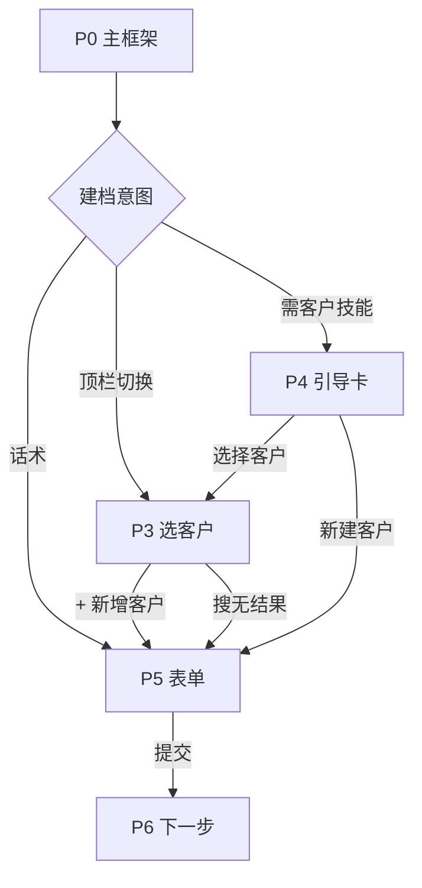

# UI 设计说明书 · v1.5.0（v3）

> **基于**：v1.4.0 对话页框架 · [shared/design-spec.md](../shared/design-spec.md)  
> **范围**：最近访问 · 新增客户  
> **画布**：H5 390×844 · 对话气泡内卡片宽约 **358px**（左右各 16px 内边距）

---

## 1. 页面清单

| 编号 | 视图 | 说明 |
|------|------|------|
| **P0** | 对话主框架 | 顶栏 **仅保留「切换」**，无新建按钮 |
| **P1** | 首屏 bundle | 欢迎 + 待跟进 + 最近访问 |
| **P3** | 选客户卡 | 底部「+ 新增客户」 |
| **P3a** | 搜无结果 | 新建引导 |
| **P4** | 缺客户引导卡 | 双按钮 |
| **P5** | 新增客户表单卡 | **本版重设计** |
| **P6** | 提交成功下一步卡 | 复用 v1.4 |

**已删除**：~~顶栏「新建」~~（v1.5 不做主框架入口）。

**新增客户入口（最终）**：P3 底部 · P3a · P4 · 话术。

---

## 2. P0 · 主框架

顶栏客户区与 v1.4.0 **完全一致**，仅「切换」按钮：

```
┌────────────────────────────────────── 390px ──┐
│ 销售助手 · Pro          [清空] [退出]          │
├───────────────────────────────────────────────┤
│ 当前功能          │  当前客户         [切换]  │
│ 产品报价          │  未选择                   │
├───────────────────────────────────────────────┤
│              消息区                            │
├───────────────────────────────────────────────┤
│ 技能条 · 输入区                                │
└───────────────────────────────────────────────┘
```

---

## 3. P1 · 最近访问

（与 v2 相同，略）主行功能名 + 时间；次行进度 / 客户·进度。

---

## 4. P3 / P3a / P4

（与 v2 相同，略）

---

## 5. P5 · 新增客户表单卡（重设计）

### 5.1 设计目标

| 问题（v2 布局） | 对策 |
|----------------|------|
| 编码/性质各占一整行，浪费纵向空间 | **元信息双列条**，只读字段合并为一行 |
| 类别两个下拉各带标签，冗长 | **单标签 + 双列并排**（一级 \| 二级选填） |
| 地区 6 个全宽下拉，需大量滚动 | **分区块 + 国内 1+2 行 / 国际 1+2 行** |
| 字段平铺无分组 | **两个视觉分区**：基本信息 / 地区 |

**目标高度**：表单主体 **≤ 320px**，首屏内 **尽量不滚动**；极端小屏才启用 `sc-form-scroll--card`。

### 5.2 整体线框（358px 内容宽）

```
┌─ 新增客户 ────────────────────────────────────┐  card head 40px
│ ┌─ sc-form-meta-row ────────────────────────┐ │
│ │ 编码              │ 性质                   │ │  高 48px · 底 #F4F4F5
│ │ C-NEW-20260619-001│ 客户                   │ │
│ └───────────────────────────────────────────┘ │
│                                               │  gap 12px
│ 名称 *                                        │
│ ┌─────────────────────────────────────────┐   │  input 40px
│ │ 请输入客户名称                           │   │
│ └─────────────────────────────────────────┘   │
│                                               │  gap 12px
│ 所属类别 *                                    │
│ ┌──────────────────┬──────────────────────┐   │  2col gap 8px
│ │ 终端客户      ▼  │ 可不选           ▼  │   │  select 40px
│ └──────────────────┴──────────────────────┘   │
│ 二级选填，选一级即可提交                       │  hint 11px
│                                               │  gap 12px
│ ┌─ sc-form-block（地区）────────────────────┐ │
│ │ 地区 *                                    │ │
│ │ ┌─────────────┬─────────────┐             │ │  segment 36px
│ │ │  国内  ●    │   国际  ○   │             │ │
│ │ └─────────────┴─────────────┘             │ │
│ │ 省/直辖市 *                               │ │
│ │ ┌─────────────────────────────────────┐   │ │
│ │ │ 请选择                          ▼  │   │ │  全宽 select
│ │ └─────────────────────────────────────┘   │ │
│ │ ┌──────────────────┬──────────────────┐   │ │
│ │ │ 市 *          ▼  │ 区/县 *       ▼  │   │ │  各 50%
│ │ └──────────────────┴──────────────────┘   │ │
│ │ ✓ 江苏省 · 苏州市 · 工业园区              │ │  汇总行（选满后显示）
│ └───────────────────────────────────────────┘ │
│ ───────────────────────────────────────────── │  1px border-top
│     [ 取消 ]              [ 提交 ]           │  footer 52px · 不参与滚动
└───────────────────────────────────────────────┘
```

**国际模式**（切换 segment 后，块内字段替换，结构对称）：

```
│ 国家 *                                        │
│ [ 请选择国家                            ▼ ]   │  全宽
│ [ 州/省 *          ▼ ] [ 城市 *          ▼ ]  │  50% + 50%
│ ✓ 德国 · 巴伐利亚 · 慕尼黑                    │
```

### 5.3 分区规格

#### A · 元信息条 `sc-form-meta-row`

| 属性 | 值 |
|------|-----|
| 布局 | 2 列等宽 · gap 8px · 内边距 10×12 |
| 背景 | `#F4F4F5` · 圆角 8px · 无上单独 label |
| 单元 | 上：10px `#71717A` 标签；下：13px `#18181B` 600 值 |
| 编码 | 超长省略 · title 展示全文 |
| 性质 | 固定「客户」 |

#### B · 名称

| 属性 | 值 |
|------|-----|
| 标签 | `名称 *` · `sc-field-label` |
| 输入 | 全宽 · 高 40px · 唯一 **可编辑主字段**，视觉权重最高 |

#### C · 所属类别 `sc-field-row--2col`

| 列 | 宽 | 占位 | 规则 |
|----|-----|------|------|
| 左 | 50% | 请选择一级 | **必选** |
| 右 | 50% | 可不选 | **选填**；一级未选时 disabled |

区块下 **一行** hint（非每列重复标签）：「二级选填，选一级即可提交」。

#### D · 地区块 `sc-form-block`

| 属性 | 值 |
|------|-----|
| 容器 | 背景 `#FAFAFA` · 边框 1px `#E4E4E7` · 圆角 8px · padding 12px |
| 标题 | 块内顶部 `地区 *`（不再重复外层 label） |
| Segment | 块内第一项 · 高 36px · margin-bottom 10px |
| 国内 | 行1 省全宽；行2 市+区各 50% · gap 8px |
| 国际 | 行1 国家全宽；行2 州省+城市各 50% |
| 汇总 | `sc-form-block__summary` · 12px `#71717A` · 前缀 ✓ · 三级选满后显示 |
| 切换 国内/国际 | 清空对侧选项 · 隐藏对侧行 |

### 5.4 尺寸 token（Figma / 实现共用）

| Token | 值 |
|-------|-----|
| 卡片最大宽 | 358px（随气泡） |
| 分区纵向 gap | 12px |
| 双列 gap | 8px |
| 输入/下拉高 | 40px |
| Segment 高 | 36px |
| 标签 | 12px / `#71717A` / mb 4px |
| Hint | 11px / `#A1A1AA` |
| 卡片 head | 14px 600 · padding 12px 12px 8px |
| Footer | padding 10px 12px · 按钮各 flex:1 · gap 8px |

### 5.5 字段与校验

| 字段 | 必填 | 说明 |
|------|------|------|
| 编码 | — | 元信息条只读 |
| 名称 | ✓ | |
| 性质 | — | 元信息条固定「客户」 |
| 类别一级 | ✓ | |
| 类别二级 | — | |
| 国内 | 省+市+区 | 块内联动 |
| 国际 | 国+州省+城市 | 须选到城市 |

错误：首个问题字段描边 `#EF4444` + hint；同名 toast。

### 5.6 与 v2 布局对比

| 维度 | v2（长表单） | v3（分区紧凑） |
|------|-------------|----------------|
| 只读字段 | 2 个全宽行 | 1 个双列 meta 条 |
| 类别 | 2 标签 + 2 全宽下拉 | 1 标签 + 1 行双下拉 |
| 地区 | 3～6 个全宽下拉 | 1 灰底块 + 最多 3 行 |
| 预估高度 | ~480px 需滚 | ~300px 首屏可见 |
| 滚动 | 默认开启 | **默认不滚**，小屏才滚 |

---

## 6. P6 · 提交成功

（不变）

---

## 7. 入口动线



---

## 8. CSS 新增

| 类名 | 用途 |
|------|------|
| `sc-form-meta-row` | 编码+性质双列只读条 |
| `sc-form-meta-cell` | meta 条单元 |
| `sc-form-block` | 地区（及未来扩展）灰底分区 |
| `sc-form-block__summary` | 地区选满汇总 |
| `sc-field-row--2col` | 类别/市区等双列（复用 v1.4 交期字段行） |
| `sc-segment` | 国内/国际 |
| `sc-input--readonly` | 只读输入（若不用 meta 条时） |

**删除**：~~`sc-status-switch--ghost`~~、~~`btn-customer-create-header`~~

---

## 9. 标注映射

| spec-id | 页面 |
|---------|------|
| `chat-recent` | P1 |
| `sheet-customer` | P3 |
| `btn-customer-create` | P3 底部 |
| `card-customer-prompt` | P4 |
| `card-customer-create` | P5 |
| `card-next-step` | P6 |

---

## 10. Figma 帧说明（待落稿）

建议在 Figma 建 **390×844** 帧「v1.5.0 / 新增客户表单」，内含：

1. **P5-default-domestic** — 国内默认空态  
2. **P5-domestic-filled** — 国内已选满 + 汇总行  
3. **P5-international** — 国际三段已选  
4. **P5-error-name** — 名称校验错误态  

> Figma MCP 需用户完成授权后可自动落稿；结构以本节 §5.2 线框为准。
